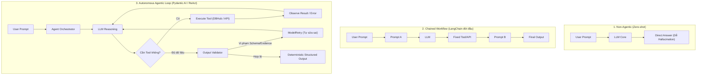
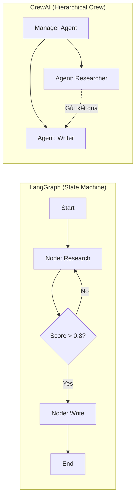
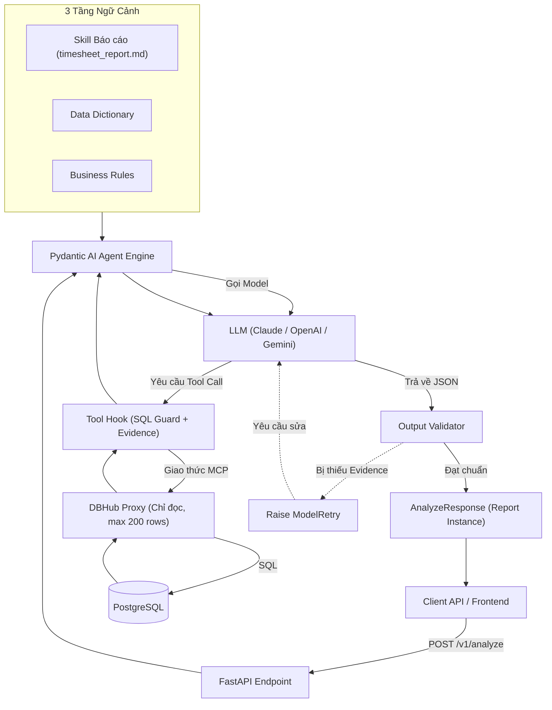
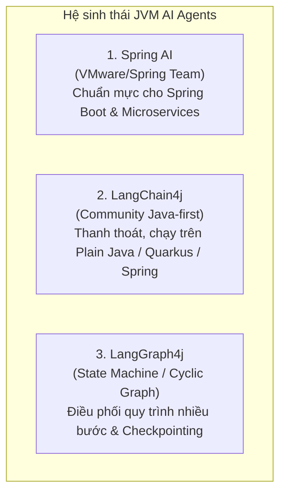
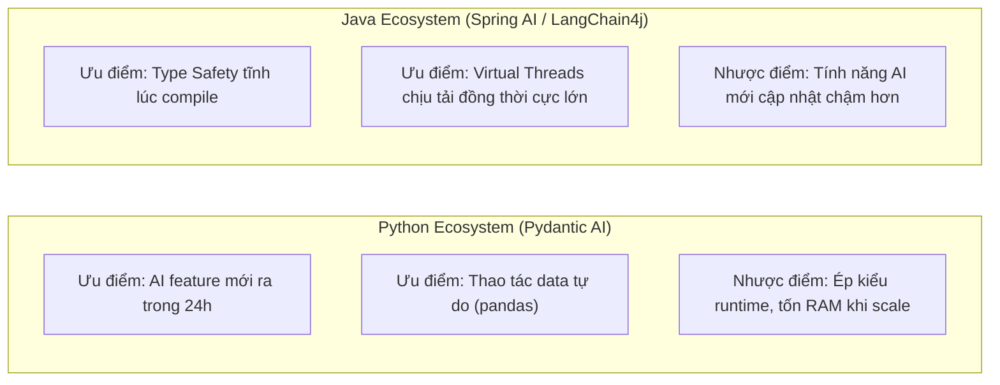

# Tổng Quan Khái Niệm AI Agent & So Sánh Các Agent Frameworks Hàng Đầu

> **Tài liệu học tập & chuẩn hóa kiến trúc AI Agent**  
> **Chủ đề:** Agent, Agentic Workflow, Agent Framework, và so sánh chuyên sâu: **Pydantic AI**, **LangChain**, **LangGraph**, **CrewAI**, **Vanna 2.0**.  
> **Ngày cập nhật:** 2026-10-01  
> **Tác giả:** Đội ngũ Kỹ thuật & Nghiên cứu AI  

---

## Mục lục

1. [Các khái niệm nền tảng: Agent, Agentic, và Agent Framework](#1-các-khái-niệm-nền-tảng)
   - [1.1 Khái niệm "Agent" và lịch sử tiến hóa](#11-khái-niệm-agent-và-lịch-sử-tiến-hóa)
   - [1.2 "Agentic" (Agentic Workflow) là gì?](#12-agentic-agentic-workflow-là-gì)
   - [1.3 "Agent Framework" là gì?](#13-agent-framework-là-gì)
2. [Sơ đồ tiến hóa kiến trúc xử lý của AI](#2-sơ-đồ-tiến-hóa-kiến-trúc-xử-lý-của-ai)
3. [Phân tích chi tiết 5 Agent Frameworks](#3-phân-tích-chi-tiết-5-agent-frameworks)
   - [3.1 LangChain — Bộ công cụ đời đầu](#31-langchain--bộ-công-cụ-đời-đầu-the-legacy-pioneer)
   - [3.2 LangGraph — Đồ thị trạng thái và quy trình phức tạp](#32-langgraph--đồ-thị-trạng-thái-và-quy-trình-phức-tạp-the-state-machine)
   - [3.3 CrewAI — Mô hình nhập vai đa tác nhân](#33-crewai--mô-hình-nhập-vai-đa-tác-nhân-the-role-playing-crew)
   - [3.4 Pydantic AI — Chuẩn mực Type-Safe cho Backend Production](#34-pydantic-ai--chuẩn-mực-type-safe-cho-backend-production-the-production-standard)
   - [3.5 Vanna 2.0 — Chuyên gia dữ liệu & Text-to-SQL thuần chủng](#35-vanna-20--chuyên-gia-dữ-liệu--text-to-sql-thuần-chủng-the-data-specialist)
4. [Ma trận so sánh tổng hợp (Master Comparison Matrix)](#4-ma-trận-so-sánh-tổng-hợp)
5. [So sánh kiến trúc điều phối qua Mermaid](#5-so-sánh-kiến-trúc-điều-phối-qua-mermaid)
6. [Bài học thực chiến: Lựa chọn framework cho bài toán Data Agent](#6-bài-học-thực-chiến-lựa-chọn-framework-cho-bài-toán-data-agent)
7. [Góc nhìn Java Developer: Hệ sinh thái AI Agent trên JVM](#7-góc-nhìn-java-developer-hệ-sinh-thái-ai-agent-trên-jvm)
   - [7.1 Bức tranh tổng quan Java trong kỷ nguyên AI Agent](#71-bức-tranh-tổng-quan-java-trong-kỷ-nguyên-ai-agent)
   - [7.2 Top 3 Frameworks AI Agent hàng đầu cho Java](#72-top-3-frameworks-ai-agent-hàng-đầu-cho-java)
   - [7.3 Các framework và SDK bổ trợ đáng chú ý](#73-các-framework-và-sdk-bổ-trợ-đáng-chú-ý)
   - [7.4 Ma trận so sánh các Java Agent Frameworks](#74-ma-trận-so-sánh-các-java-agent-frameworks)
   - [7.5 So sánh thực chiến: Xây dựng AI Agent bằng Java vs Python](#75-so-sánh-thực-chiến-xây-dựng-ai-agent-bằng-java-vs-python)
   - [7.6 Kiến trúc đề xuất chuẩn mực cho Java Shop](#76-kiến-trúc-đề-xuất-chuẩn-mực-cho-java-shop)

---

## 1. Các khái niệm nền tảng

### 1.1 Khái niệm "Agent" và lịch sử tiến hóa

Khái niệm **Agent (Tác nhân)** trong khoa học máy tính đã thay đổi căn bản qua ba thời kỳ:

```
[Classical AI: Rule-based] ──► [Chained LLM: Linear Pipeline] ──► [Modern Autonomous Agent: ReAct Loop]
(Cảm biến + Hành động cứng)     (Gọi tuần tự Prompt -> Output)     (Lập kế hoạch + Gọi Tool + Tự sửa sai)
```

1. **AI Cổ điển (Classical / Symbolic AI - Trước 2022):**
   - Theo định nghĩa của Russell & Norvig: Một Agent là thực thể tiếp nhận thông tin từ môi trường qua **Sensors (Cảm biến)** và tác động ngược lại môi trường qua **Actuators (Cơ cấu chấp hành)** theo một hàm mục tiêu cố định (ví dụ: máy hút bụi tự né chướng ngại vật, thuật toán Minimax chơi cờ).
2. **Thời kỳ đầu LLM (Chained Prompting - 2022 đến 2023):**
   - LLM đóng vai trò như một bộ xử lý text. Lập trình viên viết các đường ống tuyến tính (Linear Chains): Prompt 1 $\rightarrow$ Text 1 $\rightarrow$ Parse regex $\rightarrow$ Prompt 2 $\rightarrow$ Kết quả.
   - **Hạn chế:** Hoàn toàn bị động, không thể tự thích ứng nếu một bước chạy bị lỗi.
3. **AI Agent Hiện Đại (LLM-Powered Autonomous Agent - 2024 đến nay):**
   - LLM được nâng cấp từ "bộ gõ chữ" thành **"Bộ não điều phối" (Reasoning Engine)**. Một Agent hoàn chỉnh gồm 4 trụ cột:
     - **Planning (Lập kế hoạch):** Tự phân tích yêu cầu lớn thành các mục tiêu con.
     - **Memory (Trí nhớ):** Bộ nhớ ngắn hạn (Context cửa sổ chat) và Dài hạn (Vector Database, Knowledge Base).
     - **Tools / Actuators (Công cụ hành động):** Quyền gọi API, chạy câu lệnh SQL, duyệt web, sinh file.
     - **Feedback Loop (Vòng lặp ReAct):** Nhận kết quả từ Tool $\rightarrow$ Quan sát (Observation) $\rightarrow$ Suy luận lại (Thought) $\rightarrow$ Tự sửa sai nếu lỗi.

---

### 1.2 "Agentic" (Agentic Workflow) là gì?

> **"Agentic" là một tính từ chỉ MỨC ĐỘ TỰ CHỦ (Spectrum of Agency) của hệ thống, không phải tên gọi của một phần mềm.**

Theo nghiên cứu của **Andrew Ng (Stanford)**, thay vì bắt LLM sinh câu trả lời trong một lần duy nhất (Zero-shot generation), **Agentic Workflow** tổ chức công việc theo quy trình lặp đi lặp lại thông qua 4 mẫu thiết kế cốt lõi:

| Mẫu thiết kế Agentic | Giải thích cơ chế | Ví dụ thực tế |
|---|---|---|
| **Reflection (Phản tỉnh)** | LLM tự kiểm tra, chấm điểm và tìm lỗi sai trong kết quả của chính mình trước khi trả lời. | Viết xong code Python $\rightarrow$ LLM tự chạy linter $\rightarrow$ phát hiện syntax error $\rightarrow$ tự sửa. |
| **Tool Use (Sử dụng công cụ)** | LLM tự quyết định khi nào cần tìm thông tin bên ngoài qua API hoặc Database. | Không tự đoán số doanh thu $\rightarrow$ LLM tự sinh câu SQL và gọi DB để lấy số thật. |
| **Planning (Lập kế hoạch)** | LLM phác thảo toàn bộ lộ trình các bước cần làm trước khi bắt tay vào thực hiện. | "Bước 1: Nạp file $\rightarrow$ Bước 2: Kiểm tra dữ liệu thiếu $\rightarrow$ Bước 3: Tính toán KPI". |
| **Multi-agent Collaboration** | Chia nhỏ bài toán phức tạp cho nhiều Agent có vai trò chuyên biệt phối hợp cùng nhau. | Một Agent viết code, một Agent chuyên review bảo mật, một Agent kiểm thử. |

---

### 1.3 "Agent Framework" là gì?

Nếu không có framework, lập trình viên sẽ phải tự viết code tay toàn bộ hạ tầng điều khiển:
- Vòng lặp `while True` nhận diện tool call.
- Cơ chế parse tham số JSON từ văn bản thô của LLM.
- Cơ chế bắt lỗi và gửi lại lịch sử (retry loop).
- Quản lý trạng thái phiên làm việc (Session state).

**Agent Framework** là thư viện/nền tảng cung cấp sẵn các khung cấu trúc (scaffolding) này, giúp lập trình viên chỉ cần tập trung vào **Nghiệp vụ (Business Rules), Công cụ (Tools), và Dữ liệu (Context)**.

---

## 2. Sơ đồ tiến hóa kiến trúc xử lý của AI



---

## 3. Phân tích chi tiết 5 Agent Frameworks

### 3.1 LangChain — Bộ công cụ đời đầu (The Legacy Pioneer)

* **Năm ra đời:** Cuối 2022 (Harrison Chase).
* **Triết lý:** "Swiss Army Knife" — Cung cấp sẵn mọi thứ để kết nối LLM với thế giới bên ngoài.
* **Điểm mạnh:**
  - Hệ sinh thái tích hợp khổng lồ nhất (hàng trăm vector store, connectors cho mọi loại DB, search engine).
  - Tài liệu phong phú, cộng đồng đông đảo, dễ tìm code mẫu.
* **Hạn chế:**
  - **Over-abstraction (Quá nhiều tầng trừu tượng thừa):** Tạo ra các khái niệm như `Runnable`, `PromptTemplate`, `OutputParser`, khiến việc debug lỗi Python thông thường trở nên phức tạp.
  - **Khó chạy Production:** Traceback lỗi lồng qua hàng chục tầng thư viện, khó kiểm soát độ trễ và chi phí token.
* **Đánh giá:** Rất tốt cho việc học tập, làm POC (Proof of Concept) nhanh trong 1–2 ngày; không khuyến nghị cho các backend production yêu cầu tính ổn định cao.

---

### 3.2 LangGraph — Đồ thị trạng thái và quy trình phức tạp (The State Machine)

* **Năm ra đời:** Đầu 2024 (do chính đội ngũ LangChain phát triển).
* **Triết lý:** Agent thực chất là một **Đồ thị có hướng có chu trình (Directed Cyclic Graph)** hoặc một Máy trạng thái (Finite State Machine).
* **Điểm mạnh:**
  - **Kiểm soát luồng chặt chẽ:** Phù hợp cho các quy trình phân nhánh phức tạp (ví dụ: nếu step A ra kết quả < 0.8 thì rẽ nhánh B, ngược lại đi tiếp nhánh C).
  - **Human-in-the-loop tuyệt vời:** Dễ dàng tạm dừng workflow (Pause) để đợi con người bấm nút duyệt trên giao diện rồi mới chạy tiếp.
  - **Time-travel debugging:** Cho phép quay ngược lại trạng thái trước đó để kiểm tra hoặc chạy lại.
* **Hạn chế:**
  - Cú pháp cồng kềnh, độ dốc học tập (learning curve) cao.
  - Quá phức tạp đối với các bài toán Agent đơn lẻ chỉ cần gọi 2–3 tool DB.

---

### 3.3 CrewAI — Mô hình nhập vai đa tác nhân (The Role-Playing Crew)

* **Năm ra đời:** Cuối 2023 (João Moura).
* **Triết lý:** Mô phỏng một **công ty thu nhỏ** gồm nhiều chuyên gia (Crew). Mỗi Agent được gán một "Vai diễn" (Role, Goal, Backstory).
* **Điểm mạnh:**
  - Trực quan, dễ viết, cách tiếp cận theo góc nhìn tổ chức con người rất hấp dẫn.
  - Cực kỳ mạnh cho các bài toán sáng tạo, viết lách, nghiên cứu thị trường (ví dụ: 1 Researcher tìm tin tức $\rightarrow$ 1 Writer viết bài $\rightarrow$ 1 Editor biên tập).
* **Hạn chế:**
  - **Ảo giác tập thể (Hallucination Cascade):** Nếu Agent A tìm sai thông tin, Agent B và C sẽ tiếp tục tin vào thông tin sai đó và phân tích tiếp, dẫn đến kết quả sai nghiêm trọng.
  - **Lãng phí Token:** Các Agent chào hỏi, bàn luận qua lại làm chi phí token tăng gấp 3–5 lần so với Single Agent.
  - **Khó kiểm soát định dạng JSON:** Không phù hợp cho các bài toán backend data cần format chặt chẽ.

---

### 3.4 Pydantic AI — Chuẩn mực Type-Safe cho Backend Production (The Production Standard)

* **Năm ra đời:** Cuối 2024 (do chính Samuel Colvin và đội ngũ tạo ra **Pydantic** phát triển).
* **Triết lý:** **FastAPI-style for AI Agents**. Không dùng các lớp trừu tượng phức tạp, dựa hoàn toàn trên Python Type Hints, Dependency Injection và Pydantic Validation.
* **Điểm mạnh:**
  - **An toàn kiểu dữ liệu tuyệt đối (Type Safety):** Toàn bộ tham số đầu vào và đầu ra đều được kiểm tra bằng Pydantic model (`output_type=Report`).
  - **Cơ chế tự sửa sai độc quyền (`ModelRetry`):** Nếu LLM trả về số liệu không có bằng chứng hoặc sai schema, Pydantic AI tự động gửi thông báo lỗi ngược lại cho LLM để nó tự sửa mà không làm sập ứng dụng.
  - **Tích hợp Model Context Protocol (MCP):** Hỗ trợ kết nối chuẩn với các MCP Server như DBHub một cách tự nhiên (`MCPToolset`).
  - **Dependency Injection (`deps_type`):** Truyền kết nối DB, session người dùng an toàn trong môi trường đa luồng (Async/Thread-safe).
* **Hạn chế:**
  - Tập trung chủ yếu vào kiến trúc Single Agent hoặc Modular Agent; không thiết kế sẵn cho việc nhập vai multi-agent phức tạp như CrewAI.
* **Đánh giá:** Lựa chọn số 1 hiện nay để xây dựng API Backend cho Enterprise.

---

### 3.5 Vanna 2.0 — Chuyên gia dữ liệu & Text-to-SQL thuần chủng (The Data Specialist)

* **Năm ra đời:** 2023, nâng cấp lên kiến trúc Modular 2.0 vào 2025.
* **Triết lý:** Không làm Agent đa năng, chỉ tập trung 100% giải quyết bài toán: **Ngôn ngữ tự nhiên $\rightarrow$ SQL chuẩn xác $\rightarrow$ Biểu đồ trực quan**.
* **Điểm mạnh:**
  - **Semantic Context & Training RAG:** Tích hợp sẵn cơ chế nạp DDL, tài liệu schema và câu SQL mẫu (Golden Queries) vào Vector Database.
  - **Cơ chế tự học (Self-Learning Memory):** Tự động ghi nhớ câu SQL đúng; khi người dùng sửa một câu SQL sai, hệ thống lưu lại để không bao giờ lặp lại lỗi đó.
  - **Bảo mật phân quyền (Row-Level Security):** Phiên bản 2.0 có sẵn `UserResolver` để phân quyền dữ liệu theo từng phòng ban, cá nhân.
* **Hạn chế:**
  - Chỉ dùng được cho bài toán liên quan đến Database/SQL; không dùng được cho các tác vụ chung khác.
* **Đánh giá:** Tiêu chuẩn công nghiệp cho mảng Business Intelligence (GenBI) và Text-to-SQL chuyên sâu.

---

## 4. Ma trận so sánh tổng hợp

| Tiêu chí | LangChain | LangGraph | CrewAI | Pydantic AI | Vanna 2.0 |
|---|---|---|---|---|---|
| **Mục đích thiết kế chính** | Thư viện RAG & Chain tổng quát | Đồ thị luồng trạng thái phức tạp | Đa tác nhân phân vai (Multi-agent) | **Agent hướng Backend & Type-safe** | **Chuyên sâu 100% cho Text-to-SQL** |
| **Kiến trúc cốt lõi** | Linear Chain / Runnable | State Graph (Cycles/Nodes) | Sequential / Hierarchical Crew | **ReAct Loop + Dependency Injection** | Modular (Llm, Runner, VectorStore) |
| **Độ an toàn kiểu dữ liệu** | Thấp (nhiều Dict không kiểm soát) | Trung bình (qua TypedDict) | Thấp | **Tuyệt đối (100% Pydantic Model)** | Khá (Schema-aware) |
| **Cơ chế tự sửa lỗi (Correction)** | Thủ công | Tự vẽ vòng lặp trên Graph | Agent khác phê bình | **Tự động qua `ModelRetry`** | Tự sửa cú pháp SQL |
| **Giao thức MCP (DBHub)** | Cần Adapter ngoài | Cần Adapter ngoài | Hạn chế | **Native (`MCPToolset`)** | Dùng SqlRunner nội bộ |
| **Mức tiêu hao Token** | Trung bình | Tùy đồ thị | Rất cao (chat chéo) | **Tối ưu (Gọn, hỗ trợ Cache)** | Tối ưu cho SQL Context |
| **Độ phức tạp khi Debug** | Rất khó (nhiều lớp vỏ) | Trung bình | Khó | **Rất dễ (Traceback chuẩn Python)** | Dễ (Xem log câu lệnh SQL) |
| **Phù hợp nhất cho** | POC nhanh | Workflow có người duyệt | Brainstorming, Content | **REST API, Enterprise Data Service** | **Self-service BI, Text-to-SQL** |

---

## 5. So sánh kiến trúc điều phối qua Mermaid

### 5.1 Kiến trúc Graph (LangGraph) vs Kiến trúc Role-Playing (CrewAI)



### 5.2 Kiến trúc Type-Safe Backend (Pydantic AI + DBHub)



---

## 6. Bài học thực chiến: Lựa chọn framework cho bài toán Data Agent

Trong dự án phân tích dữ liệu Timesheet (**SS_Data_Agent**), việc quyết định công nghệ dựa trên các nguyên tắc thực tế sau:

### 1. Tại sao loại bỏ LangChain và CrewAI ngay từ đầu?
- **CrewAI:** Không phù hợp cho bài toán tài chính, chấm công hoặc đo đạc giờ làm. Dữ liệu đòi hỏi **độ chính xác 100% đến từng con số thập phân**, việc để 3–4 agent chat qua lại sẽ làm tăng nguy cơ hallucination và đốt token vô ích.
- **LangChain:** Quá nhiều lớp trừu tượng thừa, gây khó khăn cho việc bảo trì lâu dài và viết Unit Test.

### 2. Tại sao chọn Pydantic AI cho giai đoạn hiện tại (Giai đoạn 1 – 2)?
- **Hợp đồng dữ liệu minh bạch:** API chỉ chấp nhận trả về đúng cấu trúc `Report` định sẵn.
- **Không ảo giác số liệu:** Nhờ cơ chế `output_validator`, nếu một số liệu trong báo cáo không có `sql_id` đối ứng trong mảng `EvidenceItem`, Agent sẽ tự động phạt model và yêu cầu truy vấn lại trước khi xuất kết quả.
- **Tương thích hoàn hảo với DBHub:** Kết nối MCP trực tiếp giúp bảo vệ database nội bộ mà không cần viết code kết nối phức tạp.

### 3. Khi nào sẽ nâng cấp lên Vanna 2.0 (Giai đoạn 3)?
- Khi hệ thống mở rộng phục vụ toàn bộ doanh nghiệp với hàng nghìn người dùng:
  - Cần **Row-Level Security (RLS)** để nhân viên phòng nào chỉ xem được dữ liệu phòng đó.
  - Cần **Self-Learning Memory** để hệ thống ghi nhớ các câu hỏi đặc thù và các lần người dùng bấm nút "Sửa câu trả lời này", giúp agent càng dùng càng thông minh.

---

## 7. Góc nhìn Java Developer: Hệ sinh thái AI Agent trên JVM

### 7.1 Bức tranh tổng quan Java trong kỷ nguyên AI Agent

Trong khi **Python** chiếm ưu thế tuyệt đối ở khâu nghiên cứu và thử nghiệm (AI research & experimentation), thì **Java/JVM** đang trỗi dậy mạnh mẽ ở khâu **triển khai hạ tầng doanh nghiệp (Enterprise Production)**:

- Hầu hết các hệ thống lõi (Core Banking, ERP, viễn thông, logistics) đều vận hành trên nền tảng Java.
- Lợi thế cố hữu của Java: Quản lý bộ nhớ chặt chẽ, kiểu dữ liệu tĩnh (static typing), tính ổn định cao khi chịu tải đồng thời lớn, và công nghệ **Virtual Threads (Java 21 / Project Loom)** cho phép xử lý hàng chục nghìn kết nối mạng đồng thời mà không nghẽn tài nguyên.

---

### 7.2 Top 3 Frameworks AI Agent hàng đầu cho Java



#### 1. Spring AI — "Nhà Vua" cho hệ sinh thái Spring Boot
- **Xuất xứ & Bản quyền:** Do chính đội ngũ Spring (VMware / Tanzu) phát triển chính thức.
- **Môi trường khuyến nghị:** Java 17/21+, Spring Boot 3.x / 4.x.
- **Triết lý thiết kế:** Tích hợp tự nhiên vào phong cách lập trình Spring (`ChatClient`, `@Bean`, Auto-configuration, Actuator metrics).
- **Tính năng Agent nổi bật:**
  - **`ChatClient` Fluent API:** Cú pháp khai báo chuỗi gọi prompt, tool và structured output cực kỳ ngắn gọn.
  - **Hỗ trợ Model Context Protocol (MCP) Native:** Mô-đun `spring-ai-mcp` cho phép kết nối trực tiếp đến các MCP server như **DBHub** mà không cần qua lớp trung gian nào.
  - **Structured Output qua Java `record`:** Tự động parse và map JSON từ LLM thành Java Record kiểu tĩnh với đầy đủ Jackson annotations.
  - **`ToolCallingAdvisor`:** Interceptor kiểm soát tự động vòng lặp gọi tool (ReAct loop), đo lường thời gian và ngăn chặn vòng lặp vô tận.

#### 2. LangChain4j — "Làn gió độc lập, thanh thoát và linh hoạt"
- **Xuất xứ:** Dự án mã nguồn mở độc lập (không trực thuộc LangChain Corp), do cộng đồng Java tự thiết kế theo tư duy OOP chuẩn mực.
- **Môi trường hỗ trợ:** Chạy trên **mọi môi trường Java**: Plain Java (SE), Quarkus (hỗ trợ GraalVM native image), Micronaut, Helidon và cả Spring Boot.
- **Khái niệm Declarative `AiServices`:** Lấy cảm hứng từ Spring Data JPA hay Feign Client. Lập trình viên chỉ cần khai báo một `interface`:
  ```java
  public interface TimesheetAssistant {
      @SystemMessage("Bạn là chuyên gia phân tích dữ liệu timesheet...")
      Report analyze(@UserMessage String question);
  }
  ```
  Framework sẽ tự động sinh proxy thực thi, tự bind các tool đánh dấu `@Tool`, tự quản lý lịch sử hội thoại và tự ép kiểu kết quả về `Report`.
- **Ưu điểm lớn:** Rất nhẹ, khởi động cực nhanh, không kéo theo toàn bộ hệ sinh thái Spring nếu dự án chỉ cần một microservice nhỏ gọn.

#### 3. LangGraph4j — "Đồ thị trạng thái cho Agent đa bước"
- **Xuất xứ:** Cổng chuyển đổi chính thức (Port) của LangGraph sang Java.
- **Mục đích:** Xử lý các quy trình phức tạp có rẽ nhánh, có chu trình lặp (Cyclic Graph) và cần kiểm soát trạng thái nghiêm ngặt.
- **Tính năng độc quyền trên JVM:**
  - **State Persistence (Checkpointing):** Lưu trạng thái từng bước chạy của Agent vào PostgreSQL. Nếu server bị khởi động lại, Agent có thể khôi phục đúng bước đang dang dở.
  - **Human-in-the-loop:** Tạm dừng ở một Node chờ người duyệt (ví dụ: bấm "Xác nhận chuyển khoản" trên UI) rồi mới chạy tiếp các node sau.
  - **Tích hợp kép:** Có adapter chính thức cho cả Spring AI (`spring-ai-core`) và LangChain4j.

---

### 7.3 Các framework và SDK bổ trợ đáng chú ý

1. **Microsoft Semantic Kernel for Java:** Framework của Microsoft, thích hợp nhất nếu hạ tầng doanh nghiệp sử dụng Azure AI / Azure OpenAI. Tuy nhiên, cộng đồng Java nhỏ hơn đáng kể so với bản C# và Python.
2. **Spring AI Alibaba:** Đóng góp từ Alibaba Cloud, mở rộng Spring AI với các mẫu thiết kế Multi-Agent nâng cao (Handoffs, Graph Routing) và tích hợp hệ sinh thái Nacos/Sentinel.
3. **Official Java SDKs (`openai-java`, `anthropic-java`):** Bộ thư viện chính chủ từ các nhà cung cấp mô hình (do Stainless sinh tự động), cung cấp client HTTP kiểu tĩnh an toàn nếu lập trình viên muốn tự kiểm soát 100% vòng lặp mà không qua framework.

---

### 7.4 Ma trận so sánh các Java Agent Frameworks

| Tiêu chí | Spring AI | LangChain4j | LangGraph4j |
|---|---|---|---|
| **Đối tượng sử dụng chính** | Doanh nghiệp chạy Spring Boot | Đa nền tảng (Plain Java, Quarkus, Spring) | Bổ trợ cho workflow phức tạp |
| **Cách định nghĩa Tool** | `ToolCallback`, `@Bean`, MCP Client | Annotation `@Tool`, `@P` | Graph Node functions |
| **Hỗ trợ giao thức MCP** | **Rất mạnh (Module chính thức)** | Có qua adapter cộng đồng | Kế thừa từ runtime bên dưới |
| **An toàn kiểu dữ liệu (Type Safety)** | Java `record` + BeanOutputConverter | Java `record` + Jackson mapping | Dựa trên State Schema |
| **Tốc độ khởi động & RAM** | Trung bình (do Spring context) | **Rất nhanh, nhẹ (hỗ trợ GraalVM)** | Phụ thuộc vào framework đi kèm |
| **Khôi phục trạng thái (Checkpoint)** | Thủ công (lưu database tự viết) | Hỗ trợ ChatMemory cơ bản | **Tích hợp sẵn State Checkpointer** |
| **Độ phức tạp khi học** | Thấp (quen thuộc với dân Spring) | **Rất thấp (sạch và trực quan nhất)** | Trung bình - Cao |

---

### 7.5 So sánh thực chiến: Xây dựng AI Agent bằng Java vs Python



| Khía cạnh | Python (Pydantic AI / FastAPI) | Java (Spring AI / Spring Boot) |
|---|---|---|
| **Tốc độ đón đầu công nghệ AI** | **Rất nhanh (vài giờ đến vài ngày)** sau khi OpenAI/Anthropic ra API mới. | Chậm hơn từ vài tuần đến vài tháng. |
| **Bảo vệ kiểu dữ liệu (Safety)** | Kiểm tra ở Runtime qua Pydantic. | **Kiểm tra ở Compile-time** qua Java Compiler & Records. |
| **Xử lý đồng thời (Concurrency)** | Asyncio đơn luồng (Event loop), dễ nghẽn nếu có tác vụ CPU. | **Virtual Threads (Java 21)** cân hàng chục nghìn request gọi LLM mượt mà. |
| **Khả năng phân tích dữ liệu tự do** | **Rất mạnh**: Agent có thể tự sinh code Python chạy sandbox (`pandas`, `numpy`). | Hạn chế: Hầu như phải đẩy toàn bộ việc tính toán vào **SQL Views / Database**. |
| **Hạ tầng Enterprise sẵn có** | Cần dựng thêm Docker, bảo trì môi trường Python riêng. | **Tận dụng 100% CI/CD, K8s, Vault, Kafka** có sẵn của doanh nghiệp. |

---

### 7.6 Kiến trúc đề xuất chuẩn mực cho Java Shop

Nếu tổ chức của bạn tiêu chuẩn hóa trên nền tảng **Java / Spring Boot**, kiến trúc tham chiếu tối ưu để triển khai một Data Agent (tương đương bản Python Pydantic AI) là:

1. **Framework lõi:** **Spring Boot 3.x/4.x + Spring AI 2.0.x** trên nền **Java 21** (bật Virtual Threads).
2. **Giao tiếp Database:** Giữ nguyên **DBHub (MCP Server)** làm chốt chặn an toàn chỉ đọc (Read-only, Limit 200 rows). Kết nối từ Spring qua thư viện `spring-ai-mcp`.
3. **Hợp đồng dữ liệu:** Dùng **Java `record`** để định nghĩa `Report`, `Kpi`, `Finding`, `TableData`, đảm bảo tương thích 1-1 với JSON Schema của bản Python.
4. **Kiểm soát an toàn SQL:** Viết một `GuardedToolCallback` bọc ngoài tool của DBHub để dùng `JSqlParser` phân tích cú pháp và chặn các câu lệnh ngoài allowlist.
5. **Render báo cáo:** Dùng **Thymeleaf** dựng HTML template và **OpenPDF / Playwright Java** để xuất file PDF chất lượng cao.
6. **Khi nào cần thêm LangGraph4j?** Chỉ tích hợp thêm khi bài toán mở rộng sang quy trình phê duyệt đa phòng ban (Multi-agent handoff) hoặc cần tạm dừng workflow chờ con người xác nhận.
