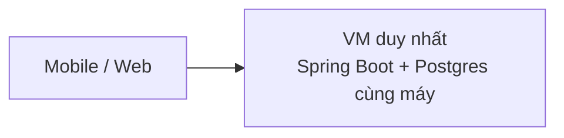
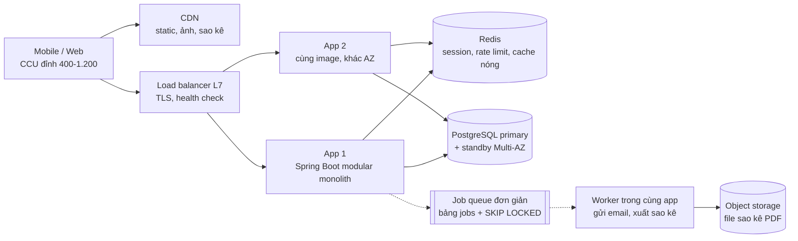
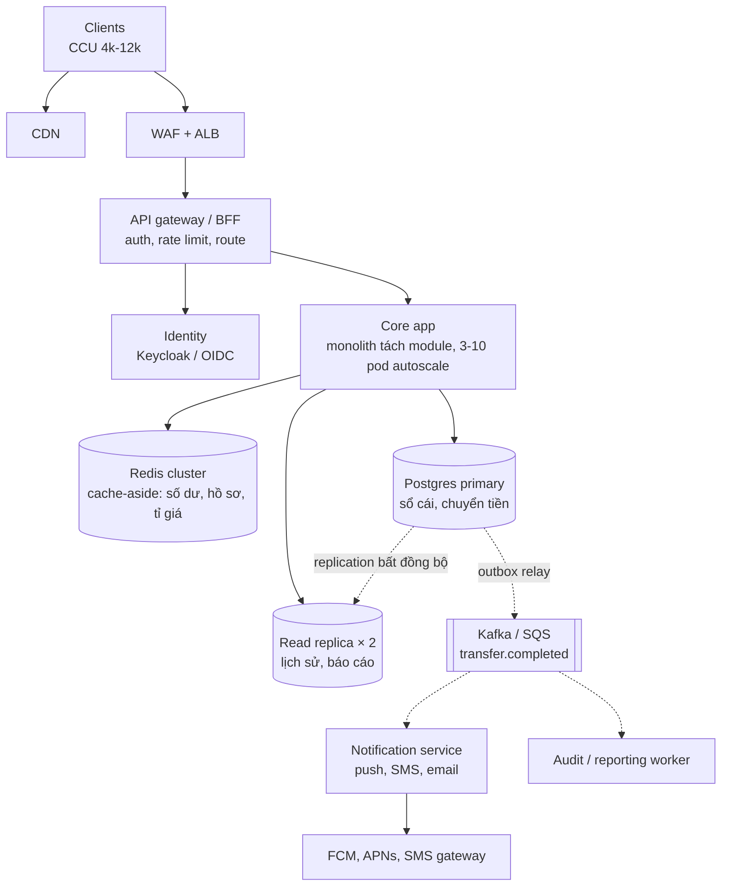
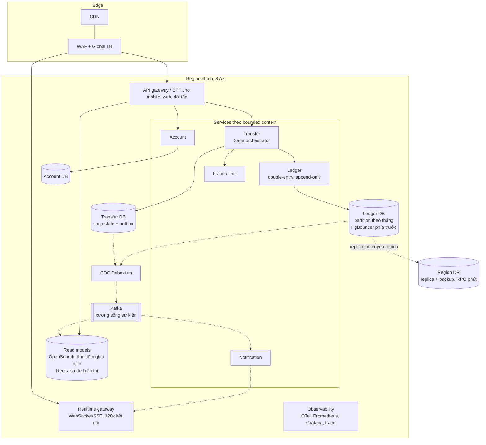

# Track S — Vẽ hệ thống từ 100k → 1M → 10M users

> **Track mới của lộ trình v2.** Học cách đi từ một con số "N users" ra CCU, RPS, số máy, rồi ra
> **sơ đồ**, và biết chính xác **cái gì vỡ trước** khi tải tăng 10 lần.
>
> Cha: [00 — Lộ trình 6 tháng](00-lo-trinh-6-thang.md) · Track song song: [01 — Code Java chậm dưới tải cao](01-java-code-cham-duoi-tai-cao.md)
> · Bài tập chi tiết: [10 — Implement giai đoạn 1](10-implement-gd1-nen-tang.md)

---

## 0. Đọc file này trong 60 giây

1. **"N users" không phải đơn vị tải.** Phải đổi qua 4 bước: đăng ký → DAU → **CCU đỉnh** → **RPS
   đỉnh**. Bỏ bước nào là sai cả bậc độ lớn.
2. **CCU phụ thuộc độ dài phiên nhiều hơn số user.** Cùng 1 triệu user đăng ký, app ngân hàng (phiên
   4 phút) có **~4.000** CCU đỉnh, app chat (phiên 60 phút) có **~50.000**, chênh nhau 12 lần.
3. **100k users là bài toán sẵn sàng (availability), không phải bài toán tải.** ~200 RPS lúc đỉnh,
   một instance Spring Boot dư sức. Vẫn cần 2 instance vì **một instance chết là sập**, chứ không
   phải vì thiếu CPU.
4. **10M users ngân hàng thì phần ghi sổ cái vẫn vừa một Postgres primary đủ mạnh.** Thứ không vừa là
   **phần đọc**, **số team**, và **bán kính sự cố (blast radius)**. Đó mới là lý do tách microservices,
   không phải "nhiều user".
5. **Code xấu nhân với số máy.** Mỗi request phí thêm 2 ms CPU thì ở mức 10M users bạn trả thêm ~33
   pod (xem [§6](#6-code-xấu-nhân-với-số-máy--nối-sang-track-p)). Kiến trúc đẹp không cứu được.

---

## 1. Từ "N users" ra CCU và RPS — công thức 4 bước

```text
Bước 1  DAU        = đăng ký × tỉ lệ hoạt động ngày
Bước 2  CCU đỉnh   = DAU × phút_dùng_mỗi_ngày × tỉ_trọng_giờ_cao_điểm ÷ 60
Bước 3  RPS đỉnh   = CCU đỉnh × request_mỗi_giây_của_một_user_đang_dùng
Bước 4  Ngày đặc biệt (ngày lương, flash sale, Tết) = × 3 đến × 10 so với giờ cao điểm thường
```

**Vì sao bước 2 viết như vậy.** Tổng "user-phút" trong ngày là `DAU × phút_dùng`. Giờ cao điểm
thường gánh ~10% lưu lượng cả ngày (gấp ~2,4 lần trung bình). Lấy phần user-phút rơi vào giờ đó
chia 60 phút là số người đang online cùng lúc trong giờ ấy.

**Con số mặc định khi đề không cho.** Đây là giả định, phải **nói to lên bảng** trong phỏng vấn:

| Tham số | App ngân hàng / ví (hồ sơ A) | Chat / mạng xã hội (hồ sơ B) |
|---|---|---|
| DAU / đăng ký | 30% | 50% |
| Phút dùng mỗi ngày | 2 phiên × 4 phút = **8** | **60** |
| Tỉ trọng giờ cao điểm | 10% | 10% |
| Request/giây của một user đang dùng | **0,17** (1 request / 6 s: mỗi màn hình 3–5 API, đổi màn hình ~25 s) | **0,05** (nhưng giữ **1 kết nối WebSocket** suốt phiên) |
| Hệ số ngày đặc biệt | × 3 (ngày lương) | × 2 (sự kiện) |

### 1.1 Bảng tính sẵn — hồ sơ A (ngân hàng, đúng capstone A)

| | **100k** đăng ký | **1M** đăng ký | **10M** đăng ký |
|---|---:|---:|---:|
| DAU | 30.000 | 300.000 | 3.000.000 |
| **CCU đỉnh** giờ cao điểm | **400** | **4.000** | **40.000** |
| CCU ngày lương (× 3) | 1.200 | 12.000 | 120.000 |
| **RPS đỉnh** giờ cao điểm | **~70** | **~670** | **~6.700** |
| RPS ngày lương | **~200** | **~2.000** | **~20.000** |
| RPS trung bình cả ngày | ~28 | ~280 | ~2.800 |
| Giao dịch chuyển tiền/ngày (1 lần/DAU) | 30k | 300k | 3M |
| TPS chuyển tiền ngày lương | ~2,5 | ~25 | **~250** |
| Ghi DB/giây ngày lương (~6 ghi/giao dịch¹) | ~15 | ~150 | **~1.500** |
| Dữ liệu sổ cái mới/năm (~600 B/giao dịch kể cả index) | ~6,5 GB | ~65 GB | **~650 GB** |

¹ Hai bút toán (double-entry), một dòng `transfer`, một dòng `outbox`, một khoá idempotency, một
dòng audit.

**Cách tính một ô để tự kiểm tra (10M, CCU đỉnh):** `3.000.000 × 8 × 0,10 ÷ 60 = 40.000`.
RPS: `40.000 × 0,17 ≈ 6.800`, làm tròn ~6.700.

### 1.2 Bảng tính sẵn — hồ sơ B (chat, để thấy CCU thay đổi thế nào)

| | 100k | 1M | 10M |
|---|---:|---:|---:|
| DAU | 50.000 | 500.000 | 5.000.000 |
| **CCU đỉnh** | **5.000** | **50.000** | **500.000** |
| RPS đỉnh | ~250 | ~2.500 | ~25.000 |
| Kết nối WebSocket giữ cùng lúc | 5.000 | 50.000 | **500.000** |

> **Bài học của hai bảng:** cùng 10M user đăng ký, hồ sơ B có CCU gấp 12 lần hồ sơ A, và phải giữ
> nửa triệu kết nối mở. Câu hỏi đầu tiên khi nghe "N users" là **"một phiên dùng bao lâu, và có giữ
> kết nối không?"**, chứ không phải "bao nhiêu server".

### 1.3 Khi đề cho thẳng CCU — đi ngược lại

"Hệ thống 100k CCU" là cỡ lớn. Với hồ sơ A, 100k CCU giờ cao điểm thường ứng với
`DAU = 100.000 × 60 ÷ (8 × 0,10) = 7,5 triệu`, tức **~25 triệu user đăng ký**. Còn nếu 100k CCU là
con số ngày lương thì ứng với ~8 triệu đăng ký. Với hồ sơ B, 100k CCU ứng với DAU 1 triệu, khoảng
2 triệu đăng ký.

→ Gặp chữ "CCU" trong đề thì **hỏi lại** nó là đỉnh ngày thường hay đỉnh sự kiện, rồi đặt hệ thống
vào đúng bậc của thang bên dưới.

### 1.4 Từ RPS ra số máy — ba con số nhẩm

| Thành phần | Nhẩm nhanh (giả định ghi rõ) | Nguồn của con số |
|---|---|---|
| **Pod Spring Boot 2 vCPU** | Request JSON + 1–2 query tốn ~4–5 ms CPU → ~400 RPS ở 100% CPU → **~250 RPS** ở mức 60% để dư cho đỉnh | Suy luận từ CPU/request; **phải đo lại** bằng load test ở tuần 12 |
| **Postgres primary 8–16 vCPU** | Vài nghìn ghi/giây đơn giản có index; 10–20k đọc/giây theo khoá chính | Kinh nghiệm chung, phụ thuộc mạnh vào schema; lab [05-postgres-depth](../katalon-prep/katalon-prep-java/05-postgres-depth/) đo được một phần |
| **Redis một node** | ~100k thao tác/giây đơn giản | Redis là single-thread cho lệnh, nên đây là trần CPU một core |

Ba con số này để **ra quyết định trên bảng**, không phải để ghi vào design doc. Design doc phải dùng
số **đo trên chính code của bạn**, và đó là việc của tuần 12 và track P.

---

## 2. Thang 5 bậc — tóm tắt trên một trang

| Bậc | Quy mô (hồ sơ A) | CCU / RPS đỉnh | Kiến trúc | Động lực chính để lên bậc |
|---|---|---|---|---|
| **L0** | ≤ 10k users, nội bộ, MVP | < 50 / < 20 | 1 VM: Spring Boot + Postgres cùng máy | Một máy chết là mất hết, kể cả dữ liệu |
| **L1** | **100k** | 400–1.200 / 70–200 | Modular monolith × 2 sau LB, Postgres Multi-AZ, Redis, S3 + CDN, job queue đơn giản | Availability, deploy không downtime |
| **L2** | **1M** | 4k–12k / 670–2.000 | Monolith autoscale 3–10 pod, read replica, cache-aside, **outbox → Kafka/SQS**, worker async, API gateway, 2–3 service tách ra có lý do | Đọc nặng lên DB, việc chậm chặn request, team 3–5 nhóm |
| **L3** | **10M** | 40k–120k / 6,7k–20k | **Microservices theo bounded context**, mỗi service DB riêng, Kafka làm xương sống, CDC, CQRS read model, partition theo thời gian, PgBouncer, multi-AZ toàn bộ, DR region | Blast radius, số team, phần đọc, đỉnh × 3 |
| **L4** | 50M+ hoặc đa quốc gia | 500k+ / 100k+ | **Cell-based** (mỗi cell phục vụ một tập user), multi-region active-active, global routing | Một region là một điểm chết; luật lưu trữ dữ liệu theo quốc gia |

> **Luật của thang:** chỉ lên bậc khi **có một thứ cụ thể đang vỡ hoặc sắp vỡ**, và nói được tên nó.
> Vẽ L3 cho bài 100k users là over-engineer, đúng cái lỗi mà lộ trình gốc đã cảnh báo ("Kafka,
> sharding cho hệ thống chỉ 50 QPS").

---

## 3. Từng bậc — sơ đồ, con số, và cái gì vỡ trước

Mọi sơ đồ dưới đây vẽ cho **Mini Core Transfer** (capstone A): mở tài khoản, chuyển tiền nội bộ, lịch
sử giao dịch, thông báo. Mũi tên liền là gọi đồng bộ, mũi tên đứt là bất đồng bộ.

### 3.1 L0 — một máy (điểm xuất phát, vẽ trong 5 phút)



Vẽ L0 không phải để dùng. Vẽ để **liệt kê điểm chết đơn (SPOF)**: máy, ổ đĩa, process, và việc
deploy (restart là downtime). Mỗi bậc sau là câu trả lời cho một điểm chết trong danh sách này.

### 3.2 L1 — 100k users: sẵn sàng trước, tải sau



| Quyết định | Vì sao | Đánh đổi là… |
|---|---|---|
| **Modular monolith**, không microservices | 200 RPS, một team. Ranh giới module (`account`, `transfer`, `notification`) vẫn giữ, dùng ArchUnit chặn import chéo, để tách sau rẻ | Một bug OOM làm chết mọi chức năng cùng lúc |
| **2 instance** dù 1 là đủ CPU | Một instance chết hoặc đang deploy thì vẫn còn một | Gấp đôi chi phí app, đổi lấy deploy không downtime |
| **Stateless app**, session trong Redis hoặc JWT | LB gửi request vào máy nào cũng được | Thêm một phụ thuộc (Redis) phải theo dõi |
| **Postgres Multi-AZ** (standby đồng bộ) | Mất một AZ không mất dữ liệu đã commit | Mỗi commit chờ thêm một round trip sang AZ kia (~1–2 ms) |
| **Job queue bằng bảng + `SKIP LOCKED`** | Chưa cần Kafka; giao dịch và job nằm trong cùng một transaction | Không có replay, không fan-out cho nhiều consumer |

**Cái vỡ trước khi lên 1M (×10):** đọc lịch sử giao dịch và số dư dồn hết vào primary; connection
pool (10 pod × 10 connection = 100, chạm `max_connections` mặc định của Postgres); việc chậm như gửi
SMS chạy trong request làm p99 nhảy; một team 15 người cùng deploy một artifact.

### 3.3 L2 — 1M users: tách đọc, tách việc chậm



| Quyết định | Con số đứng sau | Đánh đổi là… |
|---|---|---|
| **Read replica** cho lịch sử giao dịch | Đọc chiếm ~90% của 2.000 RPS | Replication lag: user vừa chuyển xong mở lịch sử không thấy. Phải có **read-your-writes** (đọc primary trong N giây sau khi ghi, hoặc theo version) |
| **Cache-aside** cho số dư và hồ sơ | Hit ratio 90% thì DB chỉ còn thấy 1/10 lượng đọc | Cache sai thì hiển thị sai số dư; số dư **dùng để quyết định chuyển tiền** thì vẫn đọc từ DB có khoá |
| **Outbox → broker**, không gọi SMS trong request | Gửi SMS mất 200–2.000 ms, request chuyển tiền chỉ được 300 ms p99 | Thông báo đến trễ vài giây; phải có idempotency ở consumer |
| **Tách Notification** thành service riêng đầu tiên | Tải khác hẳn (burst khi chiến dịch), lỗi khác hẳn (phụ thuộc bên thứ ba), ít ràng buộc dữ liệu với core | Thêm một thứ để deploy, giám sát, on-call |
| **API gateway** | Rate limit, auth tập trung trước khi chạm app | Thêm một hop (~1–3 ms), và là điểm chết nếu không có HA |

**Cái vỡ trước khi lên 10M (×10):** primary vẫn gánh mọi ghi **và** mọi khoá; bảng sổ cái lên vài
trăm GB, `VACUUM` và index ngày càng chậm; 6–8 team giẫm chân nhau trong một codebase; một module
lỗi (ví dụ báo cáo chạy query nặng) kéo chết cả chuyển tiền: **blast radius quá lớn**.

### 3.4 L3 — 10M users: microservices có lý do



| Quyết định | Con số / lý do | Đánh đổi là… |
|---|---|---|
| Tách service **theo bounded context**, không theo bảng | 6–10 team cần deploy độc lập; Ledger cần SLO khác Notification | Giao dịch xuyên service phải dùng **Saga + outbox**, không còn `@Transactional` chung |
| **Ledger vẫn là một Postgres primary**, partition theo tháng | 1.500 ghi/giây ngày lương vẫn vừa một primary mạnh; 650 GB/năm chia partition thì `VACUUM`, index, xoá dữ liệu cũ (detach partition) vẫn nhẹ | Primary vẫn là trần ghi cuối cùng; khi chạm trần mới tính shard theo `account_id`, và shard thì chuyển tiền giữa hai shard thành saga |
| **PgBouncer** (transaction pooling) | 80 pod × 10 connection = 800 → quá xa mức Postgres chịu được | Mất các tính năng gắn với session (prepared statement kiểu cũ, `SET` theo session, advisory lock theo session) |
| **CQRS read model** (OpenSearch, Redis) cho tìm kiếm và hiển thị | Đọc là ~90% của 20.000 RPS; tìm kiếm full-text không nên chạy trên DB ghi | Read model trễ vài trăm ms đến vài giây; phải nói rõ màn hình nào chấp nhận trễ |
| **CDC (Debezium)** thay cho dual write | Ghi DB rồi publish Kafka là hai việc có thể hỏng giữa chừng | Thêm một hệ thống phải vận hành (connector, offset, schema) |
| **Realtime gateway** riêng | 120k kết nối mở ngày lương; một node Netty giữ được vài chục nghìn → 4–6 node | Phải có sticky routing hoặc pub/sub giữa các node để đẩy tin tới đúng kết nối |
| **DR region** active-passive, RPO tính bằng phút | Yêu cầu ngân hàng; active-active cho sổ cái là bài toán đồng thuận xuyên region, rất đắt | Mất region thì mất vài phút dữ liệu chưa sang kịp, và failover cần runbook đã diễn tập |

**Cái vỡ trước khi lên L4:** một region là một điểm chết; luật dữ liệu theo quốc gia (ví dụ khách
Úc phải nằm ở Úc); một sự cố deploy ảnh hưởng **mọi** user cùng lúc.

### 3.5 L4 — vượt 10M (chỉ cần nói được, không cần vẽ chi tiết)

**Cell-based architecture:** chia user thành các *cell* (ví dụ 2M user/cell), mỗi cell là một bản sao
đầy đủ của L3 ở quy mô nhỏ. Một lớp định tuyến mỏng ánh xạ `user → cell`. Sự cố hay deploy hỏng chỉ
chạm một cell. Đánh đổi: chuyển tiền giữa hai cell là giao dịch xuyên cell; công cụ vận hành phải
nhân theo số cell. Đọc thêm: AWS Builders' Library và Well-Architected về cell-based architecture.

---

## 4. Lộ trình vẽ — 10 bản vẽ từ cơ bản tới microservices

Mỗi bản vẽ: **tự vẽ trong thời gian giới hạn**, ghi số lên từng mũi tên, rồi mới so với sơ đồ mẫu ở
§3 hoặc lời giải sách. Bản vẽ nào cũng phải trả lời được: *"tải × 10 thì cái gì vỡ trước?"*

| # | Tuần | Vẽ cái gì | Bậc | Giới hạn | Điều phải thấy trong bản vẽ |
|:---:|:---:|---|:---:|:---:|---|
| V1 | 1 | Ứng dụng ngân hàng ở **L0** + danh sách SPOF | L0 | 10' | Mỗi SPOF có một dòng "nếu chết thì sao" |
| V2 | 1 | Cùng ứng dụng ở **L1** + bảng ước lượng 100k users | L1 | 20' | CCU, RPS, ghi/giây viết ngay trên sơ đồ |
| V3 | 2 | **Rate limiter** đặt ở đâu (gateway hay app), dùng Redis thế nào | L1 | 20' | Đường đi của request bị chặn và request được qua |
| V4 | 3 | **URL shortener** + **unique ID generator** | L1→L2 | 30' | Tỉ lệ đọc/ghi, cache, ID không trùng khi nhiều instance |
| V5 | 4 | **Notification system** | L2 | 30' | Hàng đợi, retry, idempotency, DLQ, tách theo kênh |
| V6 | 6 | Mini Core Transfer ở **L2** (1M) | L2 | 30' | Read replica + read-your-writes, cache-aside, outbox |
| V7 | 8–9 | **Payment / wallet** với Kafka + Saga | L2 | 40' | Luồng bù trừ khi bước 3/4 lỗi, khoá idempotency |
| V8 | 11 | Tách monolith V6 thành services: **C4 container diagram** | L2→L3 | 40' | Ranh giới bounded context, ai sở hữu dữ liệu nào, sync hay async giữa chúng |
| V9 | 13–14 | Phủ **observability + security** lên V8 | L3 | 30' | Trace đi qua đâu, token được kiểm ở đâu, mTLS ở đâu |
| V10 | 15–16 | Mini Core Transfer ở **L3** (10M) trên AWS, multi-AZ + DR | L3 | 45' | AZ là hộp bao, RPO/RTO ghi rõ, đường failover |
| **Drill** | 17–24 | **"Một hệ thống, ba quy mô"**: vẽ lại V2 → V6 → V10 liên tục trong 45' và nói lý do từng thay đổi | L1→L3 | 45' | Đây là câu "nếu tải tăng 10 lần thì sao" mà vòng senior luôn hỏi |

### 4.1 Quy ước vẽ — để người khác đọc được

- **Ba cấp C4**: *Context* (hệ thống và người dùng, đối tác), *Container* (app, DB, broker), *Component*
  (module bên trong một app). Phỏng vấn gần như chỉ cần cấp Container.
- **Mũi tên liền** = đồng bộ (HTTP/gRPC), **mũi tên đứt** = bất đồng bộ (queue, CDC, replication).
- **Ghi số trên mũi tên**: `2k RPS`, `p99 50ms`, `1,5k ghi/s`. Mũi tên không có số là mũi tên trang trí.
- **AZ và region là hộp bao**. Thấy ngay thứ gì nằm trong một AZ duy nhất là thấy SPOF.
- **Cylinder** cho thứ lưu trạng thái. Hộp nào không phải cylinder thì phải stateless, nếu không thì
  ghi rõ trạng thái đó nằm ở đâu.
- Công cụ: **Excalidraw** khi luyện phỏng vấn (giống bảng trắng), **mermaid** khi lưu trong repo (vẽ
  lại được, diff được), draw.io cho design doc ở công ty.

### 4.2 Tự chấm một bản vẽ — 6 câu

1. Có số CCU/RPS/ghi/giây không, và số đó tính từ giả định nào?
2. Mỗi thứ có trạng thái đã có bản sao ở AZ khác chưa?
3. Chỉ ra được **một** chỗ nghẽn đầu tiên khi tải × 10 không?
4. Luồng tiền (hoặc luồng dữ liệu quan trọng nhất) đi qua những hộp nào, và hộp nào có thể làm trùng
   hoặc mất nó?
5. Có hộp nào thêm vào mà không nói được "vì cái gì đang vỡ"? Nếu có, xoá nó.
6. Có ghi "đánh đổi là…" cho ít nhất 3 quyết định không?

---

## 5. Câu hỏi "tải tăng 10 lần thì sao?" — cách trả lời

Đi theo đúng thứ tự này, mỗi bước một câu:

```text
1. Số mới:      "×10 nghĩa là 2.000 → 20.000 RPS, ghi 150 → 1.500/s, 12k → 120k CCU."
2. Vỡ trước:    "Thứ vỡ đầu tiên là ___ vì ___ (con số)."
3. Sửa:         "Tôi ___, đánh đổi là ___."
4. Vỡ tiếp:     "Sau đó thứ chạm trần tiếp theo là ___."
5. Không làm:   "Tôi CHƯA ___ (shard, multi-region) vì ___ vẫn còn dư ___ lần."
```

Bước 5 là chỗ ghi điểm senior: nói được **vì sao chưa cần** một thứ đắt tiền.

---

## 6. Code xấu nhân với số máy — nối sang track P

Kiến trúc ở trên giả định mỗi request tốn ~4–5 ms CPU. Track P đo được những đoạn code Java phổ biến
làm con số đó phình ra mà không ai để ý. Ví dụ ở L3 (20.000 RPS ngày lương, pod 2 vCPU chạy ở 60%):

```text
CPU mỗi request    pod cần                         chênh lệch
4,5 ms             20.000 × 4,5 ms ÷ (2 × 1000 × 0,6) ≈ 75 pod
6,5 ms (+2 ms)     20.000 × 6,5 ms ÷ 1.200           ≈ 108 pod      → +33 pod, +44% chi phí app
```

2 ms thêm mỗi request không đến từ một lỗi µs của nhóm 1 (cần ~140 lần `new ObjectMapper()` mới đủ).
Nó thường đến từ **một vòng lặp O(n²) theo dữ liệu**: theo số đo ở track P, khử trùng bằng
`list.contains` trên ~1.500 phần tử, hoặc nối chuỗi `+=` khoảng 600 dòng, là đủ 2 ms.

Và có loại code còn tệ hơn: không làm tốn CPU mà **giữ tài nguyên khan hiếm** (connection, thread)
lâu hơn cần thiết. Loại này không giải được bằng thêm máy, vì trần nằm ở pool chứ không ở CPU. Demo
đo được ở [01 §3](01-java-code-cham-duoi-tai-cao.md#3-nhóm-2--giữ-tài-nguyên-khan-hiếm-quá-lâu-littles-law):
pool 10 connection, gọi HTTP 50 ms bên trong `@Transactional` → trần **~163 req/s** cho toàn service,
thêm bao nhiêu pod cũng vậy.

---

## 7. Tài liệu cho track này

| Tài liệu | Dùng cho |
|---|---|
| System Design Interview Vol 1 (Alex Xu), chương 1 *Scale from zero to millions of users* và chương 2 *Back-of-the-envelope estimation* | Bậc L0→L3 và cách ước lượng |
| AWS re:Invent, chuỗi bài *Scaling up to your first 10 million users* | Cùng thang này nhưng gắn dịch vụ AWS cụ thể |
| [AWS Builders' Library](https://aws.amazon.com/builders-library/) | Cell-based, timeouts, load shedding cho L3–L4 |
| Fundamentals of Software Architecture (Richards, Ford) | Khi nào modular monolith, khi nào microservices |
| C4 model (c4model.com, Simon Brown) | Quy ước vẽ §4.1 |

---

## 8. Ranh giới trung thực

| Nội dung | Trạng thái |
|---|---|
| Công thức 4 bước ở §1 | Là mô hình ước lượng chuẩn (user-phút chia cửa sổ thời gian). **Các tham số mặc định là giả định**, không phải số đo của một ngân hàng cụ thể. Có số thật của dự án thì thay vào |
| "Giờ cao điểm ~10% lưu lượng ngày", "0,17 request/giây/user" | **Giả định hợp lý, chưa đối chiếu** với log production nào trong workspace này. Việc đầu tiên ở công ty thật: lấy access log một ngày, đếm request theo giờ để thay số |
| Năng lực pod / Postgres / Redis ở §1.4 | **Suy luận và kinh nghiệm chung**, chưa đo trên code của bạn. Tuần 12 có load test để thay bằng số thật |
| Sơ đồ §3 | Là thiết kế mẫu cho một domain giả định (capstone A), **không phải** kiến trúc của NAB hay ngân hàng nào |
| Ví dụ "+33 pod" ở §6 | Phép tính đúng theo giả định đã ghi; con số CPU 4,5 ms là giả định. Track P đo được chi phí thật của từng anti-pattern trên máy lab |
