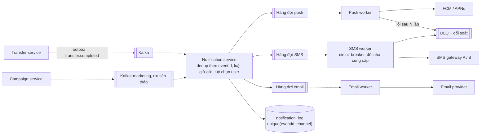

# Implement giai đoạn 1 — Nền tảng (tuần 1–4): hướng dẫn học và bài tập

> **Technical details cho giai đoạn 1** của [lộ trình 6 tháng](00-lo-trinh-6-thang.md). Mỗi tuần có:
> đầu ra phải nộp, lịch 5 buổi, đọc gì, ghi chú khái niệm, lab có tiêu chí chấm, bài tập có đáp án,
> phần Track P ([code chậm](01-java-code-cham-duoi-tai-cao.md)) và Track S ([vẽ hệ thống](02-ve-he-thong-100k-1m-10m.md)),
> và một bài nói 2 phút bằng tiếng Anh.
>
> Kết thúc tuần 4 phải qua được [mốc kiểm tra](#mốc-tuần-4--tiêu-chí-qua-giai-đoạn).

---

## 0. Cách dùng file này

**Nhịp một tuần** (khớp lịch tuần mẫu của lộ trình, 10–11 giờ):

| Buổi | Thời lượng | Làm gì trong file này |
|---|---|---|
| Thứ Hai | 1,5 giờ | Mục **Đọc** + **Ghi chú khái niệm** của tuần. Ghi chú bằng sơ đồ, không chép lại sách |
| Thứ Tư | 1,5 giờ | Bài engineering blog của tuần + bài tập lý thuyết (phần **Bài tập**, nhóm đầu) |
| Thứ Sáu | 1 giờ | 30 phút ôn + sổ lỗi; 30 phút **Track P** của tuần |
| Thứ Bảy | 3–4 giờ | **Lab** của tuần: code, đo, thử phá |
| Chủ nhật | 3 giờ | **Track S** (bản vẽ của tuần) + 1 đề bấm giờ + **bài nói 2 phút** |

**Quy tắc làm bài tập:** tự làm trước, ghi câu trả lời vào file của mình, rồi mới mở phần
*Đáp án*. Đáp án là **một** lời giải hợp lý, không phải lời giải duy nhất; chỗ nào khác thì ghi lý
do vào sổ lỗi.

**Thư mục bài làm đề xuất** (tạo trong repo này, cạnh các file lộ trình):

```text
java-system-design/my-work/
├── so-loi.md                      sổ lỗi, cập nhật mỗi Thứ Sáu
├── w1-uoc-luong.md                bảng ước lượng 3 hệ thống + số JMH của máy bạn
├── w2-rate-limiter/               Spring Boot project (lab 2)
├── w3-db-lab/                     Spring Boot + JPA (lab 3: lost update, Snowflake, N+1)
├── w4-cache-lab/                  Spring Boot + Redis + Caffeine (lab 4)
├── drawings/                      V1 … V5: file .excalidraw hoặc mermaid trong .md
└── recordings.md                  link/ghi chú 4 bài nói 2 phút, lỗi phát âm, câu bị vấp
```

**Mẫu sổ lỗi** (một dòng cho mỗi lỗi, kể cả lỗi nhỏ):

| Ngày | Đề / lab | Lỗi | Vì sao sai | Lần sau làm gì |
|---|---|---|---|---|
| 07/10 | Ước lượng app chat | Quên giờ cao điểm, dùng RPS trung bình | Không thuộc bước 2 của công thức | Viết 4 bước lên góc bảng trước khi tính |

**Stack cho lab:** Java 21, Spring Boot 3.3+, PostgreSQL 16, Redis 7, JUnit 5. Có Docker thì dùng
Testcontainers. Không có Docker thì dùng [embedded-postgres](https://github.com/zonkyio/embedded-postgres)
như module [05-postgres-depth](../katalon-prep/katalon-prep-java/05-postgres-depth/) và chạy
`redis-server` cài cục bộ.

---

## Tuần 1 — Khung tư duy, ước lượng, và chi phí của một request

### Đầu ra phải có cuối tuần

- [ ] Bảng ước lượng cho 3 hệ thống (bài tập 1.1–1.3), mỗi con số có giả định đi kèm.
- [ ] Số JMH nhóm 1 của **máy bạn**, đặt cạnh số của máy lab, và bảng "nhân với QPS" (lab 1B).
- [ ] Bản vẽ **V1** (L0 + danh sách SPOF) và **V2** (L1, 100k users, có số).
- [ ] Thuộc bảng latency (§1.2) đủ để nhẩm không cần nhìn.
- [ ] Bài nói 2 phút: *"How would you estimate the load for a banking app with 5 million users?"*

### Đọc

| Buổi | Tài liệu | Phần |
|---|---|---|
| Thứ Hai | System Design Interview Vol 1 (Alex Xu) | Chương 1 *Scale from zero to millions of users*, chương 2 *Back-of-the-envelope estimation* |
| Thứ Tư | Blog: Discord — *How Discord Stores Trillions of Messages* (2023) | Đọc với câu hỏi: con số nào buộc họ đổi database? |
| Thứ Sáu | [01 §1–2](01-java-code-cham-duoi-tai-cao.md#1-ba-cơ-chế-biến-code-xấu-thành-sự-cố-hệ-thống) và [02 §1](02-ve-he-thong-100k-1m-10m.md#1-từ-n-users-ra-ccu-và-rps--công-thức-4-bước) | Ba cơ chế; công thức 4 bước |
| Chủ nhật | Alex Xu Vol 1, chương 3 *A framework for system design interviews* | Khung 4 bước, so với khung 6 bước của lộ trình |

### Ghi chú khái niệm

#### 1.1 Quy đổi phải nhẩm được

```text
1 ngày   = 86.400 s ≈ 10^5 s           (sai 16%, đủ cho ước lượng)
1 tháng  ≈ 2,5 × 10^6 s
1 năm    ≈ 3,15 × 10^7 s

1 triệu request/ngày  ≈ 12 RPS trung bình
1 tỷ request/ngày     ≈ 12.000 RPS trung bình
Đỉnh                  = trung bình × 2–3  (hoặc theo tỉ trọng giờ cao điểm: 10%/giờ → × 2,4)

Storage/năm   = ghi/giây × byte/bản ghi × 3,15×10^7 × hệ số nhân bản (thường × 2–3)
Băng thông    = RPS × kích thước response trung bình

Availability: 99,9%  = 8,8 giờ chết/năm  = 43 phút/tháng
              99,99% = 53 phút/năm       = 4,3 phút/tháng
```

#### 1.2 Bảng latency (bậc độ lớn là thứ cần nhớ, không phải chữ số)

| Thao tác | Bậc | Ghi nhớ bằng |
|---|---|---|
| Đọc L1 cache | ~1 ns | |
| Đọc RAM | ~100 ns | 100 lần L1 |
| Gọi hàm Java nhỏ, cấp phát object nhỏ | 10–100 ns | P01–P06 ở [01](01-java-code-cham-duoi-tai-cao.md) nằm quanh đây |
| Đọc ngẫu nhiên SSD | ~100 µs | |
| Round trip trong cùng AZ (app ↔ DB, app ↔ Redis) | ~0,5–1 ms | **Mỗi query trả ít nhất chừng này**, dù chỉ 1 dòng (P15) |
| Round trip khác AZ, cùng region | ~1–2 ms | Giá của Multi-AZ synchronous commit |
| Bắt tay TCP + TLS 1.3 tới server xa | 2 × RTT | Lý do phải giữ keep-alive (P08) |
| Round trip TP.HCM ↔ Singapore | ~30–40 ms | |
| Round trip TP.HCM ↔ Sydney | ~100–150 ms | NAB: app ở VN gọi hệ thống ở Úc |
| Một lần dừng GC thế hệ trẻ (G1, heap vài GB) | vài ms → vài chục ms | Rơi vào p99 |

Các số mạng và GC là giá trị điển hình, đo lại được bằng `ping` / log GC; dùng để ra quyết định trên
bảng, không phải để ghi vào hợp đồng SLA.

#### 1.3 Little's Law — công thức dùng nhiều nhất cả lộ trình

```text
L = λ × W
L  số thứ đang "ở trong hệ thống" (request đang xử lý, connection đang bận, test đang chạy)
λ  throughput (mỗi giây)
W  thời gian mỗi thứ ở lại
```

Ba cách dùng: (1) biết λ và W → ra số worker/connection/pod cần có; (2) biết L tối đa (kích thước
pool) và W → ra **trần throughput**; (3) thấy L tăng mà λ không đổi → W đang tăng, có thứ gì đó chậm
đi. P09 ở track P là cách (2).

### Lab 1A — Sổ ước lượng (Thứ Bảy, 1,5 giờ)

Làm bài tập 1.1–1.3 vào `my-work/w1-uoc-luong.md`. Mỗi bài theo đúng format:

```text
Giả định (ghi rõ, đánh dấu cái nào là đoán):
Bước 1 … Bước 4 (users → DAU → CCU → RPS), rồi ghi/giây, storage 5 năm, băng thông
Con số nào làm thay đổi thiết kế, và thay đổi thế nào (1–3 dòng):
```

Tiêu chí đạt: mỗi bài ≤ 10 phút; mọi con số truy ngược được về giả định; có câu cuối "con số nào làm
đổi thiết kế".

### Lab 1B — Đo chi phí một request bằng JMH (Thứ Bảy, 2 giờ)

1. **Chạy lại số của lab trên máy bạn.**

   ```bash
   cd java-system-design/perf-lab
   mvn -q test && mvn -q package -DskipTests
   java -jar target/benchmarks.jar 'PerRequestBench|BatchBench' -prof gc
   ```

   Chép bảng [01 §2](01-java-code-cham-duoi-tai-cao.md#2-nhóm-1--lãng-phí-cpu-và-rác-mỗi-request-p01p07)
   vào sổ, thêm cột "máy tôi". Ghi JDK version. Tỉ lệ xấu/sửa phải cùng bậc với máy lab; nếu lệch
   hơn 3 lần thì ghi vào sổ lỗi và tìm lý do (JDK khác, máy đang bận, laptop đang tiết kiệm pin).

2. **Hiểu vì sao benchmark phải viết như vậy.** Đọc một benchmark trong
   [`bench/PerRequestBench.java`](perf-lab/src/main/java/com/prep/perf/bench/PerRequestBench.java)
   rồi trả lời bài tập 1.5.

3. **Viết benchmark cho code của chính bạn.** Chọn một hàm chạy ở **mọi** request trong dự án đang
   làm (map DTO, validate, tính phí, build cache key). Copy vào package `code/` của perf-lab, viết
   cặp `xxxBad / xxxGood` nếu thấy chỗ sửa được, hoặc chỉ đo nếu không. Thêm một test vào
   `SameResultTest` chứng minh hai bản cho cùng kết quả.

4. **Nhân với QPS.** Với số vừa đo, điền bảng:

   | Hàm | ns/op | B/op | Ở 1k RPS: core / MB/s rác | Ở 10k RPS | Ở 50k RPS |
   |---|---:|---:|---|---|---|
   | … | | | | | |

Tiêu chí đạt: có số của máy mình; có ít nhất một benchmark **của code thật**; trả lời được "ở 10k RPS
hàm này tốn bao nhiêu core và bao nhiêu MB/s rác".

### Track S tuần 1 — V1 và V2 (Chủ nhật, 45 phút)

- **V1 (10 phút):** Mini Core Transfer ở L0. Liệt kê mọi SPOF; mỗi SPOF một dòng "nếu chết thì sao".
- **V2 (20 phút):** cùng hệ thống ở L1, 100k users. Viết bảng ước lượng (dùng bài tập 1.4) **lên
  chính sơ đồ**. Mỗi hộp thêm vào phải xoá được một SPOF của V1, ghi rõ xoá cái nào.
- So với [02 §3.1–3.2](02-ve-he-thong-100k-1m-10m.md#32-l1--100k-users-sẵn-sàng-trước-tải-sau)
  rồi tự chấm 6 câu ở [02 §4.2](02-ve-he-thong-100k-1m-10m.md#42-tự-chấm-một-bản-vẽ--6-câu).

### Bài tập tuần 1

**1.1 — App ngân hàng 5 triệu user.** Ước lượng CCU và RPS đỉnh (ngày thường, ngày lương), ghi/giây,
storage sổ cái 5 năm, băng thông ra lúc đỉnh.

<details markdown="1">
<summary><b>Đáp án 1.1</b></summary>

Giả định: hồ sơ A của [02 §1](02-ve-he-thong-100k-1m-10m.md#1-từ-n-users-ra-ccu-và-rps--công-thức-4-bước)
(DAU 30%, 8 phút/ngày, giờ cao điểm 10%, 0,17 RPS/user đang dùng, ngày lương × 3), mỗi DAU 1 giao
dịch/ngày, 6 ghi DB/giao dịch, 600 B/giao dịch kể cả index, response trung bình 2 KB.

```text
DAU            5.000.000 × 0,30                      = 1.500.000
CCU đỉnh       1.500.000 × 8 × 0,10 ÷ 60             = 20.000        ngày lương × 3 = 60.000
RPS đỉnh       20.000 × 0,17                         ≈ 3.400         ngày lương ≈ 10.200
Giao dịch      1.500.000/ngày; giờ cao điểm 150.000/3.600 ≈ 42 TPS; ngày lương ≈ 125 TPS
Ghi DB         125 × 6                               ≈ 750 ghi/giây lúc đỉnh
Storage        1.500.000 × 600 B = 0,9 GB/ngày ≈ 330 GB/năm ≈ 1,6 TB/5 năm (≈ 3,3 TB với 1 replica)
Băng thông ra  10.200 × 2 KB ≈ 20 MB/s ≈ 160 Mbit/s lúc đỉnh
```

Con số làm đổi thiết kế: **10k RPS đọc** → cần cache + read replica (L2). **750 ghi/giây** → vẫn vừa
một Postgres primary, **chưa** cần shard. **1,6 TB/5 năm** → partition theo tháng để `VACUUM` và xoá
dữ liệu cũ nhẹ nhàng.

</details>

**1.2 — Nền tảng chạy 1 triệu test/ngày** (capstone B). Mỗi test chạy trung bình 2 phút, sinh 1 KB
kết quả, 50 KB log, 3 ảnh chụp 200 KB; 10% test có video 5 MB. 70% số test chạy trong 8 giờ làm việc;
lúc nightly bắt đầu thì có đợt × 5. Ước lượng số test chạy đồng thời lúc đỉnh và dung lượng lưu trữ.

<details markdown="1">
<summary><b>Đáp án 1.2</b></summary>

```text
Tốc độ đến     700.000 ÷ 28.800 s ≈ 24 test/s trong giờ làm việc; đợt nightly × 5 ≈ 120 test/s
Đồng thời      Little's Law: L = λ × W = 24 × 120 s ≈ 2.900 test chạy cùng lúc
               đợt nightly: 120 × 120 ≈ 14.400 (→ phải xếp hàng, không cấp máy cho đỉnh này)
Máy chạy test  4 trình duyệt/node → ~720 node giờ làm việc; autoscale theo độ dài hàng đợi
Storage/ngày   kết quả 1 GB + log 50 GB + ảnh 600 GB + video 500 GB ≈ 1,15 TB/ngày ≈ 420 TB/năm
Giữ 90 ngày    ≈ 104 TB ở trạng thái ổn định (lifecycle: hot 30 ngày → cold → xoá ở ngày 90)
Ghi vào S3     1,15 TB ÷ 86.400 ≈ 13 MB/s trung bình, ~40 MB/s giờ cao điểm
```

Con số làm đổi thiết kế: **2.900 test đồng thời** là bài toán **lập lịch tài nguyên hữu hạn**
(họ B ở [katalon-system-design](../katalon-prep/katalon-system-design/README.md)), không phải bài
throughput. **Ảnh + video chiếm 95% dung lượng** → object storage + pre-signed URL upload thẳng từ
worker, không đi qua API; DB chỉ giữ metadata (1 GB/ngày).

</details>

**1.3 — App chat 10 triệu user** (hồ sơ B: DAU 50%, 60 phút/ngày, 40 tin/DAU/ngày, tin 200 B, mỗi
tin tới trung bình 2 người nhận). Ước lượng kết nối đồng thời, tin/giây lúc đỉnh, storage 5 năm.

<details markdown="1">
<summary><b>Đáp án 1.3</b></summary>

```text
DAU            5.000.000
CCU đỉnh       5.000.000 × 60 × 0,10 ÷ 60 = 500.000 kết nối WebSocket giữ cùng lúc
Tin nhắn       200.000.000/ngày ≈ 2.300/s trung bình, ≈ 5.600/s giờ cao điểm
Giao tin       5.600 × 2 người nhận ≈ 11.000 lần đẩy/giây
Heartbeat      500.000 ÷ 30 s ≈ 16.700 ping/giây   ← lớn hơn cả lưu lượng tin nhắn
Storage        200 M × 200 B = 40 GB/ngày ≈ 15 TB/năm ≈ 73 TB/5 năm (≈ 220 TB với 3 bản sao)
Gateway        ~50.000 kết nối/node → 10 node + dự phòng → ~15 node
```

Con số làm đổi thiết kế: **500k kết nối** → tầng gateway có trạng thái, cần biết user nào đang ở
node nào (registry trong Redis hoặc pub/sub). **Heartbeat lớn hơn tin nhắn** → chu kỳ heartbeat là một
tham số chi phí. **73 TB, ghi tuần tự, đọc theo cuộc hội thoại** → LSM-tree (Cassandra/ScyllaDB),
partition key = conversation_id; đúng bài Discord của buổi Thứ Tư.

</details>

**1.4 — Bảng cho V2.** Tính lại bảng [02 §1.1](02-ve-he-thong-100k-1m-10m.md#11-bảng-tính-sẵn--hồ-sơ-a-ngân-hàng-đúng-capstone-a)
cột 100k mà không nhìn, rồi so. Sau đó đổi một giả định: **phiên dài 15 phút thay vì 4 phút**. Cột nào
đổi, đổi bao nhiêu lần?

<details markdown="1">
<summary><b>Đáp án 1.4</b></summary>

Phút dùng/ngày từ 8 lên 30 (× 3,75) → **CCU và RPS × 3,75** (400 → 1.500 CCU; ~70 → ~255 RPS; ngày lương
~760 RPS). Số giao dịch/ngày, ghi DB và storage **không đổi**: chúng phụ thuộc số giao dịch, không phụ
thuộc thời gian user ngồi trong app. Bài học: tách hai loại tải, **tải đọc theo phiên** và **tải ghi
theo nghiệp vụ**; chúng scale theo hai biến khác nhau.

</details>

**1.5 — Đọc benchmark.** Trong `PerRequestBench`: (a) vì sao các field như `transfer`, `account` là
field của class chứ không phải hằng số viết thẳng trong method? (b) vì sao method trả về giá trị
(hoặc nhận `Blackhole`)? (c) vì sao có `@Warmup` và `@Fork`? (d) vì sao không đo bằng
`System.nanoTime()` quanh vòng lặp 1 triệu lần?

<details markdown="1">
<summary><b>Đáp án 1.5</b></summary>

(a) Hằng số viết thẳng có thể bị JIT **constant folding**: tính một lần lúc biên dịch, benchmark đo
một phép trả hằng. Field của `@State` buộc JIT đọc lại mỗi lần. (b) Kết quả không dùng thì JIT xoá
luôn phép tính (**dead code elimination**); trả về hoặc đưa vào `Blackhole` giữ nó lại. (c) Vài giây
đầu chạy ở interpreter và C1, chưa phải code C2 tối ưu; warm-up loại phần đó. Fork chạy trong JVM mới
để profile của benchmark trước không làm lệch benchmark sau. (d) Vòng lặp tự viết dính cả ba lỗi
trên, cộng thêm **loop optimizations** (JIT gộp, bỏ, hoặc vector hoá vòng lặp) và không đo được
allocation.

</details>

**1.6 — Nhân với QPS.** Dùng số máy lab: P01 JSON (14,6 µs, 19,6 KB) và P06 log (1,0 µs, 1,6 KB × 20 dòng
debug mỗi request). Ở 50k RPS, hai lỗi này tốn thêm bao nhiêu core và bao nhiêu MB/s rác? Pod 2 vCPU
chạy ở 60% thì cần thêm bao nhiêu pod chỉ vì CPU của chúng?

<details markdown="1">
<summary><b>Đáp án 1.6</b></summary>

```text
CPU   P01: (14,6 − 0,5) µs × 50.000 = 0,71 core      P06: 1,0 µs × 20 × 50.000 = 1,0 core
      tổng ≈ 1,7 core → ÷ (2 × 0,6) ≈ 1,4 → thêm ~2 pod
Rác   P01: 18,9 KB × 50.000 ≈ 950 MB/s                P06: 1,6 KB × 20 × 50.000 ≈ 1,6 GB/s
      tổng ≈ 2,5 GB/s rác thêm
```

Đặt vào bối cảnh: 50k RPS × 4,5 ms CPU mỗi request ≈ 225 core, tức ~190 pod. Thêm 1,7 core là
**dưới 1%**; 2,5 GB/s rác chia cho 190 pod là ~13 MB/s mỗi pod.

Kết luận đúng: **hai lỗi này nhỏ ở mức hệ thống.** Sửa khi gặp trong code review, không đáng một
sprint; một P09 thì đáng. Nếu chỉ được chọn một, sửa P06 trước P01 vì P06 nhân theo số dòng log. Đây
là giá trị thật của việc đo: nó cho biết **cái gì không cần tối ưu**. Trước khi tin phép nhân, đo
`jvm.gc.memory.allocated ÷ RPS` trên production.

</details>

**1.7 — Review code.** Đoạn sau có ít nhất 6 vấn đề thuộc track P. Chỉ ra từng cái, nói nó thuộc mã
P nào, và sửa.

```java
@Service
public class StatementService {
    private static final Map<String, byte[]> CACHE = new HashMap<>();

    @Transactional
    public byte[] monthlyStatement(long accountId, String month) throws Exception {
        String key = accountId + ":" + month + ":" + System.currentTimeMillis();
        if (CACHE.containsKey(key)) return CACHE.get(key);
        Account acc = accountRepo.findById(accountId).orElseThrow();
        String fx = new RestTemplate().getForObject(fxUrl + "?ccy=" + acc.getCurrency(), String.class);
        String csv = "";
        for (Txn t : txnRepo.findAll()) {
            if (t.getAccountId() == accountId && t.getMonth().equals(month)) {
                csv += t.getId() + "," + t.getAmount() + "," + fx + "\n";
                log.debug("added " + t);
            }
        }
        byte[] out = new ObjectMapper().writeValueAsBytes(Map.of("csv", csv));
        CACHE.put(key, out);
        return out;
    }
}
```

<details markdown="1">
<summary><b>Đáp án 1.7</b></summary>

| # | Vấn đề | Mã | Sửa |
|---|---|---|---|
| 1 | `static HashMap` không giới hạn; key chứa `currentTimeMillis()` nên **không bao giờ hit**, chỉ leak; còn không thread-safe | P18 | Bỏ timestamp khỏi key; Caffeine `maximumSize` + `expireAfterWrite`; sao kê tháng đã đóng thì cache được lâu |
| 2 | Gọi HTTP lấy tỉ giá **bên trong** `@Transactional` | P09 | Lấy tỉ giá trước (có cache, tỉ giá đổi theo phút), transaction chỉ bao phần đọc DB, và nên là `readOnly = true` |
| 3 | `new RestTemplate()` mỗi lần, không timeout | P08, P10 | Bean `RestClient` dùng chung, connect/read timeout, fallback |
| 4 | `txnRepo.findAll()` rồi lọc trong Java | P16, P19 | `findByAccountIdAndMonth(...)` có index `(account_id, month)`; tháng lớn thì stream |
| 5 | `csv +=` trong vòng lặp | P03 | `StringBuilder`, hoặc ghi thẳng ra `OutputStream` |
| 6 | `log.debug("added " + t)` trong vòng lặp | P06 | `log.debug("added {}", t.getId())` hoặc bỏ |
| 7 | `new ObjectMapper()` mỗi lần | P01 | Inject `ObjectMapper` |
| 8 | (bonus) bọc CSV trong JSON rồi trả `byte[]` | P19 | Trả `text/csv` dạng stream; client tải về, không cần JSON |

Thứ tự sửa theo mức nguy hiểm: **2 → 3 → 4 → 1** (giữ tài nguyên và đọc cả bảng làm sập hệ thống),
rồi 5, 6, 7 (lãng phí CPU/rác).

</details>

**1.8 — Đi ngược từ CCU.** Đề nói "hệ thống đặt vé sự kiện, đỉnh 50k CCU khi mở bán". Với hồ sơ A
(nhưng phiên đặt vé dài 10 phút), cần bao nhiêu user đăng ký? Vì sao câu trả lời này gần như vô nghĩa
cho bài đặt vé, và nên hỏi gì thay thế?

<details markdown="1">
<summary><b>Đáp án 1.8</b></summary>

Tính máy móc: `DAU = 50.000 × 60 ÷ (10 × 0,10) = 3 triệu` → ~10 triệu đăng ký. Nhưng bài đặt vé
**không có giờ cao điểm 10%**: toàn bộ 50k người đến trong **vài phút đầu mở bán**, nên tỉ trọng giờ
cao điểm không dùng được. Nên hỏi: *"bao nhiêu người vào trong 60 giây đầu, và có bao nhiêu vé?"*.
Bài này thuộc dạng **tranh tài nguyên hữu hạn** (vé) + **hấp thụ burst** (hàng đợi ảo, waiting room),
không phải dạng tải đều.

</details>

### Bài nói 2 phút (Chủ nhật)

*"Walk me through how you'd estimate the load for a banking app with 5 million users."*

Ghi âm, nghe lại, ghi vào `recordings.md` 3 chỗ vấp. Bản mẫu để so (đừng học thuộc, chỉ lấy cấu trúc):

> *"I'd go in four steps and say every assumption out loud. Five million registered users, maybe 30%
> active daily, so 1.5 million DAU. A banking session is short, two sessions of about four minutes a
> day. If the peak hour carries 10% of daily traffic, that's about 20,000 concurrent users, and on
> salary day maybe three times that. Each active user triggers roughly one API call every six seconds,
> so around 3,400 requests per second at a normal peak and 10,000 on salary day. Writes are much
> smaller: about 125 transfers per second at peak, roughly 750 database writes. So reads drive the
> caching and replica decisions, while the write path still fits one well-sized primary."*

---

## Tuần 2 — Networking, API, và rate limiter

### Đầu ra phải có cuối tuần

- [ ] Lab 2: rate limiter token bucket trên Redis trong Spring Boot, test xanh, quyết định fail-open
      hay fail-closed ghi thành ADR một trang.
- [ ] Đặc tả API chuyển tiền (bài tập 2.3): idempotency key, mã lỗi, phân trang cursor.
- [ ] Đã chạy D10 (P10) và cấu hình timeout cho mọi HTTP client trong lab.
- [ ] Bản vẽ **V3**: rate limiter đặt ở đâu.
- [ ] Bài nói 2 phút: *"Why a token bucket and not a fixed window?"*

### Đọc

| Buổi | Tài liệu | Phần |
|---|---|---|
| Thứ Hai | Alex Xu Vol 1 chương 4 *Design a rate limiter*; MDN *An overview of HTTP*, *Evolution of HTTP* | Bốn thuật toán rate limit; HTTP/1.1 → 2 → 3 |
| Thứ Tư | Stripe blog — *Designing robust and predictable APIs with idempotency* | Idempotency key theo cách Stripe làm |
| Thứ Sáu | [01 P08, P10](01-java-code-cham-duoi-tai-cao.md#p10--gọi-downstream-không-timeout-) | Client dùng chung, timeout |
| Chủ nhật | [katalon-prep-common/03-system-design §3–4](../katalon-prep/katalon-prep-common/03-system-design.md) | Token bucket, bug biên cửa sổ, retry vs circuit breaker |

### Ghi chú khái niệm

#### 2.1 Đường đi của một request HTTPS mới

```text
DNS lookup            0–1 RTT (thường đã cache)
TCP handshake         1 RTT
TLS 1.3 handshake     1 RTT     (TLS 1.2: 2 RTT; resumption 0-RTT có rủi ro replay)
HTTP request          1 RTT
                      ──────
Connection mới: ~3 RTT · Connection tái dùng (keep-alive): 1 RTT
```

**HTTP/2** ghép nhiều request trên một connection (multiplexing) nhưng mất một gói TCP thì mọi stream
cùng chờ (head-of-line blocking ở tầng TCP). **HTTP/3 (QUIC)** chạy trên UDP, mất gói chỉ chặn đúng
stream đó, hợp mạng di động chập chờn.

#### 2.2 L4 hay L7

| | L4 (NLB) | L7 (ALB, Nginx, Envoy) |
|---|---|---|
| Nhìn thấy | IP, port | URL, header, cookie, method |
| Định tuyến theo path / header | Không | Có |
| TLS | Passthrough được (cho mTLS tới tận app) | Thường kết thúc TLS tại LB |
| Kết nối dài (WebSocket, gRPC stream) | Tốt, ít overhead | Được, cần cấu hình idle timeout |
| Chi phí xử lý | Thấp | Cao hơn, nhưng làm được WAF, rate limit, auth |

#### 2.3 Chọn kiểu API

| Kiểu | Dùng khi | Không dùng khi |
|---|---|---|
| REST/JSON | API công khai, mobile, đối tác; cache được ở CDN | Gọi nội bộ tần suất rất cao cần schema chặt |
| gRPC | Service ↔ service nội bộ, cần schema (protobuf), streaming hai chiều | Trình duyệt gọi thẳng (cần gRPC-Web) |
| WebSocket | Hai chiều, độ trễ thấp: chat, giao dịch realtime | Chỉ server đẩy xuống một chiều |
| SSE | Server đẩy một chiều: thông báo, log realtime, tiến độ job | Client cần gửi lên liên tục |

#### 2.4 Idempotency key — 4 quy tắc

1. Client sinh key (UUID) **một lần cho một ý định**, gửi lại **cùng key** khi retry.
2. Server lưu `(key, hash(request), trạng thái, response)` **trong cùng transaction** với tác dụng
   phụ (ghi sổ cái).
3. Cùng key, cùng request → trả lại response cũ. Cùng key, **khác** request → `422`. Cùng key đang xử
   lý dở → `409` (hoặc chờ).
4. Thời gian giữ key **dài hơn** cửa sổ retry tối đa của client. Ngắn hơn là mất tính idempotent một
   cách im lặng (bẫy TTL ở [03-system-design §3](../katalon-prep/katalon-prep-common/03-system-design.md)).

### Lab 2 — Rate limiter phân tán trong Spring Boot (Thứ Bảy, 3–4 giờ)

**Yêu cầu:** mỗi API key được **100 request/phút, burst 20**. App chạy 2 instance nên trạng thái phải
nằm ở Redis. Vượt giới hạn trả `429 Too Many Requests` kèm `Retry-After`.

**Bước 1 — Khung project** (`my-work/w2-rate-limiter`): Spring Boot web + `spring-boot-starter-data-redis`
(Lettuce) + test. Một endpoint `GET /api/ping`.

**Bước 2 — Token bucket bằng Lua.** Phải chạy trong **một** script để đọc-tính-ghi là nguyên tử
(không có thì hai instance cùng đọc "còn 1 token" rồi cùng cho qua; đây chính là họ G, đọc → tính →
ghi). Script tham khảo, đã chạy thử (xem ranh giới trung thực):

<details markdown="1">
<summary><b>token_bucket.lua</b></summary>

```lua
-- KEYS[1] = khoá bucket, ví dụ "rl:{apiKey}"
-- ARGV[1] = capacity (token tối đa = burst), ARGV[2] = token nạp mỗi giây, ARGV[3] = token cần (1)
local capacity  = tonumber(ARGV[1])
local rate      = tonumber(ARGV[2])
local requested = tonumber(ARGV[3])

local t   = redis.call('TIME')                        -- đồng hồ của Redis, không tin đồng hồ app
local now = tonumber(t[1]) * 1000 + math.floor(tonumber(t[2]) / 1000)

local data   = redis.call('HMGET', KEYS[1], 'tokens', 'ts')
local tokens = tonumber(data[1])
local ts     = tonumber(data[2])
if tokens == nil then
  tokens = capacity
  ts = now
end

local elapsed = math.max(0, now - ts)                 -- đồng hồ lùi thì coi như 0, không âm
tokens = math.min(capacity, tokens + elapsed * rate / 1000)

local allowed, retry_ms = 0, 0
if tokens >= requested then
  tokens  = tokens - requested
  allowed = 1
else
  retry_ms = math.ceil((requested - tokens) * 1000 / rate)
end

redis.call('HSET', KEYS[1], 'tokens', tokens, 'ts', now)
redis.call('PEXPIRE', KEYS[1], math.ceil(capacity * 1000 / rate) * 2)
return { allowed, retry_ms, math.floor(tokens) }
```

Điểm phải giải thích được: nạp **lười** (tính token theo thời gian đã trôi khi có request, không cần
timer cho 10k key); `TIME` của Redis thay cho đồng hồ app (các pod lệch giờ nhau); `PEXPIRE` để key
không dùng nữa tự biến mất; trả `retry_ms` để làm header `Retry-After`.

</details>

**Bước 3 — Filter.** `OncePerRequestFilter` đọc header `X-Api-Key`, gọi script qua
`RedisTemplate.execute(RedisScript, keys, args)`, trả 429 + `Retry-After` (giây, làm tròn lên) khi
`allowed = 0`. **Gọi Redis phải có timeout** (`spring.data.redis.timeout=50ms`): rate limiter làm
chậm mọi request nếu Redis chậm. Đây là P10 ở một chỗ không ai nghĩ tới.

**Bước 4 — Quyết định khi Redis chết.** *Fail-open* (cho qua hết, có thể dùng bucket cục bộ trong
JVM làm dự phòng) hay *fail-closed* (chặn hết)? Viết ADR một trang: API công khai của ngân hàng chọn
gì, API nội bộ chọn gì, vì sao.

**Bước 5 — Test** (Testcontainers `redis:7-alpine` hoặc redis-server cục bộ):

| Test | Assert |
|---|---|
| `burstOf20PassesThe21stIsRejected` | 20 lần đầu 200, lần 21 trả 429 và có `Retry-After` |
| `tokensRefillOverTime` | Hết token, chờ 1,2 s, được thêm đúng 2 request (100/phút = 1,67/s) |
| `keysAreIndependent` | Key A hết token không ảnh hưởng key B |
| `twoInstancesShareTheLimit` | Hai filter instance (giả lập 2 pod) dùng chung Redis: tổng số request được qua ≤ 20 + phần nạp |
| `concurrentRequestsNeverExceedCapacity` | 50 thread × 10 request cùng lúc: số được qua ≤ 20 + nạp trong thời gian test |
| `redisDownFollowsTheAdr` | Dừng container: hành vi đúng như ADR, và request không treo quá timeout |

**Bước 6 — Thử phá.** Viết thêm bản **fixed window** (`INCR` + `EXPIRE` theo phút) và tái hiện bug
biên cửa sổ: dồn 100 request vào giây 59 và 100 request vào giây 61 → 200 request trong 2 giây mà
vẫn "đúng luật". Module [08-system-design](../katalon-prep/katalon-prep-java/08-system-design/) đã đo
được "200 request trong 1,1 giây"; so với số của bạn.

**Tiêu chí đạt:** 6 test xanh; ADR có; giải thích được vì sao script phải nguyên tử và vì sao gọi
Redis phải có timeout. *Tùy chọn:* làm lại bằng Bucket4j (`bucket4j-redis` với Lettuce) và so độ dài
code, độ trễ thêm mỗi request.

### Track P tuần 2

1. Chạy D10, đọc [01 P10](01-java-code-cham-duoi-tai-cao.md#p10--gọi-downstream-không-timeout-).
   Đổi tham số `run(...)` trong `main`: timeout 200 → 1.000 ms. `/balance` p99 đổi thế nào? Vì sao?
2. Trong lab 2, thêm một `RestClient` gọi "dịch vụ tỉ giá" giả (WireMock hoặc `MockWebServer` có
   `setBodyDelay(2, SECONDS)`). Cấu hình connect 300 ms, read 800 ms. Viết test chứng minh request
   **kết thúc trong < 1 s** và trả fallback.
3. `grep -rn "new RestTemplate\|HttpClient.newHttpClient\|WebClient.create" src/` trong dự án thật của
   bạn. Mỗi chỗ tìm được ghi một dòng vào sổ: có timeout không, có dùng chung không.

### Track S tuần 2 — V3 (Chủ nhật, 20 phút)

Vẽ đường đi của một request qua: CDN → WAF/LB → API gateway → app → Redis → DB. Đánh dấu **ba chỗ có
thể đặt rate limiter** và viết mỗi chỗ chặn được loại lạm dụng nào.

<details markdown="1">
<summary><b>Đáp án V3</b></summary>

| Chỗ đặt | Chặn được | Không chặn được |
|---|---|---|
| **WAF / LB** (theo IP) | Bot, DDoS tầng ứng dụng, quét brute-force | User thật dùng nhiều IP; nhiều user sau một NAT bị chặn oan |
| **API gateway** (theo API key / client id) | Đối tác gọi vượt hợp đồng, app mobile lỗi gọi vòng lặp | Luật nghiệp vụ (chuyển tiền 5 lần/phút cho mỗi tài khoản) |
| **Trong app** (theo user / tài khoản / hành động) | Luật nghiệp vụ, chống gian lận (OTP sai 5 lần) | Tải đã vào tới app, đã tốn tài nguyên |

Ngân hàng thường cần **cả ba**, với giới hạn chặt dần vào trong. Đánh đổi là ba chỗ cấu hình, ba bộ
số liệu phải theo dõi.

</details>

### Bài tập tuần 2

**2.1 — Đếm round trip.** App ở TP.HCM gọi API ở Sydney (RTT 120 ms), HTTPS, TLS 1.3. Request đầu
tiên tốn bao lâu chỉ riêng mạng? Request thứ hai trên cùng connection? Nếu code tạo client mới mỗi lần
(P08) và mỗi màn hình gọi 4 API **nối tiếp**, user chờ thêm bao lâu so với khi dùng chung client?

<details markdown="1">
<summary><b>Đáp án 2.1</b></summary>

Connection mới ≈ 3 RTT = 360 ms (DNS đã cache). Tái dùng ≈ 1 RTT = 120 ms. Bốn API nối tiếp: client
mới mỗi lần = 4 × 360 = **1.440 ms**; dùng chung = 360 + 3 × 120 = **720 ms**. Chênh 720 ms chỉ vì
P08. Sửa tiếp: gọi 4 API **song song** (720 → ~360 ms) hoặc làm một BFF ở gần backend để mobile chỉ
gọi một lần qua đường xa.

</details>

**2.2 — L4 hay L7?** Chọn và giải thích cho: (a) gateway WebSocket 120k kết nối; (b) API công khai cần
định tuyến `/v1/*` và `/v2/*` tới hai nhóm service; (c) đối tác yêu cầu mTLS kết thúc tại chính service
thanh toán; (d) gRPC giữa các service nội bộ.

<details markdown="1">
<summary><b>Đáp án 2.2</b></summary>

(a) **L4**: kết nối dài, không cần đọc nội dung, overhead thấp (L7 cũng được nếu cần auth ở biên).
(b) **L7**: định tuyến theo path. (c) **L4 passthrough**: L7 sẽ kết thúc TLS tại LB, service không
còn thấy chứng chỉ client. (d) **L7 hiểu HTTP/2** (Envoy, service mesh) để cân bằng **theo request**;
L4 cân bằng **theo connection**, mà gRPC giữ connection lâu nên tải dồn vào vài pod.

</details>

**2.3 — Đặc tả API chuyển tiền.** Viết: endpoint tạo lệnh chuyển, endpoint lịch sử giao dịch có phân
trang; header, body, mã lỗi chính; cách phân trang.

<details markdown="1">
<summary><b>Đáp án 2.3</b></summary>

```text
POST /v1/transfers
  Headers: Authorization: Bearer …, Idempotency-Key: 7c1e…(UUID)
  Body:    { "fromAccount": "…", "toAccount": "…", "amount": "150000", "currency": "VND", "note": "…" }
  201      { "id": "tr_…", "status": "COMPLETED" | "PENDING", "createdAt": "…" }
  202      khi phải chờ hệ thống ngoài (fraud, liên ngân hàng) → client poll GET /v1/transfers/{id}
  400 sai định dạng · 409 cùng key đang xử lý · 422 cùng key khác body, hoặc không đủ số dư
  429 vượt giới hạn (kèm Retry-After)

GET /v1/accounts/{id}/transactions?limit=50&cursor=eyJ0IjoiMjAyNi0xMC0wNFQwOTowMDowMFoiLCJpZCI6OTkxfQ
  200 { "items": [ … ], "nextCursor": "…" | null }
  cursor = base64 của (createdAt, id) dòng cuối trang trước
  SQL:  WHERE account_id = :acc AND (created_at, id) < (:t, :id)
        ORDER BY created_at DESC, id DESC LIMIT :limit + 1        -- lấy dư 1 để biết còn trang
  Index: (account_id, created_at DESC, id DESC)
```

Số tiền là **chuỗi** hoặc số nguyên đơn vị nhỏ nhất, không bao giờ là `double`. Cursor thay OFFSET vì
OFFSET sâu đọc rồi bỏ hàng nghìn dòng (P16) và **nhảy dòng** khi có giao dịch mới chen vào đầu danh
sách. Không trả `totalCount` (đếm cả bảng mỗi trang); mobile chỉ cần "còn nữa không".

</details>

**2.4 — Idempotency, ca khó.** (a) Hai request cùng key đến cùng lúc ở hai pod. (b) Request đầu đã
ghi sổ cái nhưng pod chết trước khi trả response. (c) Key giữ 24 giờ, client retry có backoff tối đa
48 giờ.

<details markdown="1">
<summary><b>Đáp án 2.4</b></summary>

(a) Bảng `idempotency_keys` có **unique constraint** trên key; pod thứ hai `INSERT` thất bại → trả 409
hoặc chờ rồi đọc kết quả. Không dùng "SELECT rồi INSERT" (lại là đọc → tính → ghi). (b) Vì key và bút
toán ghi **trong cùng transaction**, retry sẽ thấy key ở trạng thái `COMPLETED` và trả lại response đã
lưu, không ghi sổ lần hai. (c) Sau 24 giờ key bị xoá, retry ở giờ thứ 30 **chuyển tiền lần hai**. Sửa:
giữ key ≥ cửa sổ retry tối đa, hoặc giới hạn cửa sổ retry của client dưới TTL; ghi con số này vào
đặc tả API.

</details>

**2.5 — Timeout budget.** Mobile timeout 10 s. Gateway gọi transfer-service, transfer-service gọi
fraud (p99 300 ms) rồi ledger (p99 100 ms), có retry 1 lần cho fraud. Đặt timeout cho từng chặng.

<details markdown="1">
<summary><b>Đáp án 2.5</b></summary>

Đi từ trong ra: ledger 300 ms (≈ 3 × p99), fraud 600 ms × tối đa 2 lần + backoff 100 ms ≈ 1,3 s,
transfer-service tổng ≈ 2 s, gateway → transfer-service 2,5 s, mobile 10 s (dư cho mạng di động).
Quy tắc: **timeout của người gọi > tổng timeout + retry của người được gọi**, nếu không thì người gọi
bỏ đi trong khi bên dưới vẫn làm (và có thể chuyển tiền xong mà không ai biết → cần idempotency để
retry an toàn).

</details>

### Bài nói 2 phút

*"Why would you use a token bucket and not a fixed window counter?"* Ý chính phải có: bug biên cửa sổ
(gấp đôi giới hạn trong 2 giây), token bucket cho phép burst có kiểm soát, nạp lười nên không cần timer,
script nguyên tử trên Redis vì đọc → tính → ghi, và Redis chậm thì limiter làm chậm mọi request nên cần
timeout và quyết định fail-open/closed.

---

## Tuần 3 — Database sâu, URL shortener, ID generator

### Đầu ra phải có cuối tuần

- [ ] Lab 3A: test **tái hiện** lost update, rồi ba cách sửa (`@Version`, `FOR UPDATE`, update có điều
      kiện), có bảng so sánh dưới tranh chấp.
- [ ] Lab 3B: Snowflake ID generator có test (không trùng khi đa luồng, tăng dần, đồng hồ lùi).
- [ ] Lab 3C: test **đếm query** bắt N+1, rồi sửa.
- [ ] Bản vẽ **V4**: URL shortener + ID generator, có ước lượng.
- [ ] Bài nói 2 phút: *"Optimistic or pessimistic locking for a balance update?"*

### Đọc

| Buổi | Tài liệu | Phần |
|---|---|---|
| Thứ Hai | DDIA chương 3 *Storage and Retrieval* (B-tree, LSM) và chương 7 *Transactions* | Đọc chương 7 kỹ hơn; chú ý *lost update* và *write skew* |
| Thứ Tư | Alex Xu Vol 1 chương 7 *Unique ID generator* và chương 8 *URL shortener* | |
| Thứ Sáu | [01 P09, P15, P16](01-java-code-cham-duoi-tai-cao.md#p09--gọi-http-ra-ngoài-bên-trong-transactional-) | Kèm chạy D09, D15 |
| Chủ nhật | [06 — Race condition balance ledger](../katalon-prep/katalon-system-design/06-race-condition-balance-ledger.md) Phần I | Lỗi thật, 7 phát hiện có file:line, thang 5 bậc giải pháp |

### Ghi chú khái niệm

#### 3.1 B-tree hay LSM-tree

| | B-tree (Postgres, MySQL InnoDB) | LSM-tree (Cassandra, RocksDB, ScyllaDB) |
|---|---|---|
| Ghi | Sửa tại chỗ, ghi ngẫu nhiên | Ghi tuần tự vào memtable → SSTable, rất nhanh |
| Đọc theo khoá | Nhanh, ổn định | Có thể phải xem nhiều SSTable (bloom filter giúp) |
| Đọc theo khoảng | Tốt | Tốt trong một partition |
| Chi phí ẩn | Phân mảnh, `VACUUM` (Postgres) | Compaction tốn I/O, khuếch đại ghi |
| Hợp với | Giao dịch, truy vấn linh hoạt, sổ cái | Ghi rất nhiều, truy vấn biết trước: tin nhắn, log, time series |

#### 3.2 Index — bốn điều hay bị hỏi

1. **Thứ tự cột trong index ghép:** cột so sánh bằng trước, cột khoảng/sắp xếp sau. Index
   `(account_id, created_at)` phục vụ `WHERE account_id = ? ORDER BY created_at DESC`; index
   `(created_at, account_id)` thì không.
2. **Covering index** (`INCLUDE (amount)`) → *Index Only Scan*, không chạm bảng.
3. **Partial index** (`WHERE status = 'FAILED'`) cho tập con hay truy vấn: nhỏ hơn 17 lần trong lab 05.
4. **Đọc `EXPLAIN (ANALYZE, BUFFERS)`:** so *estimated rows* với *actual rows* (lệch nhiều = thống kê
   cũ); *Rows Removed by Filter* lớn = thiếu index; *Buffers read* = đọc từ đĩa.

#### 3.3 Isolation và các dị thường — bảng phải thuộc

| Dị thường | Ví dụ | Postgres Read Committed (mặc định) | Repeatable Read | Serializable |
|---|---|:---:|:---:|:---:|
| Dirty read | Đọc dữ liệu chưa commit | Không xảy ra | Không | Không |
| Non-repeatable read | Đọc 2 lần trong 1 tx ra 2 giá trị | **Có** | Không | Không |
| **Lost update** | Hai tx cùng đọc số dư 150, cùng trừ 100, cùng ghi 50 | **Có** (nếu app đọc → tính → ghi) | Phát hiện, tx sau lỗi *could not serialize* | Không |
| **Write skew** | Hai tx kiểm tra tổng hạn mức trên **hai dòng khác nhau**, mỗi tx sửa một dòng | **Có** | **Có** | Không (SSI) |

`@Version` (optimistic) bắt được lost update **trên cùng một dòng**, **không** bắt được write skew vì
hai tx sửa hai dòng khác nhau. Đây là bẫy kinh điển, xem
[06 §7](../katalon-prep/katalon-system-design/06-race-condition-balance-ledger.md).

#### 3.4 Ba cách chống lost update — chọn thế nào

| Cách | Code | Hợp khi | Đánh đổi là… |
|---|---|---|---|
| **Update có điều kiện** | `UPDATE account SET balance = balance - :x WHERE id = :id AND balance >= :x` → kiểm tra số dòng bị ảnh hưởng | Phép tính đơn giản, làm được trong SQL | Logic nghiệp vụ nằm trong SQL |
| **Optimistic** `@Version` | JPA tự thêm `WHERE version = ?`; xung đột → `OptimisticLockException` → retry | Ít tranh chấp; đọc nhiều, ghi thưa | Tranh chấp cao → retry bùng nổ |
| **Pessimistic** `SELECT … FOR UPDATE` | `@Lock(PESSIMISTIC_WRITE)` | Tranh chấp cao trên ít dòng (tài khoản nóng) | Giữ khoá suốt tx: tx phải **ngắn** (đừng gọi HTTP bên trong, P09) |

#### 3.5 Replica và read-your-writes

Replication bất đồng bộ → replica trễ vài ms tới vài giây. User vừa chuyển tiền, mở lịch sử (đọc
replica) không thấy giao dịch. Cách xử lý: đọc **primary** trong N giây sau khi user đó ghi; hoặc
client gửi kèm "version/LSN tôi vừa ghi", replica chưa tới version đó thì chuyển sang primary; hoặc
màn hình ngay sau khi ghi dùng chính response của lệnh ghi.

### Lab 3A — Tái hiện và sửa lost update (Thứ Bảy, 1,5 giờ)

Project `my-work/w3-db-lab`: Spring Boot + JPA + Postgres (Testcontainers hoặc embedded-postgres).

```java
@Entity class Account {
    @Id Long id;
    long balance;
    // @Version Long version;      ← bỏ comment ở bước sửa 1
}

@Service class WithdrawService {
    @Transactional
    public void withdraw(long id, long amount, Runnable afterRead) {
        Account a = repo.findById(id).orElseThrow();      // ĐỌC
        afterRead.run();                                   // điểm chen: test dùng để ép xen kẽ
        if (a.balance < amount) throw new InsufficientFunds();
        a.balance -= amount;                               // TÍNH → GHI lúc commit
    }
}
```

**Test tái hiện** (ép hai transaction đọc xong rồi mới ghi, không phụ thuộc may rủi):

```java
@Test
void lostUpdate_bothWithdrawalsSucceed_moneyIsCreated() throws Exception {
    long id = givenAccountWithBalance(150);
    var bothRead = new CyclicBarrier(2);
    Runnable waitForOther = () -> { try { bothRead.await(5, SECONDS); } catch (Exception e) { throw new RuntimeException(e); } };

    try (var ex = Executors.newFixedThreadPool(2)) {
        var f1 = ex.submit(() -> service.withdraw(id, 100, waitForOther));
        var f2 = ex.submit(() -> service.withdraw(id, 100, waitForOther));
        f1.get(); f2.get();                                // CẢ HAI thành công
    }
    assertEquals(50, balanceOf(id));                       // đã rút 200 từ 150, còn 50: sai
}
```

**Ba cách sửa**, mỗi cách một test mới, test cũ đổi thành assert hành vi đúng:

1. `@Version` → một trong hai lệnh ném `ObjectOptimisticLockingFailureException`. Thêm retry (đọc lại)
   → lần retry thấy số dư 50 → `InsufficientFunds`. Số dư cuối **50**, chỉ một lệnh thành công.
2. `@Lock(PESSIMISTIC_WRITE)` trên query đọc → lệnh thứ hai **chờ** ở bước đọc (barrier sẽ timeout:
   sửa test để chỉ một thread chờ barrier). Số dư cuối 50.
3. Update có điều kiện bằng `@Modifying @Query` → không cần đọc trước. Số dư cuối 50.

**Đo dưới tranh chấp:** 50 thread, mỗi thread rút 1 đồng × 20 lần từ **một** tài khoản. Ghi bảng:

| Cách | Thời gian | Số lần retry / lỗi | Số dư cuối đúng? |
|---|---:|---:|:---:|
| Không sửa | | | |
| `@Version` + retry tối đa 3 | | | |
| `FOR UPDATE` | | | |
| Update có điều kiện | | | |

Kỳ vọng (để tự kiểm tra, **chưa đo trong workspace này**): không sửa thì số dư sai; `@Version` có
nhiều retry và có lệnh thất bại sau 3 lần; hai cách còn lại đúng, update có điều kiện nhanh nhất vì
chỉ một round trip và khoá giữ ngắn nhất.

### Lab 3B — Snowflake ID generator (Thứ Bảy, 1 giờ)

64 bit = 1 bit dấu | **41 bit** mili giây tính từ epoch riêng | **10 bit** node | **12 bit** sequence.
41 bit ms ≈ 69 năm; 10 bit = 1.024 node; 12 bit = 4.096 ID/ms/node.

Viết class với `LongSupplier clock` tiêm vào (để test bơm thời gian giả), và 4 test: 2 triệu ID từ 8
thread không trùng; ID tăng dần trên một node; hết 4.096 ID trong một ms thì chờ ms sau; đồng hồ lùi
nhiều thì ném lỗi, lùi ít thì chờ.

<details markdown="1">
<summary><b>Bản tham khảo (đã chạy: 2.000.000 ID từ 8 thread, không trùng)</b></summary>

```java
public final class Snowflake {
    private static final long EPOCH = 1_767_225_600_000L;     // 2026-01-01T00:00:00Z
    private static final int NODE_BITS = 10, SEQ_BITS = 12;
    private static final long MAX_SEQ = (1L << SEQ_BITS) - 1;

    private final long node;
    private final LongSupplier clock;
    private long lastMs = -1, seq = 0;

    public Snowflake(long node, LongSupplier clock) {
        if (node < 0 || node >= (1L << NODE_BITS)) throw new IllegalArgumentException("node 0..1023");
        this.node = node;
        this.clock = clock;
    }

    public synchronized long next() {
        long now = clock.getAsLong();
        if (now < lastMs) {                                    // NTP lùi đồng hồ
            if (lastMs - now > 5) throw new IllegalStateException("clock moved back " + (lastMs - now) + "ms");
            now = waitUntil(lastMs);                           // lùi ít: chờ cho kịp
        }
        if (now == lastMs) {
            seq = (seq + 1) & MAX_SEQ;
            if (seq == 0) now = waitUntil(lastMs + 1);         // hết 4.096 ID trong ms này
        } else {
            seq = 0;
        }
        lastMs = now;
        return ((now - EPOCH) << (NODE_BITS + SEQ_BITS)) | (node << SEQ_BITS) | seq;
    }

    private long waitUntil(long target) {
        long now = clock.getAsLong();
        while (now < target) { Thread.onSpinWait(); now = clock.getAsLong(); }
        return now;
    }
}
```

Output khi chạy:

```text
2,000,000 ids from 8 threads, unique=2000000, 1548 ms
monotonic on one node: true
clock back 1000ms -> clock moved back 1000ms
base62 length 10 e.g. 7OkmbWqz5M
```

`synchronized` ở đây không phải P11: mỗi node một generator, thân hàm vài chục ns, không có I/O
bên trong (nên cũng không phải P12).

</details>

Câu hỏi phải trả lời được: **node id lấy từ đâu khi chạy trên Kubernetes?** (ordinal của StatefulSet;
hoặc mỗi pod khi khởi động "thuê" một node id có hạn trong Redis/DB và gia hạn định kỳ; hai pod trùng
node id là trùng ID).

### Lab 3C — Bắt N+1 bằng test (Thứ Bảy, 1 giờ)

1. Chạy D15 và D09 trong perf-lab, đọc output.
2. Trong `w3-db-lab`, tạo `Customer` 1–n `Order` 1–n `OrderItem`, quan hệ `LAZY`. Endpoint
   `GET /customers/{id}/orders?limit=20` trả số món và tổng tiền từng đơn.
3. Bật `spring.jpa.properties.hibernate.generate_statistics=true` trong profile test. Viết test:

   ```java
   Statistics stats = entityManagerFactory.unwrap(SessionFactory.class).getStatistics();
   stats.clear();
   mvc.perform(get("/customers/1/orders?limit=20")).andExpect(status().isOk());
   assertThat(stats.getPrepareStatementCount()).isLessThanOrEqualTo(3);
   ```

4. Test phải **đỏ** trước (21+ query). Sửa bằng `@EntityGraph` hoặc query `IN`, test xanh.
5. Tắt `spring.jpa.open-in-view` (đặt `false`). Có chỗ nào ném `LazyInitializationException` không?
   Sửa bằng cách nạp đủ trong service, không bật lại.

### Track S tuần 3 — V4: URL shortener (Chủ nhật, 30 phút)

Đề: 100 triệu URL mới/tháng, tỉ lệ đọc/ghi 100:1, giữ 5 năm, link ngắn càng ngắn càng tốt, có thống
kê số lượt click.

<details markdown="1">
<summary><b>Đáp án V4 (rút gọn)</b></summary>

```text
Ghi        100 M ÷ 2,5 M s ≈ 40/s       đỉnh ~100/s
Đọc        4.000/s                       đỉnh ~10.000/s
Lưu        100 M × 60 tháng × 500 B ≈ 3 TB
Độ dài mã  base62: 62^7 ≈ 3,5 nghìn tỷ  → 7 ký tự đủ cho 6 tỷ URL
```

| Quyết định | Phương án | Đánh đổi là… |
|---|---|---|
| Sinh mã | **Cấp dải số**: mỗi instance lấy một khối 10.000 số từ sequence trong DB, đổi base62 → 7 ký tự, không va chạm | Mã đoán được theo thứ tự (cần thì xáo trộn bằng phép hoán vị có khoá); mất dải khi instance chết (vô hại) |
| | Snowflake → base62 | 10–11 ký tự, dài hơn yêu cầu |
| | Hash (MD5/SHA) cắt 7 ký tự | Phải kiểm tra va chạm, mỗi lần ghi thêm một lần đọc |
| Lưu | KV theo khoá mã (DynamoDB / Postgres có PK) | Truy vấn ngược "URL này đã rút gọn chưa" cần index phụ |
| Đọc | Cache (Redis) phía trước, link nóng hit > 90% | Sửa/xoá link phải xoá cache |
| Redirect | **302** nếu cần đếm click (trình duyệt không cache); 301 nếu không cần | 302 = mọi click đều chạm server |
| Thống kê | Ghi click bất đồng bộ vào hàng đợi → gộp theo phút (họ A) | Thống kê trễ vài giây |

Cái vỡ trước khi × 10: cache thiếu RAM cho tập link nóng; ghi thống kê click nếu làm đồng bộ.

</details>

### Bài tập tuần 3

**3.1 — Chọn index.** Bảng `transactions(id, account_id, created_at, amount, status)`, 500 triệu dòng.
Ba truy vấn: (a) 50 giao dịch mới nhất của một tài khoản; (b) mọi giao dịch `FAILED` trong 1 giờ qua
(chiếm 0,1%); (c) tổng `amount` theo ngày của một tài khoản trong 90 ngày. Đề xuất index cho từng cái.

<details markdown="1">
<summary><b>Đáp án 3.1</b></summary>

(a) `(account_id, created_at DESC, id DESC)`: so sánh bằng trước, sắp xếp sau; kèm keyset pagination.
(b) **Partial index** `(created_at) WHERE status = 'FAILED'`: nhỏ hơn hàng nghìn lần index đầy đủ.
(c) Dùng lại index (a) với `INCLUDE (amount)` để thành *Index Only Scan*; nếu chạy rất thường xuyên thì
bảng tổng hợp theo ngày (họ A). Ngoài ra **partition theo tháng** trên `created_at`: truy vấn 90 ngày
chỉ chạm 3–4 partition, xoá dữ liệu cũ bằng `DETACH PARTITION`.

</details>

**3.2 — Dị thường nào?** (a) Hai nhân viên cùng duyệt tăng hạn mức cho một khách, mỗi người đọc hạn
mức hiện tại rồi cộng thêm. (b) Một khách có hai thẻ, luật "tổng chi tiêu hai thẻ trong ngày ≤ 50
triệu"; hai giao dịch trên hai thẻ chạy cùng lúc, mỗi bên kiểm tra tổng rồi ghi vào **thẻ của mình**.
Mỗi trường hợp: tên dị thường, `@Version` có cứu không, sửa thế nào.

<details markdown="1">
<summary><b>Đáp án 3.2</b></summary>

(a) **Lost update** trên cùng một dòng. `@Version` cứu được; update có điều kiện hoặc `FOR UPDATE` cũng
được. (b) **Write skew**: hai tx đọc cùng tập dữ liệu (cả hai thẻ), ghi vào **hai dòng khác nhau**.
`@Version` **không** cứu vì không dòng nào bị hai tx cùng sửa. Sửa: khoá một dòng **đại diện** chung
(`SELECT … FROM customer WHERE id = ? FOR UPDATE`) trước khi kiểm tra; hoặc chuyển hạn mức thành một
dòng `daily_spend(customer_id, day)` và cộng bằng update có điều kiện; hoặc chạy tx ở `SERIALIZABLE`
và retry khi lỗi serialization.

</details>

**3.3 — Trần của pool.** Hikari `maximumPoolSize = 10`, mỗi request giữ connection trung bình 25 ms.
(a) Trần RPS một pod? (b) 6 pod thì sao, và DB thấy bao nhiêu connection? (c) DB `max_connections =
100`, còn chừa 10 cho admin và job; tối đa bao nhiêu pod? (d) Cần 6.000 RPS thì làm gì?

<details markdown="1">
<summary><b>Đáp án 3.3</b></summary>

(a) `10 ÷ 0,025 = 400 RPS`. (b) 2.400 RPS, 60 connection. (c) `(100 − 10) ÷ 10 = 9` pod → trần 3.600
RPS. (d) Theo thứ tự rẻ tới đắt: **giảm thời gian giữ** (tìm P09, N+1: từ 25 ms xuống 10 ms là trần
gấp 2,5); cache để bớt request chạm DB; read replica cho phần đọc; PgBouncer (transaction pooling) để
nhiều pod chia ít connection thật. **Tăng `maximumPoolSize`** là bước cuối, và thường không giúp vì
DB không chạy song song thật nhiều hơn vài lần số core.

</details>

**3.4 — Replication lag.** User chuyển tiền xong, app quay về màn hình lịch sử, không thấy giao dịch
vừa làm và gọi tổng đài. Ba cách sửa, mỗi cách một đánh đổi.

<details markdown="1">
<summary><b>Đáp án 3.4</b></summary>

1. Đọc primary trong 10 giây sau khi user ghi (đánh dấu trong session/Redis). Đánh đổi: thêm tải cho
   primary đúng lúc đông.
2. Response của lệnh chuyển tiền trả luôn giao dịch mới; app chèn nó vào đầu danh sách. Đánh đổi:
   logic ở client, phải khử trùng khi danh sách từ server cũng có.
3. Ghi kèm LSN; replica chưa tới LSN đó thì chuyển sang primary. Đánh đổi: phức tạp, phụ thuộc DB.

</details>

### Bài nói 2 phút

*"Would you use optimistic or pessimistic locking to update an account balance?"* Phải nói được: tuỳ
mức tranh chấp; tài khoản thường thì optimistic hoặc update có điều kiện; tài khoản nóng (ví merchant,
tài khoản nhận lương) thì pessimistic **với transaction rất ngắn**, hoặc tốt hơn là đổi mô hình sang
sổ cái append-only để không còn dòng nào bị tranh; và `@Version` không chống được write skew.

---

## Tuần 4 — Caching, nhất quán, notification system

### Đầu ra phải có cuối tuần

- [ ] Lab 4: cache hai tầng (Caffeine + Redis) có test **đếm số lần nạp DB** khi stampede, có xoá
      cache sau commit.
- [ ] Đã chạy D18, D19; sửa một chỗ cache hoặc export trong code thật (hoặc ghi rõ vì sao không có).
- [ ] Bản vẽ **V5** (notification system) và **V2 hoàn chỉnh** (có số).
- [ ] **Mock 45 phút có ghi âm**: URL shortener hoặc Rate limiter, chấm theo rubric ở mốc tuần 4.
- [ ] Bài nói 2 phút: *"How do you prevent a cache stampede?"*

### Đọc

| Buổi | Tài liệu | Phần |
|---|---|---|
| Thứ Hai | DDIA chương 5 *Replication* (phần *Problems with Replication Lag*) và chương 9 phần *Linearizability* | Read-your-writes, monotonic reads |
| Thứ Tư | Alex Xu Vol 1 chương 10 *Notification system* | |
| Thứ Sáu | [01 P18, P19](01-java-code-cham-duoi-tai-cao.md#p18--cache-không-giới-hạn-) | Kèm chạy D18, D19 |
| Chủ nhật | [02 §3–5](02-ve-he-thong-100k-1m-10m.md#3-từng-bậc--sơ-đồ-con-số-và-cái-gì-vỡ-trước) | L1 → L3, khung trả lời "× 10" |

### Ghi chú khái niệm

#### 4.1 Bốn chiến lược cache

| Chiến lược | Đọc | Ghi | Hợp khi | Rủi ro |
|---|---|---|---|---|
| **Cache-aside** | App xem cache, miss thì đọc DB rồi nạp | App ghi DB rồi **xoá** cache | Mặc định cho hầu hết hệ thống | Đọc dữ liệu cũ trong cửa sổ nhỏ |
| Read-through | Cache tự nạp từ DB (thư viện làm) | như trên | Muốn gom logic nạp một chỗ | Cache thành phụ thuộc bắt buộc |
| Write-through | | Ghi cache và DB đồng bộ | Dữ liệu vừa ghi là đọc ngay | Ghi chậm hơn; cache đầy thứ không ai đọc |
| Write-behind | | Ghi cache, DB ghi sau | Ghi cực nhiều, mất được một ít | **Mất dữ liệu** khi cache chết; không dùng cho tiền |

**Xoá thay vì cập nhật cache khi ghi:** hai request ghi đồng thời cập nhật cache theo thứ tự ngược với
DB sẽ để lại giá trị sai mãi mãi; xoá thì lần đọc sau nạp lại giá trị đúng.

#### 4.2 Ba bệnh của cache

| Bệnh | Triệu chứng | Chữa |
|---|---|---|
| **Stampede** (dogpile) | Key nóng hết hạn, 500 request cùng miss, cùng đập DB | **Single-flight**: một request nạp, các request khác chờ (`Caffeine.get(key, loader)` trong một JVM; khoá ngắn trong Redis giữa nhiều pod); **TTL có jitter** để key không hết hạn cùng lúc; *stale-while-revalidate* |
| **Hot key** | Một key (tỉ giá USD, trang chủ) dồn vào một node Redis | Cache cục bộ L1 (Caffeine, TTL vài giây) trước Redis; nhân bản key `fx:USD:{0..7}` |
| **Penetration** | Truy vấn key không tồn tại, cache không bao giờ hit | Cache cả kết quả "không có" (TTL ngắn); bloom filter |

#### 4.3 Caffeine hay Redis

| | Caffeine (trong JVM) | Redis (dùng chung) |
|---|---|---|
| Độ trễ | ~100 ns | ~0,5–1 ms (một round trip) |
| Nhất quán giữa pod | Mỗi pod một bản, lệch nhau | Một bản cho mọi pod |
| Bộ nhớ | Ăn vào heap mỗi pod (× số pod) | Tách riêng, scale riêng |
| Dùng cho | Dữ liệu ít đổi, đọc cực nhiều (cấu hình, tỉ giá, danh mục) | Session, rate limit, dữ liệu theo user, cache cần xoá đồng loạt |

#### 4.4 CAP, PACELC — nói trong 30 giây

Khi **mạng bị chia cắt** (P), hệ thống phải chọn **nhất quán** (C, từ chối phục vụ phía bị cô lập) hoặc
**sẵn sàng** (A, phục vụ nhưng có thể trả dữ liệu cũ). PACELC thêm vế thường ngày: **khi không có sự
cố** (E), chọn giữa **độ trễ** (L) và **nhất quán** (C), ví dụ đọc replica (nhanh, có thể cũ) hay đọc
primary (chậm hơn, mới). Với ngân hàng: **quyết định trừ tiền** chọn C; **màn hình hiển thị số dư** có
thể chọn L với độ cũ vài giây, miễn là nói rõ.

### Lab 4 — Cache hai tầng và stampede (Thứ Bảy, 3–4 giờ)

Project `my-work/w4-cache-lab`: endpoint `GET /accounts/{id}/summary` đọc DB mất ~50 ms (giả lập bằng
`pg_sleep(0.05)` hoặc sleep trong repository giả). Đặt một bộ đếm `dbLoads` trong repository.

| Bước | Làm | Test (đếm, không đo thời gian) |
|---|---|---|
| 1 | Cache-aside bằng Redis, TTL 60 s | Hai lần gọi liên tiếp → `dbLoads == 1` |
| 2 | **Tái hiện stampede**: xoá key, 200 virtual thread gọi cùng lúc | Không bảo vệ → `dbLoads` gần 200 |
| 3 | Single-flight trong JVM: Caffeine `cache.get(id, this::loadFromRedisOrDb)` | `dbLoads == 1` với 200 thread trong **một** JVM |
| 4 | Single-flight giữa nhiều pod: `SET lock:{id} NX PX 3000`; người không lấy được khoá chờ ngắn rồi đọc lại cache | Hai "pod" (hai bean độc lập dùng chung Redis), 100 thread mỗi bên → `dbLoads ≤ 2` |
| 5 | TTL có jitter: `60 s ± 10%` | 1.000 key nạp cùng lúc → thời điểm hết hạn trải ra, không dồn một giây |
| 6 | Xoá cache **sau commit**: `TransactionSynchronization.afterCommit` (hoặc `@TransactionalEventListener(phase = AFTER_COMMIT)`) | Chuyển tiền xong, summary đọc lại thấy số mới; tx rollback thì cache **không** bị xoá |

**Thử phá (bước 7):** xoá cache **trước** commit thay vì sau. Viết test cho thấy một request đọc chen
vào giữa xoá và commit sẽ nạp lại **giá trị cũ** vào cache và giữ nó tới hết TTL. Ghi vào sổ lỗi vì
sao `afterCommit` là chỗ đúng.

**Tiêu chí đạt:** 7 test, tất cả assert trên số đếm; giải thích được vì sao Caffeine chỉ chặn
stampede trong một JVM.

### Track P tuần 4

1. Chạy D18 và D19 qua `RunAll`, rồi chạy riêng với heap khác:
   `java -Xmx64m -cp target/benchmarks.jar com.prep.perf.demo.D18UnboundedCache bad`. OOM xảy ra sau
   bao nhiêu request? Có tỉ lệ với heap không?
2. Trong `w4-cache-lab`, thay mọi `Map` dùng làm cache bằng Caffeine có `maximumSize`,
   `expireAfterWrite`, `recordStats()`, và đăng ký metric với Micrometer
   (`CaffeineCacheMetrics.monitor(registry, cache, "summary")`). Xem `cache.gets{result=hit}` trên
   `/actuator/metrics`.
3. Viết endpoint export 200.000 giao dịch ra CSV bằng `StreamingResponseBody` + `Stream<Txn>` từ
   repository + `fetchSize`. Chạy app với `-Xmx256m`, gọi 5 export song song: không OOM. Đổi sang
   `findAll()` + `String`: OOM ở bao nhiêu export song song?

### Track S tuần 4 — V5: Notification system (Chủ nhật, 30 phút)

Đề: ngân hàng 1 triệu user, gửi thông báo giao dịch (push, SMS cho giao dịch lớn, email sao kê), và
chiến dịch marketing gửi 1 triệu push trong 10 phút. Không gửi trùng, không gửi sau 22h cho marketing,
nhà cung cấp SMS có thể chết.

<details markdown="1">
<summary><b>Đáp án V5 (rút gọn)</b></summary>

```text
Giao dịch     300k/ngày → ~25/s lúc đỉnh ngày lương; SMS cho 10% → ~2,5/s
Chiến dịch    1 M ÷ 600 s ≈ 1.700 push/s trong 10 phút
```



| Quyết định | Vì sao | Đánh đổi là… |
|---|---|---|
| Hàng đợi **tách theo kênh và theo độ ưu tiên** | 1 triệu push marketing không được chặn thông báo giao dịch | Nhiều hàng đợi phải theo dõi |
| **Dedup** bằng unique `(eventId, channel)` trước khi gửi | Kafka at-least-once → chắc chắn có trùng | Một lần ghi DB cho mỗi thông báo |
| Retry có backoff + jitter, **DLQ** | Nhà cung cấp lỗi tạm thời | Thông báo đến muộn |
| **Circuit breaker + nhà cung cấp SMS dự phòng** | SMS gateway chết thì OTP chết | Hai hợp đồng, hai định dạng API |
| Luật giờ gửi + tần suất tối đa mỗi user | Không làm phiền, tuân thủ | Logic lịch gửi, hàng đợi trễ |

Cái vỡ trước khi × 10: worker push nếu gọi FCM từng thông báo một (dùng API gửi theo lô); bảng
`notification_log` nếu không partition theo ngày.

</details>

### Bài tập tuần 4

**4.1 — Chọn chiến lược.** Chọn cách cache (hoặc không cache) cho: (a) tỉ giá ngoại tệ cập nhật mỗi
phút; (b) số dư hiển thị trên màn hình chính; (c) số dư dùng để **quyết định** cho phép chuyển tiền;
(d) cấu hình phí theo loại tài khoản, đổi vài lần một năm; (e) giỏ hàng.

<details markdown="1">
<summary><b>Đáp án 4.1</b></summary>

(a) Caffeine L1 TTL 30–60 s (hot key, mọi request đọc) + Redis L2; chấp nhận cũ vài chục giây.
(b) Cache-aside Redis, xoá sau commit, TTL ngắn; hiển thị kèm "cập nhật lúc…". (c) **Không cache.**
Đọc từ DB trong transaction có khoá hoặc update có điều kiện; đây là họ G. (d) Caffeine TTL dài +
xoá chủ động khi đổi cấu hình (sự kiện qua Kafka/Redis pub-sub tới mọi pod). (e) Redis là **nơi lưu
chính** (có TTL vài ngày), không phải cache của DB; mất thì phiền nhưng không sai tiền.

</details>

**4.2 — Tính hit ratio cần thiết.** Endpoint summary 2.000 RPS; DB chịu thoải mái 300 truy vấn/giây
cho loại query này. Hit ratio tối thiểu? Khi Redis restart (cache rỗng) thì chuyện gì xảy ra, và chống
thế nào?

<details markdown="1">
<summary><b>Đáp án 4.2</b></summary>

Miss tối đa 300/2.000 = 15% → **hit ratio ≥ 85%**. Redis restart: hit ratio về 0 → 2.000 query/s đổ
vào DB chịu 300 → DB quá tải, latency tăng, có thể sập dây chuyền. Chống: L1 Caffeine vẫn còn ở mỗi pod
(đỡ phần lớn key nóng); single-flight để mỗi key chỉ nạp một lần; giới hạn số lần nạp đồng thời vào DB
(semaphore, bulkhead) và trả dữ liệu cũ/lỗi nhanh thay vì xếp hàng; Redis có replica để failover thay
vì restart rỗng; làm nóng cache key nóng trước khi chuyển traffic.

</details>

**4.3 — CAP trong đời thật.** Mạng giữa hai AZ đứt 30 giây. Postgres primary ở AZ-a, standby đồng
bộ ở AZ-b. Chuyện gì xảy ra với lệnh chuyển tiền? Với màn hình lịch sử đọc từ replica ở AZ-b?

<details markdown="1">
<summary><b>Đáp án 4.3</b></summary>

Commit đồng bộ phải chờ standby xác nhận → **ghi bị treo** (hoặc lỗi theo timeout) trong lúc đứt: hệ
thống chọn **C** cho phần ghi, đúng với tiền. Nếu cấu hình cho phép hạ xuống bất đồng bộ khi standby
mất liên lạc thì ghi tiếp được nhưng có thể mất dữ liệu khi primary chết sau đó: chọn **A**, sai với
tiền. Màn hình lịch sử ở AZ-b vẫn đọc được nhưng **cũ dần**: chọn A cho phần đọc hiển thị. Câu trả lời
senior: nói rõ từng luồng chọn gì, và timeout/thông báo cho user khi ghi bị chặn.

</details>

### Bài nói 2 phút

*"How do you prevent a cache stampede?"* Phải có: tình huống (key nóng hết hạn, hàng trăm miss cùng
lúc), single-flight trong JVM và giữa các pod, TTL có jitter, stale-while-revalidate, giới hạn số lần
nạp đồng thời vào DB, và câu đánh đổi (request phải chờ người nạp; khoá phân tán có TTL để người nạp
chết không giữ khoá mãi).

---

## Mốc tuần 4 — tiêu chí qua giai đoạn

Chỉ sang giai đoạn 2 khi đạt **tất cả** dòng "bắt buộc". Trễ quá 2 tuần thì cắt phạm vi (bỏ phần tùy
chọn của lab, giữ bản vẽ và mock).

| | Tiêu chí | Bắt buộc |
|---|---|:---:|
| 1 | Làm trọn **URL shortener** và **Rate limiter** trong 45 phút mỗi đề, có ước lượng, tự chấm ≥ 7/10 theo rubric dưới | ✅ |
| 2 | Tính CCU/RPS cho 100k, 1M, 10M users **không nhìn tài liệu**, sai không quá 2 lần so với bảng 02 | ✅ |
| 3 | Bảng JMH nhóm 1 của máy mình + một benchmark trên code thật | ✅ |
| 4 | Bản vẽ V1–V5, mỗi bản tự chấm 6 câu | ✅ |
| 5 | Lab 2 (6 test), lab 3A (lost update + 3 cách sửa), lab 3C (test đếm query), lab 4 (7 test) xanh | ✅ |
| 6 | Lab 3B Snowflake | Tùy chọn |
| 7 | 4 bài nói 2 phút tiếng Anh đã ghi âm, mỗi bài ghi 3 chỗ vấp | ✅ |
| 8 | Sổ lỗi có ít nhất 10 dòng | ✅ |

**Rubric chấm mock 45 phút** (mỗi tiêu chí 0–2 điểm, tổng 10):

| Tiêu chí | 0 | 1 | 2 |
|---|---|---|---|
| Làm rõ yêu cầu | Vẽ ngay | Hỏi tính năng, quên phi chức năng | Chốt tính năng + số user, độ trễ, mức nhất quán, ngoài phạm vi |
| Ước lượng | Không có số | Có số, không nói giả định | 4 bước, giả định rõ, chỉ ra số nào đổi thiết kế |
| Thiết kế tổng thể | Thiếu luồng chính | Đủ luồng, không có số trên sơ đồ | Đủ luồng, có số, không thừa hộp |
| Đào sâu | Không có | Một điểm, một phương án | Hai điểm, mỗi điểm ≥ 2 phương án + đánh đổi |
| Lỗi và vận hành | Không nhắc | Nhắc chung chung | Nói được cái vỡ trước khi × 10, timeout, idempotency, giám sát |

---

## Ranh giới trung thực

| Nội dung | Trạng thái |
|---|---|
| Script Lua token bucket | **Đã chạy** với `fakeredis` (Python, có Lua) ngày 04/10/2026: burst 20 qua, lần 21 bị chặn với `retry_ms = 591`, sau 1,2 s được thêm đúng 2 request. **Chưa chạy trên Redis thật**; lab 2 bước 5 chính là bước kiểm chứng đó |
| Bản tham khảo Snowflake | **Đã chạy** trên JDK 21: 2.000.000 ID từ 8 thread không trùng, tăng dần, ném lỗi khi đồng hồ lùi 1 s |
| Lab 3A, 3C, lab 2, lab 4 | **Chưa làm trong workspace này.** Code trong file là khung và đoạn mấu chốt; kết quả "kỳ vọng" ở lab 3A là suy luận từ ngữ nghĩa của Postgres và JPA, chưa đo |
| Đáp án ước lượng 1.1–1.3, V4, V5 | Phép tính đúng theo giả định ghi kèm; các giả định (40 tin/ngày, 600 B/giao dịch…) là **đoán hợp lý**, không phải số liệu của sản phẩm thật nào |
| Bảng latency §1.2 | Giá trị điển hình phổ biến; RTT TP.HCM ↔ Singapore/Sydney là ước lượng, **đo lại bằng `ping` từ máy bạn** |
| Bảng isolation §3.3 | Theo tài liệu và hành vi đã biết của PostgreSQL; lab [05-postgres-depth](../katalon-prep/katalon-prep-java/05-postgres-depth/) có test MVCC và `SKIP LOCKED` chạy trên Postgres 16 thật, chưa có test riêng cho từng dị thường ở đây |
| Tài liệu đọc | Tên chương theo Alex Xu Vol 1 và DDIA bản 1; bài blog Discord và Stripe là bài công khai, tìm theo tên |
