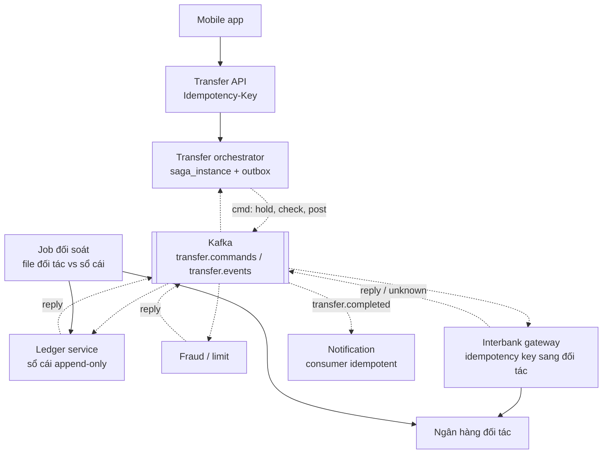

# Implement giai đoạn 2 — Dữ liệu và hệ phân tán (tuần 5–10): hướng dẫn học và bài tập

> **Technical details cho giai đoạn 2** của [lộ trình 6 tháng](00-lo-trinh-6-thang.md#giai-đoạn-2--dữ-liệu-và-hệ-phân-tán-tuần-510).
> Đây là giai đoạn phân biệt senior với mid-level: dữ liệu chạy thế nào khi có nhiều node, nhiều
> service, và mạng chập chờn.
>
> Giai đoạn trước: [10 — Implement giai đoạn 1](10-implement-gd1-nen-tang.md) · Lời giải tham khảo
> đã chạy: [dist-lab/](dist-lab/) · Track P: [01](01-java-code-cham-duoi-tai-cao.md) · Track S: [02](02-ve-he-thong-100k-1m-10m.md)
>
> Kết thúc tuần 10 phải qua được [mốc kiểm tra](#mốc-tuần-10--tiêu-chí-qua-giai-đoạn). Giai đoạn sau:
> [30 — Implement giai đoạn 3](30-implement-gd3-microservices-cloud.md).

---

## 0. Trước khi bắt đầu

**Điều kiện vào:** đã qua [mốc tuần 4](10-implement-gd1-nen-tang.md#mốc-tuần-4--tiêu-chí-qua-giai-đoạn).
Riêng lab 3A (lost update) và lab 2 (Lua nguyên tử) là nền bắt buộc: giai đoạn này lặp lại đúng hai
ý đó ở quy mô nhiều service.

**Nhịp tuần** giữ như giai đoạn 1 (Thứ Hai đọc, Thứ Tư blog + bài tập lý thuyết, Thứ Sáu ôn + Track
P, Thứ Bảy lab, Chủ nhật Track S + đề bấm giờ + bài nói 2 phút). Giai đoạn này có **hai khối hai tuần**
(tuần 5–6 và 8–9): tuần đầu của khối dùng Thứ Bảy để dựng, tuần sau để đo và thử phá.

**Bản đồ 6 tuần:**

| Tuần | Chủ đề | Lab | Track P | Track S | Đề bấm giờ |
|---|---|---|---|---|---|
| 5–6 | Replication, partitioning, consistent hashing | 5A vòng băm, 5B mô phỏng quorum | Rà checklist 01 §6 trên code lab giai đoạn 1 | **V6**: Mini Core Transfer ở L2 (1M) | Key-value store, Distributed cache |
| 7 | Saga, outbox, idempotency, sổ cái kép | 7 saga có trạng thái lưu DB | P09 nhìn qua ranh giới saga | Phác V7 | Payment system, Digital wallet |
| 8–9 | Kafka sâu | **8 Spring Boot + Kafka + Postgres**: outbox, consumer idempotent, DLT | **P20** consumer chậm → rebalance storm | **V7**: payment/wallet có Kafka + Saga | Ad click aggregation |
| 10 | Đồng thuận, khoá phân tán, đồng hồ | 10 fencing token + job scheduler | — | Cập nhật V6 bằng số đo lab 8 | Hotel reservation, Distributed job scheduler |
| 9–10 | **Capstone khởi động** | Design doc v1 (tuần 9), dựng khung MVP (tuần 10) | | | |

**Thư mục bài làm** (tiếp tục `my-work/`):

```text
java-system-design/my-work/
├── w5-6-hashing/              lab 5A, 5B (Java thuần)
├── w7-saga/                   lab 7 (Spring Boot + Postgres)
├── w8-9-kafka-lab/            lab 8 (Spring Boot + Kafka + Postgres)
├── w10-coordination/          lab 10
├── capstone/
│   ├── design-doc.md          viết tuần 9, review tuần 10
│   └── adr/                   0001-…md, một quyết định một file
└── drawings/V6, V7
```

**Chạy Kafka không cần Docker** (đã làm đúng các lệnh này để đo số liệu trong file):

```bash
curl -O https://downloads.apache.org/kafka/4.1.2/kafka_2.13-4.1.2.tgz        # so với file .sha512 đi kèm
tar xzf kafka_2.13-4.1.2.tgz && cd kafka_2.13-4.1.2
bin/kafka-storage.sh format --standalone -t "$(bin/kafka-storage.sh random-uuid)" -c config/server.properties
bin/kafka-server-start.sh config/server.properties                            # localhost:9092
```

Kafka 4.x chỉ còn KRaft, không còn ZooKeeper. Có Docker thì dùng Testcontainers cho test tự động.
Postgres không cần Docker: [embedded-postgres](https://github.com/zonkyio/embedded-postgres) như
[dist-lab](dist-lab/) và module [05-postgres-depth](../katalon-prep/katalon-prep-java/05-postgres-depth/).

---

## Tuần 5–6 — Replication, partitioning, consistent hashing

### Đầu ra phải có cuối tuần 6

- [ ] Lab 5A: vòng băm có virtual node và hệ số nhân bản 3, có bảng đo số key phải chuyển.
- [ ] Lab 5B: mô phỏng quorum `N/W/R`, tái hiện được đọc cũ khi `R + W ≤ N`.
- [ ] Hai đề bấm giờ: **Distributed key-value store**, **Distributed cache**.
- [ ] Bản vẽ **V6**: Mini Core Transfer ở L2 (1M users), có đoạn "× 10 thì vỡ gì trước".
- [ ] Bài nói 2 phút: *"How does consistent hashing reduce data movement when you add a node?"*

### Đọc

| Buổi | Tài liệu | Phần |
|---|---|---|
| T2 tuần 5 | DDIA chương 5 *Replication* | Leader-follower, sync/async, failover, replication lag, multi-leader, leaderless, quorum |
| T2 tuần 6 | DDIA chương 6 *Partitioning* | Key range vs hash, hot spot, secondary index local/global, rebalancing |
| T4 | Alex Xu Vol 1 chương 5 *Consistent hashing*, chương 6 *Key-value store* | |
| T4 tuần 6 | Amazon, *Dynamo: Amazon's Highly Available Key-value Store* (2007) | Đọc phần 4 (kiến trúc). Đây là nguồn gốc của sloppy quorum, hinted handoff |
| Tùy chọn | Martin Kleppmann, bài giảng *Distributed Systems* (Cambridge, YouTube) | Các bài về replication và quorum |

### Ghi chú khái niệm

#### 5.1 Ba mô hình replication

| | Single-leader | Multi-leader | Leaderless |
|---|---|---|---|
| Ai nhận ghi | Một leader | Nhiều leader (thường mỗi region một) | Mọi replica |
| Xung đột ghi | Không có | **Có**, phải giải (LWW, merge, CRDT) | **Có**, giải bằng version + read repair |
| Ví dụ | Postgres, MySQL, Kafka partition | Ứng dụng offline-first, active-active đa region | Cassandra, DynamoDB (gốc Dynamo) |
| Hợp với sổ cái? | **Có** | Không, trừ khi chia dữ liệu để không bao giờ hai region cùng ghi một tài khoản | Không: LWW làm **mất** một lệnh ghi |

**Đồng bộ hay bất đồng bộ:** đồng bộ thì commit chờ replica xác nhận (thêm ~1–2 ms trong cùng
region, ~90 ms nếu replica ở Singapore còn leader ở Sydney), đổi lại không mất dữ liệu đã commit
khi leader chết. Bất đồng bộ thì nhanh, nhưng **failover có thể mất vài giây ghi cuối**.

**Ba dị thường do replication lag** (đọc từ follower): *read-your-writes* (không thấy cái mình vừa ghi),
*monotonic reads* (refresh thấy dữ liệu **lùi** về cũ hơn vì đọc trúng follower chậm hơn), *consistent
prefix* (thấy câu trả lời trước câu hỏi). Cách chữa read-your-writes đã có ở
[bài tập 3.4 giai đoạn 1](10-implement-gd1-nen-tang.md#bài-tập-tuần-3).

#### 5.2 Quorum `N, W, R`

```text
N  số bản sao của mỗi key      W  số bản phải xác nhận ghi      R  số bản phải trả lời đọc
R + W > N  → tập đọc và tập ghi luôn giao nhau → đọc thấy ít nhất một bản mới nhất
N=3, W=2, R=2: chịu được 1 node chết cho cả đọc lẫn ghi
```

**Quorum không cho linearizability.** Hai lệnh ghi đồng thời, giải bằng last-write-wins theo đồng
hồ, thì một lệnh **mất im lặng**. Ghi thất bại ở bước W (chỉ được 1/2) vẫn để lại bản ghi trên 1
replica, không rollback. *Sloppy quorum + hinted handoff* (Dynamo) tăng availability nhưng phá luôn
đảm bảo `R + W > N`.

#### 5.3 Partitioning và rebalancing

| Cách chia | Đọc theo khoảng | Phân bố | Rebalance |
|---|---|---|---|
| Theo khoảng khoá | **Tốt** | Dễ lệch (khoá theo thời gian dồn vào partition mới nhất) | Tách/gộp partition |
| `hash(key) mod N` | Mất | Đều | **Thảm hoạ**: đo được **80%** key phải chuyển khi 4 → 5 node |
| Vòng băm (consistent hashing) + vnode | Mất | Đều nếu đủ vnode | Chỉ ~1/(N+1) key chuyển: đo được **18,9%** với 100 vnode |
| Số partition cố định (Kafka, Redis Cluster 16.384 slot, Elasticsearch shard) | Mất | Đều | Chuyển **nguyên partition** giữa node; số partition phải chọn trước |

**Secondary index khi đã shard:** index *local* (mỗi shard index dữ liệu của mình, truy vấn theo
index phải hỏi **mọi** shard rồi gộp: *scatter-gather*) hoặc index *global* (index tự shard theo giá
trị được index; đọc nhanh, nhưng cập nhật index thường **bất đồng bộ**).

### Lab 5A — Vòng băm có virtual node (Thứ Bảy tuần 5)

1. Viết `ConsistentHash` với `add(node)`, `remove(node)`, `nodeFor(key)`, tham số số vnode. Dùng
   `TreeMap<Long, String>` và `tailMap` (hoặc `ceilingEntry`).
2. Đo với 1 triệu key `acct-0 … acct-999999`, 4 node, rồi thêm node thứ 5:
   tỉ lệ tải max/min giữa các node và % key đổi node. Làm với 1, 10, 100, 200 vnode, và với `mod N`.
3. Thêm **hệ số nhân bản 3**: `nodesFor(key, 3)` đi theo chiều kim đồng hồ, lấy 3 node **khác nhau**
   (bỏ qua vnode trùng node vật lý). Test: xoá một node chỉ làm thay đổi tập replica của các key mà
   node đó đang giữ.

<details markdown="1">
<summary><b>Số đo tham khảo (dist-lab, 1 triệu key, 4 → 5 node)</b></summary>

```text
hash mod N, 4 -> 5 node: 80.0% key phai chuyen
ring vnodes=  1: 4 node tai max/min = 6.77 (max 40.7%, ly tuong 25%) | them node 5:  9.1% key chuyen (ly tuong 20%)
ring vnodes= 10: 4 node tai max/min = 2.20 (max 35.9%, ly tuong 25%) | them node 5: 16.4% key chuyen (ly tuong 20%)
ring vnodes=100: 4 node tai max/min = 1.11 (max 26.7%, ly tuong 25%) | them node 5: 18.9% key chuyen (ly tuong 20%)
ring vnodes=200: 4 node tai max/min = 1.19 (max 27.9%, ly tuong 25%) | them node 5: 19.8% key chuyen (ly tuong 20%)
```

Hai điều đọc ra: **1 vnode** thì một node gánh 40,7% (gấp 1,6 lần lý tưởng) và node mới chỉ nhận
9,1% thay vì 20%: vnode tồn tại để làm đều. **200 vnode lệch hơn 100** (1,19 so với 1,11): với một
hàm băm cố định, số vnode lớn hơn **không đảm bảo** đều hơn ở một cấu hình cụ thể, chỉ đều hơn **về
kỳ vọng**. Code: [`ConsistentHash.java`](dist-lab/src/main/java/com/prep/dist/ConsistentHash.java).

</details>

### Lab 5B — Mô phỏng quorum (Thứ Bảy tuần 6)

Không có lời giải tham khảo; tự viết, đây là bài kiểm tra hiểu bài.

- 3 replica trong bộ nhớ, mỗi replica lưu `(value, version)`. Ghi: tăng version, gửi tới cả 3, thành
  công khi đủ W xác nhận. Đọc: hỏi R replica, lấy bản có version lớn nhất.
- Bơm lỗi: một replica "chết" (không trả lời), một replica "chậm" (nhận ghi sau khi đọc đã xong).
- Test: `R=2, W=2` luôn đọc được giá trị mới nhất; `R=1, W=1` tái hiện được đọc cũ; hai lệnh ghi
  đồng thời giải bằng LWW theo đồng hồ lệch nhau 20 ms → **một lệnh mất**, test phải chỉ ra lệnh nào.
- Thêm *read repair*: khi đọc thấy replica cũ thì ghi bản mới vào nó. Đo: sau 1.000 lần đọc, bao
  nhiêu replica cũ đã được sửa.

### Track P tuần 5–6

Không có anti-pattern mới. Dùng 30 phút Thứ Sáu chạy [checklist 01 §6](01-java-code-cham-duoi-tai-cao.md#6-checklist-review-code-trước-khi-lên-tải)
trên code lab giai đoạn 1 của chính bạn (rate limiter, db-lab, cache-lab). Mỗi dòng "có" ghi vào sổ
lỗi kèm cách sửa. Đây là tập dượt cho lần review capstone ở tuần 15–16.

### Track S tuần 5–6 — V6: Mini Core Transfer ở L2 (Chủ nhật tuần 6, 30 phút)

Vẽ lại V2 (L1, 100k) cho **1M users**: ~12.000 CCU và ~2.000 RPS ngày lương, ghi ~150/giây. Phải có:
read replica và cách xử lý read-your-writes, cache-aside cho số dư hiển thị, outbox → broker cho thông
báo, và một đoạn trả lời câu "× 10" theo [khung 5 câu](02-ve-he-thong-100k-1m-10m.md#5-câu-hỏi-tải-tăng-10-lần-thì-sao--cách-trả-lời).
So với [02 §3.3](02-ve-he-thong-100k-1m-10m.md#33-l2--1m-users-tách-đọc-tách-việc-chậm).

<details markdown="1">
<summary><b>Đáp án đoạn "× 10" của V6</b></summary>

```text
1. Số mới:     2.000 → 20.000 RPS; ghi 150 → 1.500/giây; 12k → 120k CCU.
2. Vỡ trước:   connection tới Postgres primary: 80 pod × 10 = 800, xa quá mức primary chịu được;
               ngay sau đó là CPU primary vì đọc lịch sử vẫn có phần chạy trên primary (read-your-writes).
3. Sửa:        PgBouncer transaction pooling; đẩy lịch sử sang read model (CQRS) qua CDC;
               đánh đổi là read model trễ vài trăm ms và thêm một hệ thống phải vận hành.
4. Vỡ tiếp:    1.500 ghi/giây vẫn vừa một primary, nhưng bảng sổ cái 650 GB/năm làm VACUUM và index chậm
               → partition theo tháng.
5. Chưa làm:   chưa shard theo account_id, vì ghi còn dư nhiều lần so với trần một primary;
               shard thì chuyển tiền giữa hai shard thành saga, đắt hơn hẳn.
```

</details>

### Bài tập tuần 5–6

**5.1 — Đồng bộ hay bất đồng bộ?** Ngân hàng có leader ở Sydney. Phương án (a) replica đồng bộ ở
Melbourne (RTT ~12 ms); (b) replica đồng bộ ở Singapore (RTT ~90 ms); (c) đồng bộ trong cùng region
khác AZ (~1–2 ms) + bất đồng bộ sang Melbourne. Mỗi phương án: latency commit thêm, mất gì khi mất
cả region Sydney?

<details markdown="1">
<summary><b>Đáp án 5.1</b></summary>

(a) +12 ms mỗi commit, mất region không mất giao dịch đã commit (RPO = 0). (b) +90 ms mỗi commit:
lệnh chuyển tiền p99 300 ms mất 1/3 ngân sách chỉ vì commit, thường không chấp nhận. (c) +1–2 ms, mất
AZ không mất gì; mất **cả region** thì mất vài giây ghi cuối chưa sang Melbourne (RPO tính bằng giây)
và cần quy trình đối soát những giao dịch đó. Ngân hàng thường chọn (c) cho phần lớn dữ liệu và chỉ
dùng (a) cho dữ liệu không được mất một dòng nào, chấp nhận chậm hơn.

</details>

**5.2 — Quorum.** (a) `N=3, W=2, R=2`: chịu được bao nhiêu node chết cho ghi, cho đọc? (b) `N=5, W=3,
R=3`? (c) Một hệ thống chọn `W=1, R=1` cho nhanh. Khi nào chấp nhận được, khi nào không?

<details markdown="1">
<summary><b>Đáp án 5.2</b></summary>

(a) Ghi chịu 1 node chết (còn 2 ≥ W), đọc chịu 1. (b) Chịu 2 cho cả hai. (c) `R + W = 2 ≤ 3`: có thể
đọc cũ. Chấp nhận cho dữ liệu mà đọc cũ vài giây vô hại (lượt xem, trạng thái online, giỏ hàng); không
chấp nhận cho thứ ra quyết định dựa trên giá trị đọc được (số dư, tồn kho, hạn mức).

</details>

**5.3 — Failover nguy hiểm.** Postgres replication bất đồng bộ, leader chết, follower trễ 2 giây được
tự động đẩy lên làm leader. ID giao dịch là `bigserial`. Một service khác đã cache dữ liệu theo ID.
Chuyện gì có thể xảy ra?

<details markdown="1">
<summary><b>Đáp án 5.3</b></summary>

Leader mới không có 2 giây ghi cuối, nên sequence của nó **cấp lại** những ID đã dùng. Bản ghi mới
mang ID cũ, trong khi cache và hệ thống khác vẫn giữ dữ liệu cũ theo ID đó: hai giao dịch khác nhau
cùng một ID, có thể hiển thị dữ liệu của khách này cho khách khác. DDIA chương 5 kể một sự cố thật
cùng dạng (follower MySQL lỗi thời được đẩy lên ở GitHub). Chống: ID không phụ thuộc DB
(Snowflake/UUID, [lab 3B](10-implement-gd1-nen-tang.md#lab-3b--snowflake-id-generator-thứ-bảy-1-giờ)),
không tự động failover sang replica trễ cho dữ liệu tiền, và đối soát sau mỗi lần failover.

</details>

**5.4 — Shard key cho bảng giao dịch, có hot account.** Bảng giao dịch shard theo `hash(account_id)`.
Một merchant lớn chiếm 30% số giao dịch. Vấn đề gì, sửa thế nào?

<details markdown="1">
<summary><b>Đáp án 5.4</b></summary>

Shard chứa merchant gánh 30% tải ghi và bị tranh khoá trên **một dòng số dư**. Ba cách theo thứ tự:
(1) sổ cái append-only, số dư tính từ bút toán, nên không còn dòng số dư nào bị tranh
([06 Phần II](../katalon-prep/katalon-system-design/06-race-condition-balance-ledger.md));
(2) chia merchant thành N **tài khoản con** (salting), ghi rải vào N tài khoản, số dư là tổng; số liệu
đo ở [03-system-design §3](../katalon-prep/katalon-prep-common/03-system-design.md) cho thấy phải
salt **≥ 16 lần số partition** thì mới đều; (3) gom bút toán theo lô ngắn (vài trăm ms) cho tài khoản
nóng. Đánh đổi của (2) và (3): số dư của merchant không còn là một con số đọc trực tiếp.

</details>

**5.5 — Tìm theo mã tham chiếu.** Shard theo `account_id`. Tổng đài cần "tìm giao dịch theo mã tham
chiếu ngân hàng đối tác" trên mọi tài khoản. Hai phương án và đánh đổi?

<details markdown="1">
<summary><b>Đáp án 5.5</b></summary>

Index local + scatter-gather: hỏi mọi shard, latency bằng shard chậm nhất, tải nhân theo số shard;
chấp nhận được nếu tần suất thấp (tổng đài). Index global (bảng `reference → (account_id, txn_id)`
shard theo reference, hoặc OpenSearch nạp qua CDC): đọc một chỗ, nhưng cập nhật bất đồng bộ nên giao
dịch vừa tạo có thể chưa tìm được vài giây. Với tổng đài ngân hàng: index global qua CDC, kèm thông
báo "giao dịch dưới 1 phút có thể chưa hiện".

</details>

**5.6 — Rebalance.** Cluster 4 node, 1 triệu key. Thêm node thứ 5. So số key phải chuyển với: `mod N`,
vòng băm 100 vnode, 256 partition cố định chia đều cho node.

<details markdown="1">
<summary><b>Đáp án 5.6</b></summary>

`mod N`: ~80% (đo được 80,0%). Vòng băm 100 vnode: ~20% (đo được 18,9%). 256 partition cố định:
node mới nhận ~51 partition (256 ÷ 5), tức ~20% key, nhưng chuyển **theo nguyên partition** nên dễ
quản lý, theo dõi tiến độ, và giới hạn băng thông chuyển. Kafka, Redis Cluster, Elasticsearch đều
chọn cách thứ ba; đánh đổi là số partition phải đủ lớn ngay từ đầu.

</details>

**5.7 — Đề bấm giờ: Distributed key-value store** (45 phút, Chủ nhật tuần 5).

<details markdown="1">
<summary><b>Khung lời giải</b></summary>

| Thành phần | Chọn | Đánh đổi là… |
|---|---|---|
| Chia dữ liệu | Vòng băm + vnode | Mất truy vấn theo khoảng |
| Nhân bản | N=3, mỗi bản ở một AZ, chọn theo chiều kim đồng hồ | Gấp 3 dung lượng |
| Nhất quán | Quorum W/R chỉnh được theo từng request | Mặc định `W=2, R=2`: chậm hơn `W=1` |
| Xung đột | Version (vector clock) trả cả các bản xung đột cho client, hoặc LWW nếu chấp nhận mất | Vector clock đẩy việc gộp sang client |
| Node tạm chết | Sloppy quorum + hinted handoff | Phá đảm bảo `R + W > N` trong lúc sự cố |
| Đồng bộ lại | Read repair + anti-entropy bằng Merkle tree | Merkle tree phải tính lại khi dải khoá đổi chủ |
| Thành viên | Gossip + phát hiện lỗi theo heartbeat | Hội tụ chậm vài giây |
| Lưu trữ trên node | LSM: commit log → memtable → SSTable + bloom filter | Compaction tốn I/O |

</details>

**5.8 — Đề bấm giờ: Distributed cache** (45 phút, Chủ nhật tuần 6).

<details markdown="1">
<summary><b>Khung lời giải</b></summary>

Redis Cluster: 16.384 hash slot chia cho các master, mỗi master một replica khác AZ; client biết bản
đồ slot và gọi thẳng node (redirect `MOVED` khi bản đồ đổi). Resharding = chuyển slot. Ba câu đào sâu
hay gặp: **hot key** (L1 Caffeine trước Redis, hoặc nhân bản key), **stampede** (đã làm ở
[lab 4](10-implement-gd1-nen-tang.md#lab-4--cache-hai-tầng-và-stampede-thứ-bảy-34-giờ)), **failover
mất ghi** (replication Redis bất đồng bộ: master chết thì mất vài ghi cuối, nên cache không bao giờ
là nơi lưu chính của dữ liệu tiền). Đánh đổi chung: thao tác nhiều khoá chỉ được khi các khoá cùng
slot (dùng hash tag `{account:42}`).

</details>

### Bài nói 2 phút

*"How does consistent hashing reduce data movement when you add a node?"* Phải có: vì sao `mod N`
chuyển ~80% key (số đo), vòng băm chỉ chuyển phần của node mới (~1/(N+1)), virtual node để chia đều
(1 vnode lệch 6,8 lần), và câu đánh đổi: mất truy vấn theo khoảng, phải quản lý bản đồ vòng.

---

## Tuần 7 — Transaction phân tán: Saga, outbox, idempotency, sổ cái kép

### Đầu ra phải có cuối tuần

- [ ] Lab 7: saga orchestrator lưu trạng thái trong Postgres, bù đúng thứ tự, tiếp tục được sau khi
      crash, mỗi bước idempotent.
- [ ] Hai đề bấm giờ: **Payment system**, **Digital wallet**.
- [ ] Query kiểm tra bất biến của sổ cái kép (bài tập 7.6) chạy được trên dữ liệu lab.
- [ ] Bài nói 2 phút: *"Why wouldn't you use two-phase commit between microservices?"*

### Đọc

| Buổi | Tài liệu | Phần |
|---|---|---|
| Thứ Hai | Microservices Patterns (Chris Richardson) chương 4 *Managing transactions with sagas*; chương 3 phần *transactional outbox* | Orchestration/choreography, loại bước, biện pháp bù thiếu isolation |
| Thứ Tư | Alex Xu Vol 2 chương 11 *Payment system*, chương 12 *Digital wallet* | |
| Thứ Sáu | [nab-prep/04 — Kafka, event-driven, Saga](../nab-prep/04-kafka-event-driven-saga.md) | Câu hỏi đích danh của vòng EM ở NAB |
| Chủ nhật | [06 Phần II — thiết kế lại sổ cái](../katalon-prep/katalon-system-design/06-race-condition-balance-ledger.md) | Đổi định nghĩa để race biến mất |

### Ghi chú khái niệm

#### 7.1 Vì sao không 2PC giữa microservices

2PC giữ khoá trên **mọi** service trong suốt hai pha, qua mạng; coordinator chết giữa hai pha thì các
bên **treo** với khoá đang giữ; availability của cả giao dịch là **tích** availability từng bên (5
service 99,9% → 99,5%); Kafka, phần lớn NoSQL và API REST của đối tác không tham gia 2PC được. Saga đổi
**nhất quán tức thời** lấy **nhất quán cuối cùng + bù trừ**, và phải tự xử lý phần thiếu isolation.

#### 7.2 Orchestration hay choreography

| | Orchestration | Choreography |
|---|---|---|
| Ai điều khiển | Một orchestrator gửi lệnh, nhận phản hồi, lưu trạng thái | Mỗi service nghe sự kiện và tự làm bước của mình |
| Nhìn luồng ở đâu | Một chỗ (bảng trạng thái saga) | Rải khắp các service, phải dựng lại từ log/trace |
| Hợp với | Luồng tiền nhiều bước, cần bù chính xác (chuyển tiền liên ngân hàng) | Fan-out đơn giản, ít bù (thông báo, cập nhật read model) |
| Rủi ro | Orchestrator thành "god service" | Vòng lặp sự kiện, khó biết saga đang ở đâu |

#### 7.3 Ba loại bước và thứ tự

- **Compensatable**: có hành động bù (giữ tiền ↔ nhả tiền).
- **Pivot**: điểm không quay lại; sau bước này saga **phải** đi tới cùng (gửi lệnh sang ngân hàng đối
  tác, trừ thẻ).
- **Retriable**: sau pivot, chắc chắn thành công nếu retry đủ (ghi sổ cái cuối, gửi thông báo).

Thứ tự đúng: compensatable → pivot → retriable. Đặt bước có thể thất bại **sau** pivot là tự tạo ra
trạng thái không bù được.

**Saga thiếu isolation**, nên cần biện pháp đối phó: *semantic lock* (trạng thái `PENDING`/giữ tiền
để luồng khác biết), cập nhật giao hoán (cộng/trừ thay vì ghi đè), đọc lại giá trị trước khi ghi.

#### 7.4 Dual write và outbox

`db.save(transfer); kafka.send(event);` là **hai** hệ thống, hỏng được ở giữa: DB commit mà event mất,
hoặc event đi mà DB rollback. Outbox: ghi event vào **bảng outbox trong cùng transaction** với dữ liệu
nghiệp vụ, rồi một relay đọc bảng đó và gửi đi.

| | Polling relay (lab 8) | CDC (Debezium đọc WAL) |
|---|---|---|
| Hạ tầng | Không thêm gì | Kafka Connect + Debezium, quyền đọc replication slot |
| Độ trễ | Bằng chu kỳ poll (100–500 ms) | Vài chục ms |
| Tải DB | Query poll liên tục | Đọc WAL, gần như không thêm |
| Thứ tự | Chỉ giữ được khi **một** relay (xem lab 8 bước 7) | Theo thứ tự commit |

Cả hai đều **at-least-once**: relay gửi xong rồi chết trước khi đánh dấu thì gửi lại. Vì vậy consumer
**luôn** phải idempotent.

#### 7.5 Idempotency ở ba tầng

1. **API**: `Idempotency-Key` (giai đoạn 1, bài 2.4).
2. **Consumer**: bảng `processed_event(event_id primary key)`, insert **trong cùng transaction** với
   tác dụng phụ (lab 8).
3. **Gọi ra ngoài**: gửi kèm khoá idempotency sang đối tác (ngân hàng, PSP), để khi timeout còn hỏi
   lại được "lệnh này đã xử lý chưa" thay vì gửi lần hai.

#### 7.6 Sổ cái kép (double-entry)

Mỗi giao dịch sinh ít nhất hai bút toán, tổng bằng 0. Bút toán **chỉ thêm**, không sửa, không xoá;
sai thì ghi bút toán đảo. Số dư là tổng bút toán (hoặc một cột được duy trì cùng transaction và
**đối soát** với tổng bút toán).

### Lab 7 — Saga chuyển tiền liên ngân hàng (Thứ Bảy, 3–4 giờ)

Project `my-work/w7-saga`: Spring Boot + Postgres. Năm bước:

| # | Bước | Loại | Bù |
|---|---|---|---|
| 1 | Giữ tiền (`available -= x`, `held += x`) | Compensatable | Nhả tiền |
| 2 | Kiểm tra gian lận / hạn mức | Compensatable (chỉ đọc) | Không làm gì |
| 3 | Gửi lệnh sang ngân hàng đối tác **kèm idempotency key** | **Pivot** | — |
| 4 | Ghi sổ cái chính thức (`held -= x`, hai bút toán) | Retriable | — |
| 5 | Gửi thông báo | Retriable | — |

**Bắt buộc:**

- Bảng `saga_instance(id, type, state, current_step, payload jsonb, version, updated_at)`. Mỗi bước
  chạy trong transaction riêng và cập nhật `current_step` **cùng transaction** với tác dụng phụ của
  bước. Không gọi đối tác bên trong transaction nào (P09).
- **Recovery job** chạy mỗi 10 giây: saga nào `updated_at` quá 30 giây mà chưa ở trạng thái cuối thì
  chạy tiếp từ `current_step`. Vì vậy mỗi bước phải chạy lại an toàn.
- Bước 3 timeout **không** được bù mù: kết quả không rõ. Hỏi lại đối tác bằng idempotency key; chỉ bù
  khi đối tác xác nhận "chưa nhận".

**Test:**

| Test | Assert |
|---|---|
| `happyPath` | Trạng thái `COMPLETED`, sổ cái có 2 bút toán tổng 0, `held = 0` |
| `fraudRejects_releasesHold` | Bước 2 từ chối → bù bước 1, `available` về như cũ |
| `partnerRejects_compensatesInReverse` | Bước 3 trả "từ chối" → bù 2 rồi 1, theo đúng thứ tự |
| `partnerTimeout_queriesBeforeCompensating` | Timeout ở bước 3, đối tác thật ra đã nhận → saga đi tiếp, **không** bù |
| `crashAfterStep3_recoveryResumes` | Giết tiến trình sau bước 3 (ném lỗi trước khi bước 4 chạy), recovery job chạy tiếp, không gửi bước 3 lần hai |
| `duplicateCommand_singleSaga` | Cùng idempotency key gửi 2 lần → 1 saga |

<details markdown="1">
<summary><b>Khung tối giản đã chạy (trong bộ nhớ, chưa lưu DB)</b></summary>

[`Saga.java`](dist-lab/src/main/java/com/prep/dist/Saga.java) chỉ chứng minh phần lõi: chạy từng bước,
lỗi thì bù theo thứ tự **ngược**. Phần khó của lab (lưu trạng thái, recovery, pivot timeout) là việc
của bạn.

```java
public static Outcome execute(List<Step> steps) {
    List<String> log = new ArrayList<>();
    Deque<Step> done = new ArrayDeque<>();
    for (Step s : steps) {
        try {
            s.run(); done.push(s); log.add("OK   " + s.name());
        } catch (RuntimeException e) {
            log.add("FAIL " + s.name() + ": " + e.getMessage());
            while (!done.isEmpty()) { Step c = done.pop(); c.compensate(); log.add("UNDO " + c.name()); }
            return new Outcome(Status.COMPENSATED, log);
        }
    }
    return new Outcome(Status.COMPLETED, log);
}
```

```text
COMPLETED   [OK reserve 300 tu vi, OK fraud check, OK credit merchant 300, OK gui thong bao] -> vi=700 merchant=300
COMPENSATED [OK reserve 300 tu vi, OK fraud check, FAIL credit merchant 300: merchant bank timeout,
             UNDO fraud check, UNDO reserve 300 tu vi]                                       -> vi=1000 merchant=0
```

</details>

### Track P tuần 7 — P09 nhìn qua ranh giới saga

[P09](01-java-code-cham-duoi-tai-cao.md#p09--gọi-http-ra-ngoài-bên-trong-transactional-) nói "đừng gọi
HTTP trong `@Transactional`". Saga là cách làm điều đó **đúng** cho luồng tiền: mỗi bước một
transaction ngắn, lời gọi ra ngoài nằm **giữa** hai transaction, và trạng thái saga thay cho "một
transaction dài" về mặt nghiệp vụ. Bài tập: viết lại đoạn `transfer()` ở P09 thành 3 bước saga, chỉ
rõ transaction nào giữ khoá dòng nào, trong bao lâu.

### Track S tuần 7

Phác V7 (sẽ hoàn thiện ở tuần 8–9): luồng lệnh và sự kiện giữa orchestrator, ledger, fraud, cổng ngân
hàng đối tác, notification. Chỉ cần đúng các mũi tên và chỗ nào là pivot.

### Bài tập tuần 7

**7.1 — Sắp thứ tự bước.** Nạp tiền vào ví bằng thẻ: (a) tạo bản ghi nạp `PENDING`; (b) trừ thẻ qua
PSP; (c) cộng ví; (d) gửi email hoá đơn; (e) kiểm tra hạn mức nạp trong ngày. Bước nào là pivot? Thứ tự?

<details markdown="1">
<summary><b>Đáp án 7.1</b></summary>

Thứ tự: (a) → (e) → **(b) pivot** → (c) → (d). (a) và (e) là compensatable (huỷ bản ghi, không có gì
để bù). Trừ thẻ là pivot: sau khi tiền đã rời thẻ, saga phải đi tới cùng. (c) phải là retriable: cộng
ví idempotent theo id lần nạp, retry tới khi thành công. Đặt (e) sau (b) là sai: vượt hạn mức sau khi
đã trừ thẻ thì phải hoàn tiền thẻ, một thao tác chậm, có phí, và khách thấy hai dòng trên sao kê.

</details>

**7.2 — Thiếu isolation.** Saga chuyển 5 triệu đang chạy (đã giữ tiền, chờ đối tác). Khách mở app xem
số dư và thử chuyển tiếp 8 triệu từ số dư 10 triệu. App hiển thị gì, lệnh thứ hai được không?

<details markdown="1">
<summary><b>Đáp án 7.2</b></summary>

Tách hai con số: **số dư sổ cái** 10 triệu (chưa có bút toán), **số dư khả dụng** 5 triệu (đã trừ phần
giữ). App hiển thị cả hai ("khả dụng 5.000.000, đang xử lý 5.000.000"). Lệnh 8 triệu kiểm tra trên số
dư **khả dụng** nên bị từ chối. Đây là *semantic lock*: trạng thái giữ tiền cho các luồng khác biết có
một saga đang chạy.

</details>

**7.3 — Pivot timeout.** Bước gửi sang ngân hàng đối tác timeout sau 3 giây. Ba phương án: (a) bù
ngay (nhả tiền); (b) retry gửi lại; (c) khác. Chọn gì?

<details markdown="1">
<summary><b>Đáp án 7.3</b></summary>

(a) sai: đối tác có thể đã nhận và chuyển tiền đi, nhả tiền là **mất tiền**. (b) chỉ an toàn khi gửi
lại **cùng idempotency key** và đối tác hỗ trợ khử trùng. (c) đúng: chuyển saga sang `UNKNOWN`, hỏi
trạng thái theo idempotency key với backoff; vẫn không rõ sau N lần thì đưa vào hàng đợi **đối soát**
(file đối soát cuối ngày của đối tác) và báo khách "đang xử lý". Câu này gần như chắc chắn bị hỏi ở
phỏng vấn ngân hàng.

</details>

**7.4 — Chọn kiểu.** Orchestration hay choreography cho: (a) chuyển tiền liên ngân hàng; (b) sau khi
giao dịch hoàn tất thì cập nhật điểm thưởng, gửi thông báo, cập nhật read model tìm kiếm; (c) mở tài
khoản (eKYC, tạo tài khoản core, cấp thẻ ảo, gửi email chào mừng).

<details markdown="1">
<summary><b>Đáp án 7.4</b></summary>

(a) Orchestration: nhiều bước, có pivot, bù phải chính xác, cần nhìn trạng thái một chỗ. (b)
Choreography: các bên độc lập, không ai cần bù cho ai, publish một sự kiện `transfer.completed` là đủ.
(c) Orchestration cho eKYC → tạo tài khoản → cấp thẻ (có thứ tự và bù), rồi choreography cho email
chào mừng và các việc phụ sau đó.

</details>

**7.5 — Đề bấm giờ: Payment system** (45 phút).

<details markdown="1">
<summary><b>Khung lời giải</b></summary>

```text
Client → Payment API (Idempotency-Key) → Payment service: tạo payment CREATED
      → Payment executor → PSP (kèm idempotency key, trang thanh toán do PSP host: không chạm số thẻ)
      → webhook/poll kết quả → SUCCEEDED / FAILED → Ledger (double-entry) → Wallet → outbox → thông báo
Đối soát: file settlement của PSP mỗi ngày so với sổ cái; lệch thì vào hàng đợi xử lý tay
```

Ba điểm đào sâu: **exactly-once** = retry at-least-once + idempotency key ở cả hai đầu; **kết quả
không rõ** (như 7.3); **đối soát** là thứ chứng minh hệ thống đúng, không phải "tin code". Không lưu
số thẻ để khỏi gánh toàn bộ phạm vi PCI DSS.

</details>

**7.6 — Bất biến sổ cái.** Viết query kiểm tra (a) mọi giao dịch có tổng bút toán bằng 0; (b) số dư
lưu trong `account` khớp với tổng bút toán.

<details markdown="1">
<summary><b>Đáp án 7.6</b></summary>

```sql
-- (a) phải trả về rỗng
select transfer_id, sum(amount) from ledger_entry group by transfer_id having sum(amount) <> 0;

-- (b) phải trả về rỗng (opening_balance là số dư lúc mở/chốt kỳ)
select a.id, a.balance, a.opening_balance + coalesce(sum(e.amount), 0) as from_ledger
from account a left join ledger_entry e on e.account_id = a.id
group by a.id, a.balance, a.opening_balance
having a.balance <> a.opening_balance + coalesce(sum(e.amount), 0);
```

Chạy (a) và (b) như một **job đối soát** mỗi giờ, alert khi khác rỗng. Lab outbox ở tuần 8–9 in đúng
hai con số này sau khi chạy (`sum(ledger) = 0`, tổng số dư không đổi).

</details>

**7.7 — Digital wallet: khi nào cần thứ phức tạp.** Alex Xu Vol 2 thiết kế ví cho **1 triệu giao dịch/giây**
bằng event sourcing và state machine nhân bản qua Raft. Mini Core Transfer ở L2 có ~25 giao dịch/giây
ngày lương (L3: ~250). Trả lời trong 3 câu: bạn dùng gì, vì sao chưa cần thứ của sách.

<details markdown="1">
<summary><b>Đáp án 7.7</b></summary>

Postgres + sổ cái append-only + outbox: 250 giao dịch/giây × 6 ghi = 1.500 ghi/giây, vừa một primary.
Event sourcing + Raft giải bài toán **vượt trần một primary** bằng cách chia tài khoản ra nhiều
partition và tự nhân bản trạng thái; ta còn cách trần đó vài bậc. Ghi rõ ngưỡng chuyển: khi ghi chạm
~50–70% năng lực primary đo được, hoặc khi cần replay lịch sử để dựng lại trạng thái (yêu cầu audit).

</details>

### Bài nói 2 phút

*"Why wouldn't you use two-phase commit between microservices?"* Phải có: khoá giữ qua mạng, coordinator
chết thì treo, availability nhân lên, nhiều hệ thống không tham gia được; thay bằng saga + outbox +
idempotency; và câu đánh đổi: mất isolation, phải có trạng thái `PENDING` và đối soát.

---

## Tuần 8–9 — Kafka sâu, lab outbox + consumer idempotent, P20

### Đầu ra phải có cuối tuần 9

- [ ] Lab 8: Spring Boot + Kafka + Postgres, 7 test (bảng dưới), có test **tái hiện** gửi trùng do
      relay crash và chứng minh consumer chỉ áp dụng một lần.
- [ ] Đã chạy D20 (P20) và sửa một consumer trong lab theo một trong hai cách.
- [ ] Bản vẽ **V7**: payment/wallet có Kafka + Saga.
- [ ] Đề bấm giờ: **Ad click aggregation**.
- [ ] **Capstone: design doc v1** (mẫu ở [§Capstone](#capstone-khởi-động--tuần-910)).
- [ ] Bài nói 2 phút: *"How do you get exactly-once processing with Kafka and a database?"*

### Đọc

| Buổi | Tài liệu | Phần |
|---|---|---|
| T2 tuần 8 | Kafka: The Definitive Guide, 2nd ed. (Shapira và cộng sự) chương 3 *Producers*, 4 *Consumers* | Partition key, consumer group, commit offset |
| T2 tuần 9 | Cùng sách, chương 6 *Kafka Internals*, 7 *Reliable Data Delivery*, 8 *Exactly-Once Semantics* | ISR, `acks`, idempotent producer, transaction |
| T4 tuần 8 | Alex Xu Vol 2 chương 4 *Distributed message queue* | Tự thiết kế lại Kafka ở mức khái niệm |
| T4 tuần 9 | Alex Xu Vol 2 chương 6 *Ad click event aggregation*; DDIA chương 11 *Stream Processing* (phần window, thời gian) | |
| T6 | [01 P20](01-java-code-cham-duoi-tai-cao.md#p20--kafka-consumer-xử-lý-đồng-bộ-từng-message-) | Kèm chạy D20 |

### Ghi chú khái niệm

#### 8.1 Thứ tự chỉ tồn tại trong một partition

Cùng key → cùng partition → đúng thứ tự. Chọn key = **thực thể cần thứ tự** (`account_id` cho sự kiện
tài khoản). Tăng số partition làm `hash(key) mod partitions` đổi, sự kiện mới của một key sang
partition khác trong khi sự kiện cũ còn ở partition cũ: **thứ tự vỡ** trong lúc chuyển. Nên chọn số
partition đủ lớn từ đầu (theo số consumer tối đa dự kiến).

#### 8.2 Độ bền ghi

| Cấu hình | Mất dữ liệu khi |
|---|---|
| `acks=1` | Leader ghi xong, chết trước khi follower kịp chép |
| `acks=all`, `replication.factor=3`, `min.insync.replicas=2` | Phải mất 2/3 broker cùng lúc. **Cấu hình chuẩn cho tiền** |
| Thêm `unclean.leader.election.enable=false` (mặc định) | Không cho replica tụt hậu lên làm leader: thà ngừng ghi còn hơn mất |

Idempotent producer bật **mặc định** từ Kafka 3.0: broker khử trùng khi producer retry. Nó chỉ chống
trùng **do retry của producer**, không chống được trùng do relay outbox chết rồi chạy lại.

#### 8.3 Ba mức giao nhận

| Mức | Cách làm | Hậu quả |
|---|---|---|
| At-most-once | Commit offset **trước** khi xử lý | Crash giữa chừng → **mất** message |
| At-least-once | Commit offset **sau** khi xử lý | Crash giữa chừng → xử lý **lại** |
| "Exactly-once" có DB | At-least-once **+ consumer idempotent** (dedup trong cùng transaction với tác dụng phụ) | Đúng một lần **về hiệu quả** |

Kafka transaction (`isolation.level=read_committed`) cho exactly-once **trong Kafka** (đọc topic A,
ghi topic B, commit offset cùng một transaction). Có ghi vào Postgres thì vẫn cần idempotency ở DB.

#### 8.4 Consumer group, rebalance, `max.poll.interval.ms`

Consumer phải gọi `poll()` lại trước `max.poll.interval.ms` (mặc định 300 s), nếu không broker coi nó
đã chết, chia partition cho consumer khác, và lần commit của nó thất bại. Xử lý một lô
`max.poll.records` (mặc định 500) càng lâu càng dễ vượt. Đây chính là P20, có số đo bên dưới.
Kafka 4.0 đưa giao thức consumer group mới (KIP-848) lên GA, rebalance do broker điều phối và không
dừng cả group; nhưng giới hạn thời gian giữa hai lần poll vẫn còn.

#### 8.5 Retry, DLT, backpressure

- **Poison message** (không bao giờ xử lý được): retry vài lần có backoff rồi chuyển sang **dead-letter
  topic** kèm header lỗi, để partition không kẹt mãi ở một offset.
- **Lỗi tạm thời** (downstream chết): đừng đẩy vào DLT ngay. `pause()` partition, chờ, `resume()`; hoặc
  retry topic có độ trễ.
- **Backpressure**: consumer không được nhận nhanh hơn downstream chịu được. Giới hạn bằng
  `max.poll.records` và một executor **có giới hạn** (P13), không phải một `BlockingQueue` vô hạn.

#### 8.6 Stream processing — đủ để nói chuyện

Window *tumbling* (1 phút không chồng), *hopping* (5 phút trượt mỗi 1 phút), *session* (theo khoảng
lặng). **Event time** (lúc click xảy ra) khác **processing time** (lúc hệ thống thấy); gom theo event
time, dùng *watermark* để quyết khi nào đóng window, và có chính sách cho *late event* (cập nhật lại
window đã đóng, hoặc đưa vào bảng đối soát).

### Lab 8 — Spring Boot + Kafka + Postgres (Thứ Bảy tuần 8 và 9)

Project `my-work/w8-9-kafka-lab`: `spring-boot-starter-web`, `spring-kafka`, `spring-boot-starter-jdbc`,
Postgres. Bản lõi không Spring, **đã chạy với Postgres 16.4 và Kafka 4.1.2 thật**, là
[`OutboxLab.java`](dist-lab/src/main/java/com/prep/dist/OutboxLab.java); dùng nó để đối chiếu, không
để chép.

**Bước 1 — Schema** (giống bản đã chạy):

<details markdown="1">
<summary><b>schema.sql</b></summary>

```sql
create table account(id bigint primary key, balance bigint not null check (balance >= 0));
create table transfer(id uuid primary key, from_acc bigint not null, to_acc bigint not null, amount bigint not null);
create table ledger_entry(id bigserial primary key, transfer_id uuid not null, account_id bigint not null, amount bigint not null);
create table outbox(
    id bigserial primary key,
    event_id uuid not null unique,
    topic text not null,
    msg_key text not null,
    payload text not null,
    created_at timestamptz not null default now(),
    published_at timestamptz);
create index outbox_pending on outbox(id) where published_at is null;      -- partial index: chỉ dòng chưa gửi
create table processed_event(event_id uuid primary key, processed_at timestamptz not null default now());
create table notification(id bigserial primary key, transfer_id uuid not null, account_id bigint not null, body text not null);
```

</details>

**Bước 2 — Ghi nghiệp vụ và outbox trong một transaction.** `TransferService.transfer()` với
`@Transactional`: trừ có điều kiện (`… where id = ? and balance >= ?`, 0 dòng thì từ chối), cộng bên
nhận, insert `transfer`, hai `ledger_entry`, một dòng `outbox` (key = `acct-{from}`).

**Bước 3 — Relay.** `@Scheduled(fixedDelay = 200)`:

<details markdown="1">
<summary><b>Lõi của relay (đã chạy)</b></summary>

```java
// trong MỘT transaction ngắn: claim → gửi → đánh dấu
select id, event_id, topic, msg_key, payload from outbox
 where published_at is null order by id limit 100
 for update skip locked;                                  // relay khác bỏ qua các dòng này, không chờ

producer.send(record).get();                              // header "event-id"; chỉ đánh dấu khi broker đã ack
update outbox set published_at = now() where id = any(?);
commit;
```

Relay giữ connection trong lúc gửi lô 100 message: đó là P09 ở mức nhỏ, chấp nhận được vì Kafka trong
cùng AZ ack trong vài ms, relay chỉ có 1–2 instance với pool riêng, và `delivery.timeout.ms` chặn trên
thời gian giữ. Không chấp nhận được thì chuyển sang CDC.

</details>

**Bước 4 — Consumer idempotent.** `@KafkaListener` nhận `ConsumerRecord`; trong **một** transaction:
`insert into processed_event(event_id) values (?) on conflict do nothing`; nếu chèn được 1 dòng thì tạo
`notification`, nếu 0 dòng thì bỏ qua (trùng). Offset commit **sau** khi transaction DB commit (mặc định
của Spring Kafka là commit sau khi listener trả về).

**Bước 5 — Retry và DLT.** `DefaultErrorHandler` với `DeadLetterPublishingRecoverer` và
`FixedBackOff(1000, 2)`: lỗi 3 lần thì sang topic DLT (mặc định của `DeadLetterPublishingRecoverer` là
`<topic>.DLT`). Phân biệt lỗi không bao giờ thành công (JSON hỏng → DLT ngay, đăng ký là
not-retryable) với lỗi tạm thời.

**Bước 6 — Test** (Testcontainers có Docker; không có thì chạy Kafka từ tarball như §0):

| Test | Assert | Số tham khảo đã chạy |
|---|---|---|
| `relayCrashAfterSend_producesDuplicates` | Relay ném lỗi sau khi gửi, trước khi đánh dấu → số message trong topic **lớn hơn** số dòng outbox | 1.000 dòng → **1.100** message |
| `idempotentConsumer_appliesEachEventOnce` | Đọc hết topic có trùng → `notification` = số giao dịch, số bỏ qua = số trùng | áp dụng **1.000**, bỏ qua **100** |
| `twoRelaysWithSkipLocked_doNotDoublePublish` | Hai relay chạy song song trên phần còn lại → số gửi = số dòng còn lại | 800 / 800 |
| `ledgerInvariantsHold` | Query bài tập 7.6 trả rỗng; tổng số dư không đổi | `sum(ledger) = 0`, tổng 100.000.000 |
| `poisonMessage_goesToDlt` | Payload hỏng → nằm trong DLT kèm header lỗi; message sau nó vẫn được xử lý | — |
| `consumerCrashBeforeOffsetCommit_noDoubleEffect` | Ném lỗi sau khi DB commit, trước khi commit offset → message tới lại, bị bỏ qua | — |
| `eventsForOneAccountArriveInOrder` | Một relay: sự kiện của cùng `account_id` đến consumer theo thứ tự tạo | — |

**Bước 7 — Thử phá thứ tự.** Chạy **hai** relay song song rồi chạy lại test thứ tự. Nó có thể đỏ:
relay B lấy dòng 101–200, relay C lấy 201–300, C gửi xong trước B. `SKIP LOCKED` chống **gửi trùng**,
không giữ **thứ tự**. Ghi vào sổ lỗi ba cách: một relay duy nhất (khoá leader bằng advisory lock hoặc
ShedLock); chia outbox theo `hash(key) mod K`, mỗi phần một relay; hoặc consumer chấp nhận đến lệch
thứ tự bằng version theo từng tài khoản.

<details markdown="1">
<summary><b>Output đầy đủ của bản lõi (07/10/2026, chạy 2 lần, giống hệt nhau)</b></summary>

```text
>>> PostgreSQL 16.4 on x86_64-pc-linux-gnu
transfers committed: 1000
relay A: relay crash sau khi gui, truoc khi danh dau
relay A published+marked: 200
relay B+C published+marked: 800
messages in topic: 1100 (outbox rows: 1000)
consumer: applied=1000 duplicates skipped=100
sum(balance) = 100000000 (ban dau 100000000)
sum(ledger)  = 0
outbox pending = 0
notifications = 1000, distinct transfers notified = 1000
```

Bản lõi chưa kiểm tra thứ tự (bước 7) và DLT (bước 5); hai phần đó chỉ có trong lab Spring của bạn.

</details>

### Track P tuần 8–9 — P20: consumer chậm và rebalance storm

Chạy D20 (cần Kafka ở `localhost:9092`):

```bash
cd java-system-design/perf-lab && mvn -q package -DskipTests
java -cp target/benchmarks.jar com.prep.perf.demo.D20SlowKafkaConsumer
```

**Số đo** (2.000 message, 4 partition, 2 consumer, downstream 20 ms mỗi message, `max.poll.interval.ms`
hạ xuống 6 s cho demo chạy nhanh; 2 lần chạy):

```text
mode              xong sau          xử lý / trùng           partition bị thu hồi   commit lỗi
PER_MESSAGE_500   CHƯA XONG sau 45s 1.267–1.619 / 2.000      6                      6–7
                                    1.847–2.245 lần gửi trùng
PER_MESSAGE_50    24,6 s            2.000, 0 trùng           0                      0
BATCH_CALL_500    1,3 s             2.000, 0 trùng           0                      0
```

Bản xấu: 500 message × 20 ms = 10 s cho một lần poll, vượt 6 s → bị đuổi khỏi group → commit thất bại
→ cả lô bị xử lý lại → mãi không xong, và **gửi trùng hơn 2.000 thông báo** cho khách. Sửa A (giảm
`max.poll.records` xuống 50) hết rebalance nhưng vẫn chậm. Sửa B (gọi downstream theo lô) nhanh gấp
18 lần sửa A.

**Bài tập P20:** (a) Với cấu hình mặc định (`max.poll.records=500`, `max.poll.interval.ms=300000`),
downstream chậm tới bao nhiêu ms mỗi message thì bắt đầu storm? (b) Downstream p99 là 1,2 s: chọn
`max.poll.records` bao nhiêu? (c) Ba metric nào báo hiệu P20 trên dashboard?

<details markdown="1">
<summary><b>Đáp án P20</b></summary>

(a) `300.000 ÷ 500 = 600 ms`. Downstream bình thường 50 ms thì không sao; một sự cố làm nó chậm lên
700 ms là đủ kích hoạt storm, đúng lúc hệ thống đang yếu nhất. (b) Tính theo **p99**, không theo trung
bình, chừa hệ số an toàn 2: `300 s ÷ (1,2 s × 2) ≈ 125`, chọn 100. Tốt hơn: gọi theo lô, hoặc tách
xử lý sang executor có giới hạn và `pause()` partition khi đầy. (c) Consumer lag tăng
(`records-lag-max`), số lần rebalance / join group tăng, số lần commit thất bại; cộng thêm số thông
báo trùng ở downstream nếu có đo.

</details>

### Track S tuần 8–9 — V7: payment/wallet có Kafka + Saga (Chủ nhật tuần 9, 40 phút)

<details markdown="1">
<summary><b>Sơ đồ tham khảo</b></summary>



| Điểm phải nói | Vì sao |
|---|---|
| Orchestrator lưu trạng thái + outbox **cùng transaction** | Gửi lệnh và đổi trạng thái không được tách rời |
| Key của topic = `transferId` cho lệnh, `accountId` cho sự kiện tài khoản | Thứ tự theo đúng thực thể cần thứ tự |
| Gateway là **pivot**; trả `unknown` khi timeout | Không bù mù (bài 7.3) |
| Mọi consumer idempotent | Outbox và Kafka đều at-least-once |
| Job đối soát | Bằng chứng cuối cùng rằng tiền đúng |

</details>

### Bài tập tuần 8–9

**8.1 — Chọn key.** Topic `account.events` (mở, khoá, cập nhật hạn mức, giao dịch). Key là `eventId`,
`accountId`, hay `customerId`? Một khách có nhiều tài khoản.

<details markdown="1">
<summary><b>Đáp án 8.1</b></summary>

`accountId`: thứ tự cần giữ là **trong một tài khoản** (khoá tài khoản phải đến trước giao dịch bị từ
chối). `eventId` phân bố đều nhưng mất thứ tự. `customerId` giữ thứ tự rộng hơn cần thiết và tạo
partition nóng với khách doanh nghiệp có hàng nghìn tài khoản.

</details>

**8.2 — Cấu hình cho tiền.** Liệt kê cấu hình producer và topic để mất dữ liệu chỉ xảy ra khi mất 2
broker cùng lúc, và giải thích vì sao `acks=all` một mình chưa đủ.

<details markdown="1">
<summary><b>Đáp án 8.2</b></summary>

Topic `replication.factor=3`, `min.insync.replicas=2`; producer `acks=all`, idempotence bật (mặc định),
`delivery.timeout.ms` hữu hạn kèm xử lý lỗi gửi; broker `unclean.leader.election.enable=false`.
`acks=all` một mình nghĩa là "mọi replica **trong ISR**": nếu ISR co lại còn mỗi leader thì `acks=all`
bằng `acks=1`. `min.insync.replicas=2` bắt producer nhận lỗi thay vì ghi vào một bản duy nhất.

</details>

**8.3 — Đếm trùng.** Relay gửi lô 100 message mỗi 200 ms. Relay bị kill (deploy) trung bình 3 lần/ngày,
mỗi lần ngay sau khi gửi xong một lô. Mỗi ngày có bao nhiêu message trùng? Nếu consumer không
idempotent thì khách nhận gì?

<details markdown="1">
<summary><b>Đáp án 8.3</b></summary>

Tối đa 100 × 3 = **300 message trùng/ngày** (lab đo đúng 100 cho một lần crash). Consumer không
idempotent: 300 thông báo "bạn vừa chuyển tiền" bị gửi hai lần; tệ hơn nếu consumer là ledger: **ghi sổ
hai lần**. Giảm lô không bỏ được trùng, chỉ giảm số lượng; idempotency mới bỏ được hậu quả.

</details>

**8.4 — Đề bấm giờ: Ad click aggregation** (45 phút).

<details markdown="1">
<summary><b>Khung lời giải</b></summary>

```text
1 tỷ click/ngày ≈ 11.600/s trung bình, ~50.000/s đỉnh; truy vấn: số click theo ad trong N phút gần nhất, top 100 ad
```

| Quyết định | Chọn | Đánh đổi là… |
|---|---|---|
| Thu | Click → Kafka, key = `ad_id` | Ad nóng → partition nóng: tách key `ad_id#0..7` |
| Gộp | Stream processor, tumbling window 1 phút theo **event time**, watermark 15 s | Click đến sau watermark phải xử lý riêng |
| Ghi kết quả | Upsert `(ad_id, minute)` → **sink idempotent** | Không cần exactly-once của framework |
| Lưu thô | Raw click vào object storage | Để đối soát và tính lại khi có bug |
| Đối soát | Batch hằng ngày tính lại từ raw, so với kết quả stream | Hai đường tính cùng một con số |
| Phục vụ | OLAP (ClickHouse/Druid) hoặc Postgres partition theo ngày | |

Cùng họ bài **A** với [04 — đếm sự kiện 10k/phút](../katalon-prep/katalon-system-design/04-event-counting-10k.md):
bucket theo thời gian, rollup, giữ raw để đối soát.

</details>

### Bài nói 2 phút

*"How do you get exactly-once processing with Kafka and a database?"* Phải có: Kafka transaction chỉ
bao được phần trong Kafka; với DB thì at-least-once + dedup bằng `event_id` **trong cùng transaction**
với tác dụng phụ, commit offset sau; outbox ở phía gửi; con số của lab (1.100 message, 1.000 lần áp
dụng); và câu đánh đổi: thêm một lần ghi DB mỗi message, bảng dedup phải dọn theo thời gian.

---

## Tuần 10 — Đồng thuận, khoá phân tán, đồng hồ

### Đầu ra phải có cuối tuần

- [ ] Lab 10A: fencing token trên Postgres thật, có test tái hiện client "sống lại" sau pause.
- [ ] Lab 10B: job scheduler phân tán bằng `SKIP LOCKED` + lease (tùy chọn nếu thiếu thời gian).
- [ ] Hai đề bấm giờ: **Hotel reservation**, **Distributed job scheduler**.
- [ ] Cập nhật V6 bằng số đo của lab 8 (độ trễ outbox, số trùng).
- [ ] Qua [mốc tuần 10](#mốc-tuần-10--tiêu-chí-qua-giai-đoạn).
- [ ] Bài nói 2 phút: *"How can a distributed lock fail, and what is a fencing token?"*

### Đọc

| Buổi | Tài liệu | Phần |
|---|---|---|
| Thứ Hai | DDIA chương 8 *The Trouble with Distributed Systems*, chương 9 *Consistency and Consensus* | Đồng hồ, process pause, fencing; linearizability; consensus |
| Thứ Tư | Martin Kleppmann, *How to do distributed locking* (2016) | Khoá cho hiệu năng và khoá cho đúng đắn |
| Thứ Sáu | Bài báo Raft *In Search of an Understandable Consensus Algorithm* + minh hoạ ở raft.github.io | Leader election, log replication |
| Chủ nhật | Alex Xu Vol 2 chương 7 *Hotel reservation system* | |

### Ghi chú khái niệm

#### 10.1 Đồng hồ nói dối

- `System.currentTimeMillis()` là **wall clock**: NTP chỉnh được, kể cả **lùi**. Đo khoảng thời gian thì
  dùng `System.nanoTime()` (monotonic).
- Hai máy lệch nhau vài ms tới vài chục ms là bình thường. **Last-write-wins theo timestamp** có thể để
  lệnh ghi **cũ hơn** thắng.
- Thứ tự đáng tin: một log duy nhất (một partition Kafka, một sequence DB), hoặc đồng hồ logic
  (Lamport, version vector).

#### 10.2 Raft trong năm dòng

Mỗi node là follower, candidate hoặc leader; thời gian chia thành **term**. Hết hạn không nghe leader →
thành candidate, xin phiếu; được **đa số** thì làm leader của term mới. Leader nhận ghi, chép log sang
follower, **commit** khi đa số đã chép. Một node chỉ bầu cho candidate có log ít nhất mới bằng mình, nên
leader mới luôn có mọi entry đã commit. 5 node chịu được 2 node chết; mạng chia 2/3 thì phía 3 node vẫn
chạy, phía 2 node không ghi được. Dùng ở: etcd, Consul, **Kafka KRaft** (từ Kafka 4.0 không còn ZooKeeper).

#### 10.3 Khoá phân tán: cho hiệu năng hay cho đúng đắn

| Mục đích | Hỏng thì sao | Đủ dùng |
|---|---|---|
| **Hiệu năng** (tránh hai worker làm trùng một việc tốn kém) | Thỉnh thoảng làm trùng, tốn tiền, không sai | Redis `SET key value NX PX 30000` |
| **Đúng đắn** (hai bên cùng ghi là sai dữ liệu) | Sai dữ liệu | Khoá **+ fencing token** do chính nơi lưu trữ kiểm tra |

Khoá có TTL luôn có kẽ hở: client giữ khoá bị GC pause (hoặc mạng treo) lâu hơn TTL, khoá hết hạn,
client khác lấy khoá, client cũ tỉnh dậy vẫn tin mình giữ khoá và ghi. Không có cách nào phía client tự
biết mình đã bị pause. Chỉ nơi lưu trữ mới chặn được, bằng cách từ chối token cũ. Nếu tài nguyên cần
bảo vệ **chính là** Postgres thì dùng khoá dòng hoặc update có điều kiện trong Postgres, không cần khoá
phân tán nào.

### Lab 10A — Fencing token (Thứ Bảy, 1,5 giờ)

Bản mô phỏng đã chạy ([`Fencing.java`](dist-lab/src/main/java/com/prep/dist/Fencing.java)):

```text
KHONG fencing token  A token=1 ghi=true  | B token=2 ghi=true | gia tri cuoi: A: so du = 100 (gia tri cu)
CO fencing token     A token=1 ghi=false | B token=2 ghi=true | gia tri cuoi: B: so du = 50
```

Việc của bạn: làm bản thật. Khoá = một dòng trong bảng `lock(name, owner, token, expires_at)`, cấp
khoá bằng update có điều kiện `… where expires_at < now()` và `token = token + 1 returning token`.
Tài nguyên = bảng `config(name, value, last_token)`; lệnh ghi:
`update config set value = ?, last_token = ? where name = ? and last_token < ?` (0 dòng = bị từ chối).
Test: client A lấy khoá, "pause" (sleep quá TTL), B lấy khoá và ghi, A tỉnh dậy ghi → **0 dòng**, giá
trị cuối là của B.

### Lab 10B — Job scheduler phân tán (tùy chọn, Thứ Bảy, 2 giờ)

Bảng `job(id, run_at, status, attempts, lease_owner, lease_until, lease_version)`. Worker:

```sql
update job set status = 'RUNNING', lease_owner = :me, lease_until = now() + interval '30 seconds',
               lease_version = lease_version + 1
 where id in (select id from job where status = 'READY' and run_at <= now()
               order by run_at limit 50 for update skip locked)
returning id, lease_version;
```

Worker gia hạn lease mỗi 10 giây khi còn chạy; một *reaper* trả job có `lease_until < now()` về
`READY`. Khi ghi kết quả, kèm `where lease_version = :v`: worker bị coi là chết mà vẫn chạy tiếp sẽ
ghi 0 dòng. `lease_version` chính là fencing token. Test: 4 worker, 1.000 job, kill một worker giữa
chừng: mọi job chạy **ít nhất một lần**, kết quả ghi **đúng một lần**.

### Track S tuần 10

Mở lại V6, thay các số giả định bằng số đo của lab 8: độ trễ từ lúc commit giao dịch tới lúc consumer
nhận (chu kỳ poll của relay chiếm phần lớn), số message trùng mỗi lần relay restart. Ghi một dòng "đã
đo / còn giả định" cạnh mỗi con số trên sơ đồ.

### Bài tập tuần 10

**10.1 — LWW và đồng hồ lệch.** Node X chạy nhanh hơn node Y 20 ms. Lệnh ghi 1 (`limit = 5tr`) tới X
lúc 10:00:00.000 theo đồng hồ thật; lệnh ghi 2 (`limit = 3tr`) tới Y lúc 10:00:00.010. Giải bằng
last-write-wins theo timestamp của node nhận. Giá trị cuối là gì? Có đúng không?

<details markdown="1">
<summary><b>Đáp án 10.1</b></summary>

X ghi timestamp 10:00:00.020 (nhanh 20 ms), Y ghi 10:00:00.010. LWW chọn lệnh 1 (`5tr`) dù lệnh 2 xảy ra
**sau** theo thời gian thật: kết quả sai, và **không có lỗi nào được báo**. Với hạn mức tiền: không
dùng LWW theo đồng hồ; dùng một nguồn thứ tự duy nhất (một leader, một sequence) hoặc update có điều
kiện theo version.

</details>

**10.2 — Raft.** Cluster 5 node. (a) Tối đa mấy node chết mà vẫn ghi được? (b) Mạng chia 2 | 3, leader
cũ ở phía 2 node: chuyện gì xảy ra với client đang ghi vào leader cũ? (c) Vì sao cluster consensus
thường có số node lẻ?

<details markdown="1">
<summary><b>Đáp án 10.2</b></summary>

(a) 2 (còn 3 = đa số của 5). (b) Leader cũ không chép được tới đa số, nên **không commit** được gì; client
của nó timeout. Phía 3 node bầu leader mới với term lớn hơn và tiếp tục. Khi mạng nối lại, leader cũ
thấy term lớn hơn, xuống làm follower, bỏ các entry chưa commit. (c) 4 node chịu được 1 node chết,
giống 3 node, nhưng tốn thêm một máy và đa số lớn hơn; 6 node chịu được 2, giống 5.

</details>

**10.3 — Redis lock cho việc gì?** Chọn Redis `SET NX PX`, khoá + fencing token, hay không cần khoá
phân tán: (a) chỉ một instance chạy job gửi email nhắc nợ mỗi sáng; (b) cập nhật số dư một tài khoản;
(c) hai worker không được cùng gọi API trả phí của nhà cung cấp eKYC cho cùng một hồ sơ.

<details markdown="1">
<summary><b>Đáp án 10.3</b></summary>

(a) Khoá cho hiệu năng (Redis hoặc ShedLock) **cộng** email idempotent theo `(khách, ngày)`: thỉnh
thoảng hai instance cùng chạy thì không gửi hai lần. (b) **Không cần** khoá phân tán: tài nguyên là
Postgres, dùng update có điều kiện hoặc khoá dòng (giai đoạn 1, lab 3A). (c) Gọi trùng chỉ tốn tiền,
không sai dữ liệu: Redis lock đủ, cộng idempotency key gửi sang nhà cung cấp nếu họ hỗ trợ.

</details>

**10.4 — Đề bấm giờ: Hotel reservation** (45 phút). Trọng tâm: chống overbooking, cho phép overbooking
có chủ đích 10%, đặt nhiều đêm.

<details markdown="1">
<summary><b>Khung lời giải</b></summary>

```sql
-- một dòng cho mỗi (khách sạn, loại phòng, ngày)
create table room_type_inventory(hotel_id bigint, room_type_id bigint, date date,
    total int not null, reserved int not null, primary key (hotel_id, room_type_id, date));

-- đặt 3 đêm: MỘT transaction, phải cập nhật đúng 3 dòng, nếu không thì rollback
update room_type_inventory set reserved = reserved + :rooms
 where hotel_id = :h and room_type_id = :t and date between :in and :out - 1
   and reserved + :rooms <= total * 1.1;
-- số dòng bị ảnh hưởng < số đêm → hết phòng ít nhất một đêm → rollback
```

| Điểm | Chọn | Đánh đổi là… |
|---|---|---|
| Chống đặt trùng | `reservation_id` do client sinh (idempotency key), unique | Client phải giữ id khi retry |
| Chống overbooking | Update có điều kiện trên dòng tồn kho | Ngày cao điểm tranh một dòng; vẫn ổn vì mỗi giao dịch giữ khoá rất ngắn |
| Thanh toán | Giữ phòng `PENDING` có hạn 15 phút → saga thanh toán → xác nhận hoặc nhả | Phòng bị "giữ ảo" trong 15 phút |
| Đọc tìm phòng | Cache/replica, chấp nhận cũ; kiểm tra lại lúc đặt | Khách thấy còn phòng nhưng đặt thì hết |

Họ bài **G** (đọc → tính → ghi), đúng như [06](../katalon-prep/katalon-system-design/06-race-condition-balance-ledger.md).

</details>

**10.5 — Đề bấm giờ: Distributed job scheduler** (45 phút). Dùng lab 10B làm lõi; thêm: lịch cron
(chỉ một nơi sinh lần chạy, khoá unique `(schedule_id, fire_time)` để sinh trùng cũng vô hại), ưu tiên
và công bằng giữa tenant (họ B, [02-distributed-test-execution](../katalon-prep/katalon-system-design/02-distributed-test-execution.md)),
job treo (lease hết hạn), và câu trả lời thẳng cho *"exactly-once?"*: không; at-least-once + job
idempotent + fencing khi ghi kết quả.

### Bài nói 2 phút

*"How can a distributed lock fail, and what is a fencing token?"* Phải có: TTL + process pause là kẽ
hở không đóng được từ phía client; token tăng dần cấp cùng khoá; nơi lưu trữ từ chối token cũ; con số
của lab (A ghi bị từ chối); và khi nào không cần khoá phân tán (tài nguyên chính là DB).

---

## Capstone khởi động — tuần 9–10

Capstone chạy từ tuần 9 tới 16 (lộ trình [§capstone](00-lo-trinh-6-thang.md#dự-án-thực-hành-capstone)).
Giai đoạn 2 chỉ làm hai việc: **design doc v1** (tuần 9) và **khung MVP chạy được** (tuần 10).

### Mẫu design doc (`my-work/capstone/design-doc.md`)

```text
1. Bối cảnh và vấn đề                (5 dòng, không kiến trúc)
2. Mục tiêu / Không phải mục tiêu    (liệt kê rõ thứ KHÔNG làm)
3. Yêu cầu phi chức năng có số       (SLO: p99, availability, RPO/RTO, mức nhất quán theo từng luồng)
4. Ước lượng tải ở ba bậc            (bảng 100k / 1M / 10M theo 02 §1; ghi bậc mà MVP nhắm tới)
5. Kiến trúc                         (C4 container; mermaid trong repo)
6. Mô hình dữ liệu và API            (schema chính, endpoint chính, idempotency)
7. Luồng chính và luồng lỗi          (sequence cho happy path + 3 luồng lỗi: timeout đối tác,
                                      crash giữa saga, message trùng)
8. Phương án đã cân nhắc             (ít nhất 2 cho mỗi quyết định lớn, lý do loại)
9. Vận hành                          (deploy, migrate schema, rollback, metric và alert)
10. Rủi ro, câu hỏi mở
11. Kế hoạch                          (MVP tuần 10–14, load test và thử phá tuần 15–16)
```

Mỗi quyết định lớn ở mục 8 viết thành một **ADR** một trang (`adr/0001-outbox-polling-thay-cdc.md`):
*Bối cảnh · Quyết định · Hệ quả · Phương án đã loại*.

### Phạm vi MVP gợi ý

| | A. Mini Core Transfer | B. Distributed Test Runner |
|---|---|---|
| Tuần 10 (khung) | API mở tài khoản + chuyển tiền nội bộ có idempotency key; sổ cái kép; outbox → Kafka; consumer thông báo idempotent (tái dùng lab 8) | API nhận job + bảng job; worker claim bằng `SKIP LOCKED` + lease (tái dùng lab 10B); kết quả lưu Postgres |
| Tuần 11–14 | Saga liên ngân hàng (lab 7) với đối tác giả lập; job đối soát; Keycloak (tuần 14) | Hàng đợi theo tenant + chia công bằng; stream log qua SSE; pre-signed URL lên MinIO |
| Tuần 15–16 | Load test 500 TPS, thử phá (kill consumer, kill relay, đối tác chậm), deploy cloud | 10.000 job một tenant không làm nghẽn tenant khác, kill worker giữa chừng, autoscale theo độ dài queue |

---

## Mốc tuần 10 — tiêu chí qua giai đoạn

| | Tiêu chí | Bắt buộc |
|---|---|:---:|
| 1 | Trả lời không cần tài liệu, mỗi câu ≤ 2 phút: replication sync/async và failover; quorum; vì sao không 2PC; outbox + idempotent consumer; ba mức giao nhận của Kafka; fencing token | ✅ |
| 2 | Lab 8: 7 test xanh, trong đó có test tái hiện trùng do relay crash | ✅ |
| 3 | Lab 7: saga có recovery sau crash và xử lý pivot timeout đúng | ✅ |
| 4 | Lab 5A, 10A | ✅ |
| 5 | Lab 5B, 10B | Tùy chọn |
| 6 | Đã chạy D20, sửa một consumer, ghi số trước/sau | ✅ |
| 7 | V6 (có đoạn "× 10" và số đo thật từ lab 8), V7 | ✅ |
| 8 | 6 đề bấm giờ (KV store, cache, payment, wallet, ad click, hotel hoặc scheduler), tự chấm ≥ 7/10 theo [rubric giai đoạn 1](10-implement-gd1-nen-tang.md#mốc-tuần-4--tiêu-chí-qua-giai-đoạn) | ✅ |
| 9 | Design doc capstone v1 có đủ 11 mục; khung MVP chạy được | ✅ |
| 10 | 4 bài nói 2 phút đã ghi âm | ✅ |

Trễ quá 2 tuần: bỏ lab tùy chọn và bớt một đề bấm giờ, **không** bỏ lab 8 và design doc: capstone
phụ thuộc vào cả hai.

---

## Ranh giới trung thực

| Nội dung | Trạng thái |
|---|---|
| `ConsistentHash`, `Fencing`, `Saga` | **Đã chạy** (JDK 21). Output ở [dist-lab/results](dist-lab/results/2026-10-07.txt). `ConsistentHash` dùng MD5 nên chạy lại ra đúng số đó |
| `OutboxLab` | **Đã chạy 2 lần** với PostgreSQL 16.4 thật (embedded, không Docker) và Apache Kafka 4.1.2 thật (KRaft một node, tải từ downloads.apache.org, đã kiểm SHA-512). Hai lần cho kết quả giống hệt nhau |
| D20 (P20) | **Đã chạy 2 lần** trên cùng broker; output ở [perf-lab/results/d20-kafka-2026-10-07.txt](perf-lab/results/d20-kafka-2026-10-07.txt). `max.poll.interval.ms` hạ xuống 6 s để demo nhanh; tỉ lệ "thời gian xử lý một poll / giới hạn" mới là thứ quyết định |
| Lab Spring Boot (7, 8), lab 5B, 10A bản Postgres, 10B | **Chưa làm trong workspace này.** Bước 5 (DLT) và bước 7 (thứ tự với hai relay) của lab 8 là suy luận từ ngữ nghĩa của Spring Kafka và `SKIP LOCKED`, chưa có test |
| Tên class Spring Kafka (`DefaultErrorHandler`, `DeadLetterPublishingRecoverer`, hậu tố `.DLT`) và KIP-848 GA ở Kafka 4.0 | Theo tài liệu đã biết, **chưa chạy** ở đây; kiểm tra lại với phiên bản Spring Kafka bạn dùng |
| Đáp án đề bấm giờ | Là khung lời giải hợp lý, không phải lời giải duy nhất; các con số (1 tỷ click/ngày, 10% overbooking) là giả định của đề |
| RTT giữa các region (5.1) | Giá trị điển hình, chưa đo |
| Tên chương sách | Theo DDIA bản 1, Alex Xu Vol 1–2, Kafka: The Definitive Guide bản 2, Microservices Patterns bản 1 |
