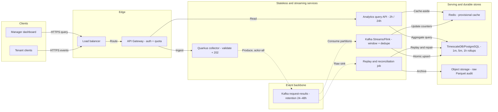
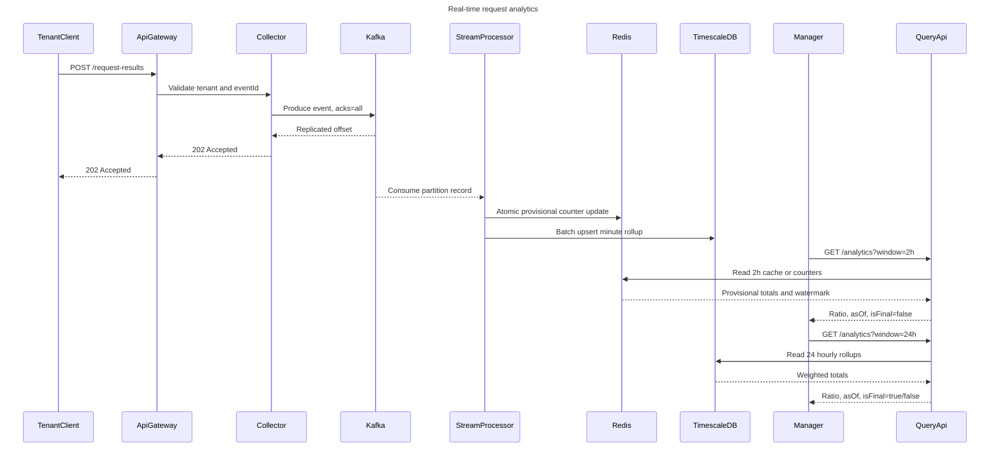

# 03 — Design Real-time Test Analytics Dashboard

> Họ bài: **đếm & tổng hợp theo thời gian** (counting/aggregation at scale).
> Chữ ký nhận dạng: *ghi nặng, đọc nhẹ, nhưng đọc theo khoảng thời gian bất kỳ*.
> Tách ra từ `katalon-senior-lead-phong-van.md` §5.3.
>
> ⭐ **Bản đào sâu của đúng họ bài này — và là câu đã bị hỏi thật ở vòng Principal — nằm ở
> [04 — Event Counting 10k/phút](04-event-counting-10k.md).** File 03 là bản tổng quát ở mức
> dashboard; file 04 đi tới tầng dòng code, thuật toán phân rã khoảng thời gian, và demo chạy được.
> Nếu chỉ có thời gian đọc một file, đọc 04.

**Đề:** Dashboard hiển thị kết quả test theo thời gian thực; write-heavy ingest, read-heavy query.

## Điểm cần nêu (analytics)

- **Pre-aggregation nhiều tầng:** raw → 1m → 1h → 1d. Query dashboard **không bao giờ** chạm raw. TimescaleDB **continuous aggregate** làm việc này native.
- **Partitioning:** partition theo `(tenant, time)`; drop partition cũ thay vì `DELETE` (tránh bloat + autovacuum bão).
- **Cardinality explosion** — bẫy kinh điển: đừng đưa `testCaseId` (hàng triệu) vào label metric. Tách metric hệ thống (Prometheus, low-cardinality) khỏi analytics dữ liệu (Postgres/Redshift, high-cardinality).
- **Late-arriving data:** worker offline rồi báo kết quả muộn → rollup phải **idempotent + recomputable** trong window watermark.
- **Cache:** Redis **cache-aside**, key gồm `tenant + filter hash + latest_run_version`. Invalidate bằng **version bump** khi có run mới, không dùng TTL mù. Chống **thundering herd** bằng single-flight lock.
- **Read replica** cho query nặng; API phân biệt rõ endpoint đọc/ghi.

## Câu hỏi phỏng vấn thực tế: 10.000 request/phút và tỷ lệ true/false trong 2–24 giờ

> ⚠️ **Trùng lặp có chủ đích — đọc kỹ đoạn này.** Phần dưới đây được viết **trước** buổi phỏng vấn
> Principal, dưới dạng bài giả định. Sau đó câu này **được hỏi thật**, với một vế khó hơn (khoảng
> thời gian **bất kỳ**, không chỉ 2h/24h) — và bản phân tích đầy đủ nằm ở
> [**04 — Event Counting 10k/phút**](04-event-counting-10k.md).
>
> **Giữ lại phần này** vì nó có 3 thứ mà file 04 không có: sơ đồ **mermaid** kiến trúc + sequence
> (vẽ được lên bảng), chi tiết **Kafka Streams / RocksDB state store**, và cách trả API kèm
> `as_of` / `watermark` / `is_final`.
>
> **Nếu chỉ đọc một file: đọc 04.** File 04 có thuật toán phân rã khoảng thời gian, bảng so 3 tech
> stack kèm ngưỡng chuyển, và demo chạy được từng bước.

**Đề bài:** Có khoảng 10.000 request/phút gửi vào system. Mỗi request chứa
`tenantId`, `eventId`, timestamp và một kết quả boolean `success=true/false`.
Làm sao nhận nhanh, rồi khi sếp hỏi có thể trả lời tỷ lệ thành công của từng
tenant trong 2 giờ **hoặc 24 giờ** gần nhất? Có cần nhiều thread, Kafka, và ghi/đọc
database thế nào?

**Bước 1 — chốt định nghĩa và ước lượng.**

- 10.000/phút chỉ khoảng **167 request/giây** (peak nên thiết kế 3–5x, khoảng
  500–800/s). Hỏi thêm payload size, số tenant, SLA query, độ trễ chấp nhận được,
  có cần giữ raw/audit hay chỉ cần aggregate.
- Tỷ lệ phải là **weighted ratio**: `sum(success_count) / sum(total_count)` trong
  cửa sổ thời gian, không phải trung bình các phần trăm của từng bucket. 2 giờ là
  120 bucket một-phút; 24 giờ có thể là 1.440 bucket một-phút hoặc dùng bucket giờ.
- Quy ước rõ request timeout, malformed, retry: thường chỉ tính request có kết quả
  hợp lệ vào `total`; nếu business muốn availability thì tạo metric khác.

**Kiến trúc đề xuất (hot path và cold path tách nhau):**

```text
Client → Load balancer/API Gateway (auth, quota, 202 Accepted)
       → stateless Quarkus collector
       → Kafka topic request-results (key = tenantId[, shard])
          ├─ Kafka Streams/Flink: 1-minute + 5-minute + 1-hour rollup → Redis/TimescaleDB
          └─ object storage (Parquet) hoặc raw Kafka topic cho audit/recompute
Dashboard API → Redis (p95 thấp) → read replica/TimescaleDB khi cache miss
```

**Sơ đồ kiến trúc để trình bày trên bảng:**



**Sequence diagram — một request và hai kiểu truy vấn:**



**Mục tiêu “real-time” cần nói bằng số:** collector trả ACK sau khoảng vài chục
millisecond; dashboard đọc số liệu **provisional** trễ khoảng 1–5 giây (stream
processor cập nhật state liên tục), còn số liệu **final** trễ theo watermark, ví dụ
2–5 phút để chờ event muộn. API nên trả `as_of`, `watermark` và `is_final`, thay vì
giả vờ mọi con số đều tuyệt đối ngay lập tức.

- Collector **không ghi DB đồng bộ cho từng request**. Producer bật `acks=all`,
  idempotence, compression/batching; chỉ trả 202 sau khi Kafka xác nhận bản ghi đã
  được replicate. Kafka retention (ví dụ 24–48h) đủ để replay cửa sổ 2h/24h và xử lý lỗi.
- 167/s không cần hàng trăm thread. Dùng non-blocking I/O ở collector và một pool
  giới hạn cho việc serialize/validate; số consumer bị giới hạn bởi số partition.
  Có thể bắt đầu 6–12 partition, benchmark rồi tăng. **Không** tạo một thread/timer
  cho mỗi tenant.
- Với key chỉ `tenantId`, tenant cực lớn có thể tạo hot partition. Nếu cần scale
  tenant đó, dùng `tenantId#shard` (16+ shard), aggregate từng shard rồi merge ở
  bước query/rollup; chấp nhận mất ordering giữa các shard vì bài toán chỉ cần count.

**Aggregate và lưu trữ.** Kafka Streams state store (RocksDB + changelog) hoặc
Flink keyed state giữ `tenant × minute → {true_count, total_count}`. Sink xuống
TimescaleDB/PostgreSQL bằng batch upsert, khóa duy nhất `(tenant_id, bucket_start)`:

```sql
INSERT INTO request_rollup (tenant_id, bucket_start, true_count, total_count)
VALUES (:tenant, :minute, :ok, :total)
ON CONFLICT (tenant_id, bucket_start) DO UPDATE SET
  true_count  = EXCLUDED.true_count,
  total_count = EXCLUDED.total_count;
```

Trong production nên ghi **delta theo eventId đã dedupe** hoặc dùng transactional
state store; không làm read-modify-write ở application vì hai consumer có thể cập
nhật cùng row. `eventId` + unique constraint/dedup store làm sink an toàn với
at-least-once và retry. Khi query 2h, đọc 120 bucket một-phút; khi query 24h, đọc 24
bucket một-giờ (hoặc 288 bucket năm-phút nếu cần độ chính xác chi tiết). Mỗi bucket
giờ được merge từ bucket nhỏ hơn và recompute khi event muộn đến. Redis cache key gồm
`tenant:<window>:<end_bucket>:<version>`; version bump khi bucket thay đổi, không dùng
TTL mù.

**Race condition, retry và dữ liệu muộn.** Kafka consumer group bảo đảm một partition
chỉ có một consumer xử lý tại một thời điểm, nhưng rebalance/retry vẫn có thể tạo
duplicate. Commit offset **sau** khi state/sink thành công; có DLQ cho poison message.
Dùng watermark (ví dụ trễ 2–5 phút), cho phép cập nhật lại bucket khi event đến muộn,
và chạy reconciliation từ raw Kafka/object storage. Nếu cần kết quả “as of” chính xác,
API trả thêm `computed_at`, watermark và trạng thái `complete/possibly_late`.

**Độ tin cậy và trade-off cần nói ra:**

- Kafka là lớp hấp thụ burst/replay, không phải database query; Postgres/TimescaleDB
  là serving store cho rollup, object storage là lịch sử rẻ để recompute.
- Chọn at-least-once + idempotent dedupe thay exactly-once end-to-end để throughput và
  vận hành đơn giản hơn. Đổi lại phải giữ eventId đủ lâu và chấp nhận eventual consistency
  vài giây trong dashboard.
- Nếu chỉ có một vài tenant và retention ngắn, Redis Streams + atomic Lua cũng đủ;
  Kafka + stream processor hợp lý khi cần replay, nhiều consumer, hoặc scale 10x.
  Để giữ 24h mà query vẫn nhanh, giữ raw tối thiểu 24–48h trong Kafka/object storage,
  giữ rollup 1 phút lâu hơn theo nhu cầu audit, và chỉ phục vụ dashboard từ rollup.

## Trade-off (analytics)

| | Được | Mất |
|---|---|---|
| Aggregate lúc write | Query cực nhanh | Không đổi được chiều phân tích sau này; ingest đắt hơn |
| Aggregate lúc read | Linh hoạt mọi filter | p99 query tệ ở tenant lớn |
| TimescaleDB (trong Postgres) | 1 hệ, transaction chung, đã có sẵn ở Katalon | Kém Redshift/ClickHouse ở scan cực lớn |
| Redshift cho warehouse | Scan hàng tỷ dòng tốt | Không real-time, thêm 1 hệ để vận hành |
| Cache theo version | Không stale | Cần đường invalidate đáng tin, phức tạp hơn TTL |
